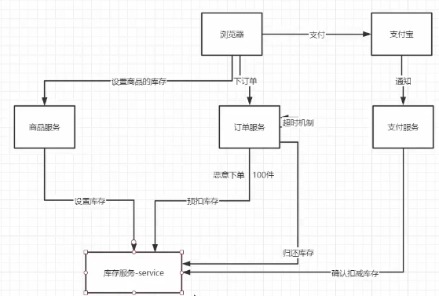
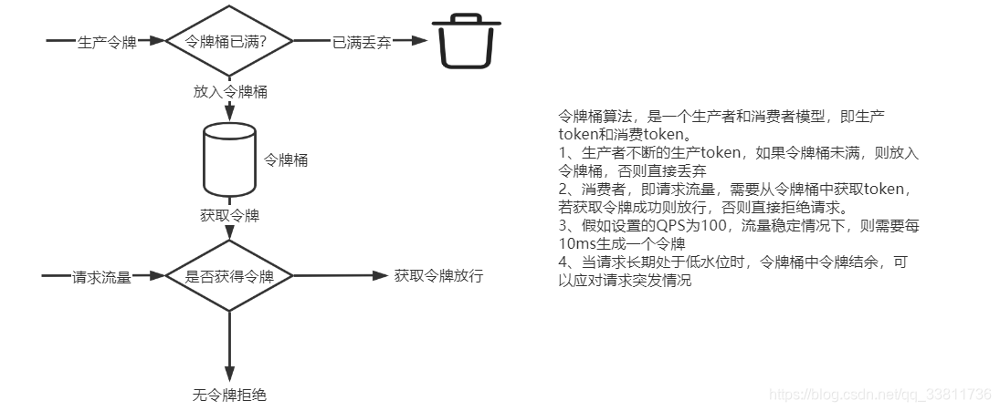

## 1. MD5，信息摘要算法

对密钥进行加密：

1. 压缩性：任意长度数据算出的MD5长度值固定
2. 容易计算
3. 抗修改性：哪怕一个字节，MD5差异值很大
4. 强碰撞性
5. 不可逆性：不可反解（常用密码可以用表来暴力破解）

```go
func genMD5(str string) string {
    MD5 := md5.New()
    _, _ = io.WriteString(MD5, str)
    // 计算 MD5 哈希值并将其转换为十六进制字符串形式
    // Sum方法是追加一个值一并生成hash。传入nil得到str的hash值
    return hex.EncodeToString(MD5.Sum(nil))
}
```

加盐：将密码变为：随机字符串+用户密码

---


## 2. zap日志

`logger.Sugar()` 方法可以将一个 `Logger` 对象转换成一个 `SugaredLogger` 对象，`SugaredLogger` 提供了更人性化的接口

```go
	logger, _ := zap.NewProduction()
	defer logger.Sync()

	url := "https://xxx.cn/"
	sugar := logger.Sugar()
	sugar.Infow("production failed to fetch URL",
		"url", url,
		"attempt", 3,
		"backoff", time.Second,
	)
	sugar.Info("Info")
	sugar.Infof("Infof: %s", url)
	sugar.Infoln("Infoln")
```

S()可以获取一个全局的sugar，日志分级别：debug info warn error fetal（生产环境不显示debug）

```go
	logger, _ := zap.NewDevelopment()
	zap.ReplaceGlobals(logger)
	// S()可以获取一个全局的sugar，提供锁安全访问logger
	// 日志分级别：debug info warn error fetal
	zap.S().Info("启动服务器,端口：", port)
```

---


## 3. viper 配置文件解决方案

1. 将线上和线下的配置文件隔离
2. 动态监控变化

---


## 4. validator 对数据进行校验

```go
// 注册mobile验证器
func checkMobile(v *validator.Validate) {
	v.RegisterValidation("mobile", myValidator.ValidateMobile)
    // 注册验证失败时的翻译
	v.RegisterTranslation("mobile", global.Translator, func(ut ut.Translator) error {
		return ut.Add("mobile", "{0}手机号格式不正确!", true) // see universal-translator for details
	}, func(ut ut.Translator, fe validator.FieldError) string {
		t, _ := ut.T("mobile", fe.Field())

		return t
	})
}
```

---


## 5.  JWT   json web token

基于session验证登陆：需要使用分布式集群存储


JWT 的格式： `Header.Payload.Signature`

Header 部分是一个 JSON 对象，描述 JWT 的元数据，通常是下面的样子。`alg`属性表示签名的算法（algorithm），默认是 HMAC SHA256（写成 HS256）；`typ`属性表示这个令牌（token）的类型（type），JWT 令牌统一写为`JWT`。

> ```javascript
> {
>   "alg": "HS256",
>   "typ": "JWT"
> }
> ```

Payload 部分也是一个 JSON 对象，用来存放实际需要传递的数据。JWT 规定了7个官方字段，供选用。注意，JWT 默认是不加密的，任何人都可以读到，所以不要把秘密信息放在这个部分。

> - iss (issuer)：签发人
> - exp (expiration time)：过期时间
> - sub (subject)：主题
> - aud (audience)：受众
> - nbf (Not Before)：生效时间
> - iat (Issued At)：签发时间
> - jti (JWT ID)：编号

> ```javascript
> {
>   "sub": "1234567890",
>   "name": "John Doe",
>   "admin": true
> }
> ```

Signature 部分是对前两部分的签名，防止数据篡改。需要指定一个密钥（secret）。这个密钥只有服务器才知道，不能泄露给用户。然后，使用 Header 里面指定的签名算法（默认是 HMAC SHA256），按照下面的公式产生签名。

> ```javascript
> HMACSHA256(
>   base64UrlEncode(header) + "." +
>   base64UrlEncode(payload),
>   secret)
> ```

客户端每次与服务器通信，都要带上这个 JWT。你可以把它放在 Cookie 里面自动发送，但是这样不能跨域，所以**更好的做法是放在 HTTP 请求的头信息`Authorization`字段里面**。

**JWT 的最大缺点是，由于服务器不保存 session 状态，因此无法在使用过程中废止某个 token，或者更改 token 的权限。也就是说，一旦 JWT 签发了，在到期之前就会始终有效，除非服务器部署额外的逻辑**。

---


## 6. consul 服务注册中心

`docker run -d -p 8500:8500 -p 8300:8300 -p 8301:8301 -p 8302:8302 -p 8600:8600/udp consul consul agent -dev -client=0.0.0.0`

```go
// Register 注册服务至注册中心
func (r *Registry) Register(address string, port int, name string, tags []string, id string) error {
    //DefaultConfig 返回客户端的默认配置
    cfg := api.DefaultConfig()
    //Address为consul的host和port
    cfg.Address = fmt.Sprintf("%s:%d", r.Host, r.Port)

    client, err := api.NewClient(cfg)
    if err != nil {
       panic(err)
    }
    //对外host和ip
    //生成对应的检查对象
    check := &api.AgentServiceCheck{
       HTTP:                           fmt.Sprintf("http://%s:%d/health", address, port),
       Timeout:                        "5s",
       Interval:                       "5s",
       DeregisterCriticalServiceAfter: "10s",
    }

    //生成注册对象
    registration := new(api.AgentServiceRegistration)
    registration.Name = name
    registration.ID = id
    registration.Port = port
    registration.Tags = tags
    registration.Address = address
    registration.Check = check

    //注册
    err = client.Agent().ServiceRegister(registration)
    if err != nil {
       panic(err)
    }
    return nil
}
```

---


## 7. 负载均衡

1. 集中式load balance：基于硬件或软件，流量大，要做分布式处理，成为性能瓶颈

2. 进程内load balance：服务注册中心维护服务提供方的节点列表；消费者维护这个列表，自己做load balance。
   不同语言要开发不同的sdk。

3. 独立进程load balance：这个组件的可用性怎么维护？

   

负载均衡算法：

1. 轮询法：一个一个发       加权轮询

2. 源地址哈希：同一ip的请求映射到同一台服务器

   > 一致性哈希算法将 key 映射到 2^32 的空间中，将这个数字首尾相连，形成一个环。
   >
   > - 计算节点/机器(通常使用节点的名称、编号和 IP 地址)的哈希值，放置在环上。
   > - 计算 key 的哈希值，放置在环上，顺时针寻找到的第一个节点，就是应选取的节点/机器。
   >
   > 
   >
   > 环上有 peer2，peer4，peer6 三个节点，`key11`，`key2`，`key27` 均映射到 peer2，`key23` 映射到 peer4。此时，如果新增节点/机器 peer8，假设它新增位置如图所示，那么只有 `key27` 从 peer2 调整到 peer8，其余的映射均没有发生改变。
   >
   > 如果服务器的节点过少，容易引起 key 的倾斜。为了解决这个问题，引入了虚拟节点的概念，一个真实节点对应多个虚拟节点。虚拟节点扩充了节点的数量，解决了节点较少的情况下数据容易倾斜的问题。而且代价非常小，只需要增加一个字典(map)维护真实节点与虚拟节点的映射关系即可。

3. 最小连接数法：谁的连接少，就连谁

```go
/*
grpc.Dial 方法用于创建一个 gRPC 连接。
使用 fmt.Sprintf 构建 Consul URL，包含主机、端口和服务名，还设置了一些查询参数（如 wait=14s 和 tag=srv）。
grpc.WithInsecure() 表示不使用 TLS 连接（仅在开发或内部网络中使用）。
grpc.WithDefaultServiceConfig 设置 gRPC 的负载均衡策略为 round_robin，即轮询。
grpc.WithUnaryInterceptor 使用 OpenTracing 进行追踪，拦截每一个 Unary RPC 调用。
*/
conn, err := grpc.Dial(
    fmt.Sprintf("consul://%s:%d/%s?wait=14s&tag=srv", consul.Host, consul.Port, global.ServerConfig.UserSerInfo.Name),
    grpc.WithInsecure(),
    grpc.WithDefaultServiceConfig(`{"loadBalancingPolicy": "round_robin"}`),
    grpc.WithUnaryInterceptor(otgrpc.OpenTracingClientInterceptor(opentracing.GlobalTracer())),
)
```

---


## 8. nacos 分布式配置中心

基于本地文件配置：修改配置文件后需要重启服务；很多服务都依赖同一个配置，全部需要改；多语言多框架

1. 命名空间：可以隔离配置集，命名空间用来区分微服务
2. 组：可以用来区分 开发、测试、生产环境

根据yaml文件配置全局变量 nacosconfig  读取：

```go
nacos:
  host: '127.0.0.1'
  port: 8848
  namespace_id: 'f571d8e2-908c-4446-951c-9e9b8fb36ab1'
  user: 'nacos'
  password: 'nacos'
  data_id: 'user-srv.json'
  group: 'dev'

//服务端配置
	sc := []constant.ServerConfig{
		{
			IpAddr: global.NacosConfig.Host,
			Port:   global.NacosConfig.Port,
		},
	}

	//客户端配置
	cc := constant.ClientConfig{
		NamespaceId:         global.NacosConfig.NamespaceId, 
		TimeoutMs:           5000,
		NotLoadCacheAtStart: true,
		LogDir:              "tmp/nacos/log",
		CacheDir:            "tmp/nacos/cache",
		LogLevel: "debug",
	}

	configClient, err := clients.CreateConfigClient(map[string]interface{}{
		"clientConfig":  cc,
		"serverConfigs": sc,
	})
	if err != nil {
		panic(err)
	}

	//获取配置
	content, err := configClient.GetConfig(vo.ConfigParam{
		DataId: global.NacosConfig.DataId,
		Group:  global.NacosConfig.Group,
	})

	if err != nil {
		panic(err)
	}
	// 读取到全局变量ServerConfig
	err = json.Unmarshal([]byte(content), &global.ServerConfig)
	if err != nil {
		panic(err)
	}
	fmt.Println(global.ServerConfig)
```

---


## 9. MySQL 多对多（many-to-many）


商品和品牌多对多。为了实现many-to-many relationships，需要一个额外的表（junction table），这个表一般只有两个列，这两个列分别是两个表的主键。通过这个额外的表，两个实体之间的多对多的关系就被实现了。

---


## 10. gorm

### 10.1 自定义模型

数据库不能存储数组类型

```go
//GormList gorm自定义模型
type GormList []string

func (g GormList) Value() (driver.Value, error) {
    return json.Marshal(g)
}

func (g *GormList) Scan(value interface{}) error {
    return json.Unmarshal(value.([]byte), &g)
}
```

### 10.2 分页查询

```go
// Paginate 分页功能
func Paginate(page, pageSize int) func(db *gorm.DB) *gorm.DB {
	return func(db *gorm.DB) *gorm.DB {
		if page <= 0 {
			page = 1
		}
		switch {
		case pageSize > 100:
			pageSize = 100
		case pageSize <= 0:
			pageSize = 10
		}
        // 计算 offset 值 (page - 1) * pageSize 确定从哪条记录开始查询
        // 并使用 Limit 设置每页返回的数据条数。
		offset := (page - 1) * pageSize
		return db.Offset(offset).Limit(pageSize)
	}
}

func main() {
	...
	// 使用分页功能查询用户数据
	var users []User
	page := 2
	pageSize := 10
	db.Scopes(Paginate(page, pageSize)).Find(&users) // 查询第二页的数据，每页显示 10 条记录
	for _, user := range users {
		fmt.Printf("ID: %d, Name: %s\n", user.ID, user.Name)
	}
}
```

### 10.3 Preload() 获取一对多的商品分类

```go
type Category struct {
	BaseModel                                                   
	//表外键
	ParentCategoryID int32       `json:"parent"`
	//指向的父级分类栏
	ParentCategory   *Category   `json:"-"`   
	//填装子分类
  SubCategory      []*Category  `gorm:"foreignKey:ParentCategoryID;references:ID"json:"sub_category"` 
}

// GetAllCategorysList 获取所有品牌分类
func (g *GoodsServer) GetAllCategorysList(context.Context, *emptypb.Empty) (*proto.CategoryListResponse, error) {
	var categorys []model.Category
	//通过反向查询，查一级内目，查二级内目，查三级内目
	global.DB.Where(&model.Category{Level: 1}).Preload("SubCategory.SubCategory").Find(&categorys)

	//json序列化
	b, _ := json.Marshal(&categorys)

	return &proto.CategoryListResponse{JsonData: string(b)}, nil
}
```

`Preload()` 进行外键预加载。
对应的sql语句：1. 查找`level为1`的category 2. 查找`parentId = 任意1中的category` 3. 查找`parentId = 任意2中的category`

### 10.4 根据传参获取商品

参数限制很多，直接操作global.db会修改全局变量，影响到其他业务。最好的方法是localdb。或者es。

### 10.5 给数据库字段加索引（Index）

```GO
Goods int32 `gorm:"type:int comment '商品id';index"`
```

`index` 指示GORM在该字段上创建一个索引。当对 `Goods` 字段进行查询时，数据库可以利用该索引加速查询过程。例如，如果你经常需要查询某个特定商品的订单信息（`SELECT * FROM orders WHERE Goods = ?`），这个索引会大大提高查询速度。

---

## 11. 阿里云oss：单体应用和微服务下的图片存储

使用gin做中转保存url和返回url有很大的性能限制。
阿里云提供了安全的web端直传服务。


### 11.1 内网穿透做回传

服务提供商将内网主机，内网网口映射到HTTP网站，提供外网访问。将oss的callbackUrl修改为对应的HTTP网站。

### 11.2 oss流程

1. 生成上传凭证，用户需要从服务器获取一个上传凭证，这个凭证通常包含上传策略和签名，用于权限验证。
2. 客户端上传文件，客户端使用获取到的上传凭证，将文件上传到OSS。上传凭证包含上传URL和必要的头信息，用于OSS服务的权限验证。
3. OSS回调通知，上传成功后，OSS可以配置回调通知服务器，以便服务器可以对上传的文件进行处理或记录。回调请求包含上传的文件信息和验证签名。
4. 客户端获取文件URL，服务器在处理回调请求后，返回文件的URL或其他信息给客户端。客户端可以使用这个URL来访问或下载文件。

---


## 12. 分布式锁

**悲观锁**：总是假设最坏的情况，每次去拿数据的时候都认为别人会修改，所以每次在拿数据的时候都会上锁，这样别人想拿这个数据就会阻塞直到它拿到锁（共享资源每次只给一个线程使用，其它线程阻塞，用完后再把资源转让给其它线程）。传统的关系型数据库里边就用到了很多这种锁机制，比如行锁，表锁等，读锁，写锁等，都是在做操作之前先上锁。

**乐观锁**：总是假设最好的情况，每次去拿数据的时候都认为别人不会修改，所以不会上锁，但是在更新的时候会判断一下在此期间别人有没有去更新这个数据，可以使用版本号机制和CAS算法实现。乐观锁适用于多读的应用类型，这样可以提高吞吐量。

### 12.1 MySQL实现悲观锁 for update

悲观锁的基本思想是“悲观地”认为并发事务会发生冲突，因此在对数据进行读写操作之前，先对数据加锁，以确保只有一个事务可以访问数据。**保证了数据一致性，但会降低并发性能**。

在**有索引**的时候：**行锁**；只会锁住满足条件的数据
没有索引会升级成表锁，但没有查询到就不会锁表

### 12.2 乐观锁

乐观锁：事务开始时不加锁，只在提交前检查数据是否被修改，如果数据被修改则回滚并重试。乐观锁适用于并发写操作较少的场景，可以提高并发性能。

### 12.3 基于redis实现分布式锁

### 12.3.1 基于 setnx 的缺陷

Redis Setnx（**SET** if **N**ot e**X**ists） 命令在指定的 key 不存在时，为 key 设置指定的值。

`SETNX lock.foo <current Unix time + lock timeout + 1>`

如果 SETNX 返回1，说明该进程获得锁，SETNX将键 lock.foo 的值设置为锁的超时时间（当前时间 + 锁的有效时间）。
如果 SETNX 返回0，说明其他进程已经获得了锁，进程不能进入临界区。进程可以在一个循环中不断地尝试 SETNX 操作，以获得锁。

锁超时时，我们不能简单地使用 DEL 命令删除键 lock.foo 以释放锁。考虑以下情况，进程P1已经首先获得了锁 lock.foo，然后进程P1挂掉了。进程P2，P3正在不断地检测锁是否已释放或者已超时，P2先删除了锁并重新新建了锁，这时P3删除锁会删除掉P2的。

`GETSET lock.foo <current Unix timestamp + lock timeout + 1>`

由于 GETSET 操作在设置键的值的同时，还会返回键的旧值，通过比较键 lock.foo 的旧值是否小于当前时间，可以判断进程是否已获得锁。

> 不推荐使用redis的setnx方法，其本质是以下原因导致的：
>
> 1. 缺乏原子性：
>    分布式锁的核心要求是原子性，即加锁和设置锁的过期时间应该是原子操作。然而，SETNX 命令只负责设置键的值，而不支持同时设置过期时间。这意味着你需要**先调用 SETNX，然后再调用 EXPIRE 来设置锁的过期时间**。这两个操作不是原子的，因此在它们之间可能发生一些导致不一致的情况，比如客户端在设置过期时间之前崩溃，导致锁永远不会被释放。
> 2. 锁释放的安全性问题：
>    释放锁时，需要确保只有持有锁的客户端才能成功释放。使用 SETNX 时，简单的 DEL 命令用于释放锁，但这样**任何客户端都可以删除锁**，导致潜在的竞态条件。为了防止这种情况，通常需要结合客户端的唯一标识来验证锁的持有者，这增加了实现的复杂性，并且容易出错。
> 3. 不支持可重入锁：
>    在分布式系统中，有时候同一个客户端可能需要多次获取同一个锁。使用 SETNX 实现的锁**不支持可重入性**，即一个客户端在持有锁的情况下再次请求锁时会被拒绝，这在实际应用中可能导致问题。

### 12.3.2 使用Lua脚本来保证原子性

### 12.3.3 redolock 解决分布式锁在集群环境中出现的问题

setnx操作应该在多台服务器上进行：**多数同意**


## 13. 支付宝沙箱环境

生成RSA密钥对（2048位）。将生成的公钥上传到支付宝开放平台对应应用的“开发设置”中，保存好私钥。通过API调用将**签名**后的请求数据发送到支付宝沙箱环境的URL，支付宝接收到请求后，会使用开发者上传的**公钥**验证签名的有效性。支付宝处理完请求后，会通过配置的回调地址通知支付结果。在回调接口中，需要使用**支付宝的公钥**验证回调数据的签名，确保数据的完整性和来源的可信。

---


## 14. elasticsearch

> MySQL性能低下，没有相关性排名，无法全文搜索，搜索不准确 没有分词
> es 可以当MySQL使用，但更多是互补的关系  
> es用来搜索，一般只将搜索要用到的字段保存到es中

- 分布式的搜索引擎和数据分析引擎
- 全文检索、结构化检索、数据分析
- 对海量数据进行近实时的处理

批量查询 GET _mget 批量插入 POST _bulk

### 14.1 全文搜索

- match：对输入进行分词，部分匹配的模糊查询

- match_phase：需要结果包含所有分词，且顺序要求一样，必须要连着

- multi_match：对多个字段进行查询，并指明权重

  ```go
  {
      "multi_match": {
          "query":  "Quick brown fox",
          "fields": [ "*_title", "chapter_title^2" ] 
      }
  }
  ```

- term：精确值查找，不会做分词，大写也不会转化为小写

- terms：在一个字段中查找多个值

- range：范围查询，"gt" "gte" "lt" "lte"

- exists

- fuzzy：模糊查询，根据编辑距离判断

- bool："must" "must_not" "should"

```go
	//初始化筛选器
	q := elastic.NewBoolQuery()
	//关键词搜索、查询新品、查询热门商品、通过价格区间筛选
	//创建一个临时筛选条件的DB
	var localDB = global.DB.Model(model.Goods{})

	if req.KeyWords != "" {
		q = q.Must(elastic.NewMultiMatchQuery(req.KeyWords, "name", "goods_brief")) //在name和goods_brief查询
	}
	if req.IsNew {
		//不参与算分，使用filter
		q = q.Filter(elastic.NewTermsQuery("is_new", req.IsNew))
	}
	if req.IsHot {
		q = q.Filter(elastic.NewTermsQuery("is_hot", req.IsHot))
	}
	if req.PriceMin > 0 {
		q = q.Filter(elastic.NewRangeQuery("shop_price").Gte(req.PriceMin))
	}
	if req.PriceMax > 0 {
		q = q.Filter(elastic.NewRangeQuery("shop_price").Lte(req.PriceMax))
	}
	if req.Brand > 0 {
		q = q.Filter(elastic.NewTermsQuery("brand_id", req.Brand))
	}
```


### 14.2 中文分词器插件 ik

ik_max_word、ik_smart

```go
GET _analyze 
{
  "text": "中国科学技术大学",
  "analyzer": "ik_max_word"
}
```

### 14.3 mapping

1. **`text` 类型**
   - **描述**：用于存储大段文本数据，会进行分词和倒排索引。
   - **效果**：适用于全文搜索，可以对文本进行分词、匹配关键词。例如，搜索商品名称或描述时，可以分词匹配相关词汇。
2. **`keyword` 类型**
   - **描述**：用于存储不需要分词的文本数据（如标签、ID、状态等），适合精确匹配。
   - **效果**：适用于过滤和聚合操作，支持排序、聚合等操作。例如，搜索商品分类、品牌名称时可以使用精确匹配。
3. **`integer` 类型**
   - **描述**：用于存储整数数据。
   - **效果**：适用于数值范围查询和排序操作。例如，查询商品的库存数量、商品的点击数等。
4. **`float` 和 `double` 类型**
   - **描述**：用于存储浮点数数据。
   - **效果**：适用于数值计算、范围查询和排序操作。例如，查询商品的价格区间、市场价格等。
5. **`boolean` 类型**
   - **描述**：用于存储布尔值（true/false）。
   - **效果**：适用于过滤操作，快速判断条件是否成立。例如，筛选是否上架商品、是否包邮等。
6. **`date` 类型**
   - **描述**：用于存储日期数据，支持多种日期格式。
   - **效果**：适用于时间范围查询、排序和聚合。例如，查询商品的发布时间、活动的开始时间等。
7. **`long` 类型**
   - **描述**：用于存储长整数数据。
   - **效果**：适用于大数值的范围查询和排序操作。例如，统计商品的销售数量等。

```go
func (EsGoods) GetMapping() string {
	goodsMapping := `
	{
		"mappings" : {
			"properties" : {
				"brands_id" : {
					"type" : "integer"
				},
				"category_id" : {
					"type" : "integer"
				},
				"click_num" : {
					"type" : "integer"
				},
				"fav_num" : {
					"type" : "integer"
				},
				"id" : {
					"type" : "integer"
				},
				"is_hot" : {
					"type" : "boolean"
				},
				"is_new" : {
					"type" : "boolean"
				},
				"market_price" : {
					"type" : "float"
				},
				"name" : {
					"type" : "text",
					"analyzer":"ik_max_word"
				},
				"goods_brief" : {
					"type" : "text",
					"analyzer":"ik_max_word"
				},
				"on_sale" : {
					"type" : "boolean"
				},
				"ship_free" : {
					"type" : "boolean"
				},
				"shop_price" : {
					"type" : "float"
				},
				"sold_num" : {
					"type" : "long"
				}
			}
		}
	}`
	return goodsMapping
}
```

### 14.4 钩子绑定到MySQL

```go
// AfterCreate Gorm中的钩子，调用对象后自动调用该方法，保存商品信息到es
func (g *Goods) AfterCreate(tx *gorm.DB) (err error) {
	goods := EsGoods{
		ID:          g.ID,
		CategoryID:  g.CategoryID,
		...
	}

	_, err = global.EsClient.Index().Index(EsGoods{}.GetIndexName()).BodyJson(goods).Id(strconv.Itoa(int(goods.ID))).Do(context.Background())
	...
}

// AfterUpdate 在同一个事务中更新数据
func (g *Goods) AfterUpdate(tx *gorm.DB) (err error) {
	_, err = global.EsClient.Update().Index(EsGoods{}.GetIndexName()).Doc(goods).Id(strconv.Itoa(int(goods.ID))).Do(context.Background())
	...
}

// AfterDelete 在同一个事务中更新数据,删除es对应的数据
func (g *Goods) AfterDelete(tx *gorm.DB) (err error) {
	_, err = global.EsClient.Delete().Index(EsGoods{}.GetIndexName()).Id(strconv.Itoa(int(g.ID))).Do(context.Background())
	...
}
```

---


## 15. 分布式事务




### 15.1 单机数据库事务

扣减库存涉及事务逻辑，执行的逻辑必须全部成功或者全部失败并且失败后数据可恢复,不能中途失败。

利用数据库事务实现扣减库存的逻辑：原子性、一致性、隔离性、持久性

```go
tx := global.DB.Begin()
//失败进行事务回滚
tx.Rollback()
//提交事务
tx.Commit()
```

### 15.2.1 CAP理论

> - Consistency（强一致性）
>   对于客户端的每次读操作，要么读到的是最新的数据，要么读取失败。换句话说，一致性是站在分布式系统的角度，对访问本系统的客户端的一种承诺：要么我给您返回一个错误，要么我给你返回绝对一致的最新数据，不难看出，其强调的是**数据正确**。
>
> - Availability（可用性）
>
>   任何客户端的请求都能得到响应数据，不会出现响应错误。换句话说，可用性是站在分布式系统的角度，对访问本系统的客户的另一种承诺：我**一定会返回数据**，不会给你返回错误，但**不保证数据最新**，强调的是不出错。
>
> - Partition tolerance（分区容错性）
>   由于分布式系统通过网络进行通信，网络是不可靠的。当任意数量的消息丢失或延迟到达时，系统仍会继续提供服务，**不会挂掉**。换句话说，分区容忍性是站在分布式系统的角度，对访问本系统的客户端的再一种承诺：我会一直运行，不管我的内部出现何种数据同步问题，强调的是不挂掉。

### 15.2.2 BASE理论  raft  弱一致性

> - 基本可用（Basically Available）
>   分布式系统在出现故障的时候，允许损失部分可用性（例如响应时间、功能上的可用性）。
> - 软状态（ Soft State）
>   允许系统存在中间状态，而该中间状态不会影响系统整体可用性。
> - 最终一致性（ Eventual Consistency）
>   系统中的所有数据副本经过一定时间后，最终能够达到一致的状态。

### 15.3  2PC

两阶段提交，将事务的提交过程分为资源准备和资源提交两个阶段，并且由事务协调者来协调所有事务参与者。

- 所有参与节点都是事务阻塞性的
- 协调者发生故障
- commit阶段协调者宕机 数据不一致


### 15.4  TCC（Try Confirm Cancel）

TCC的执行流程可以分为两个阶段，分别如下：

（1）第一阶段：Try，业务系统做检测并预留资源 (加锁，锁住资源)，比如常见的下单，在try阶段，我们不是真正的减库存，而是把下单的库存给锁定住。

（2）第二阶段：根据第一阶段的结果决定是执行confirm还是cancel

- Confirm：执行真正的业务（执行业务，释放锁）
- Cancle：是对Try阶段预留资源的释放（出问题，释放锁）


由于网络原因或者重试操作都有可能导致 Try - Confirm - Cancel 3个操作的重复执行，所以使用 TCC 时需要注意这三个操作的幂等控制，通常我们可以使用事务 xid 或业务主键判重来控制。
允许cancel空回滚；处理cancel空回滚后记录事务id，不再处理延迟到大的try操作；业务耦合度较高

### 15.5 基于本地消息的最终一致性


将消息写到日志表后，启动独立的线程，定时扫描日志表中的消息并发送到消息中间件，只有在反馈发送成功后才删除消息日志，否则等待定时任务重试。

### 15.6 基于MQ事务消息的最终一致性

业务逻辑简单、高并发


在断网或者应用重启等异常情况下，图中的步骤④提交的二次确认超时未到达 MQ Server，此时的处理逻辑如下：

- 步骤⑤：MQ Server 对该消息发起消息回查
- 步骤⑥：发送方收到消息回查后，需要检查对应消息的本地事务执行的最终结果
- 步骤⑦：发送方根据检查得到的本地事务的最终状态再次提交二次确认。
- 最终步骤：MQ Server基于 commit/rollback 对消息进行投递或者删除。

### 15.7 最大努力通知

最大努力通知，事务主动方仅仅是尽最大努力（重试，轮询....）将事务发送给事务接收方，所以存在事务被动方接收不到消息的情况，此时需要**事务被动方主动调用事务主动方的消息校对接口**查询业务消息并消费，这种通知的可靠性是由事务被动方保证的。

---


## 16. MQ

> 解耦、削峰、数据分发
>
> 选择rocketmq：延迟消息简单有效；完善的事务消息功能

### 16.1 重要概念

- **Name 服务器（NameServer）**：充当注册中心，类似 Kafka 中的 Zookeeper。
- **Broker**: 一个独立的 RocketMQ 服务器就被称为 broker，broker 接收来自生产者的消息，为消息设置偏移量。
- **主题（Topic）**：消息的第一级类型，一条消息必须有一个 Topic。
- **子主题（Tag）**：消息的第二级类型，同一业务模块不同目的的消息就可以用相同 Topic 和不同的 Tag 来标识。
- **分组（Group）**：一个组可以订阅多个 Topic，包括生产者组和消费者组。**负载均衡**：不重复消费
- **队列（Queue）**：可以类比 Kafka 的分区 Partition。


### 16.2 RocketMQ 工作原理

RockerMQ 中的消息模型就是按照主题模型所实现的，包括 Producer Group、Topic、Consumer Group 三个角色。

**为了提高并发能力，一个 Topic 包含多个 Queue**，生产者组根据主题将消息放入对应的 Topic，下图是采用轮询的方式找到里面的 Queue。

RockerMQ 中的消费群组和 Queue，可以类比 Kafka 中的消费群组和 Partition：**不同的消费者组互不干扰，一个 Queue 只能被一个消费者消费，一个消费者可以消费多个 Queue。**

消费 Queue 的过程中，通过偏移量记录消费的位置。


### 16.3 RocketMQ 架构

RocketMQ 技术架构中有四大角色 NameServer、Broker、Producer 和 Consumer，下面主要介绍 Broker。

**Broker 用于存放 Queue，一个 Broker 可以配置多个 Topic，一个 Topic 中存在多个 Queue。**

如果某个 Topic 消息量很大，应该给它多配置几个 Queue，并且尽量多分布在不同 broker 上，以减轻某个 broker 的压力。Topic 消息量都比较均匀的情况下，如果某个 broker 上的队列越多，则该 broker 压力越大。


简单提一下，Broker 通过集群部署，并且提供了 master/slave 的结构，slave 定时从 master 同步数据（同步刷盘或者异步刷盘），如果 master 宕机，则 slave 提供消费服务，但是不能写入消息。

### 16.4 订单服务和库存服务

调用库存服务前先发送一个归还库存的mq，成功调用库存创建订单就commit
下单不支付？订单服务完成后发送一个延迟消息，未支付就commit，库存服务收到延时消息归还库存


## 17.服务雪崩

在微服务之间进行服务调用是由于某一个服务故障，导致级联服务故障的现象，称为雪崩效应。
要防止系统发生雪崩，就必须要有容错设计。如果遇到突增流量，一般的做法是**对非核心业务功能采用熔断和服务降级**的措施来保护核心业务功能正常服务，而**对核心功能服务需要采用限流**的措施。

### 17.1 服务限流(预热、冷启动)

系统长时间处理低水平请求状态，当大量请求突然到来时，并非所有请求都放行，而是慢慢的增加请求，目的时防止大量请求冲垮应用，达到保护应用的目的。Sentinel中冷启动是采用令牌桶算法实现。令牌桶算法图例如下：



### 17.2 服务熔断 sentinel

> 向调用方法返回一个符合预期的、可处理的备选响应（FallBack），保证服务调用方的线程不会被⻓时间占用，避免故障在分布式系统中蔓延，乃至雪崩。如果目标服务情况好转则恢复调用。

1. 熔断器的状态

- `CLOSED`：默认状态。断路器观察到请求失败比例没有达到阈值，断路器认为被代理服务状态良好。
- `OPEN`：断路器观察到请求失败比例已经达到阈值，断路器认为被代理服务故障，打开开关，请求不再到达被代理的服务，而是快速失败。
- `HALF OPEN`：断路器打开后，为了能自动恢复对被代理服务的访问，会切换到半开放状态，去尝试请求被代理服务以查看服务是否已经故障恢复。如果成功，会转成`CLOSED`状态，否则转到`OPEN`状态。


2. 熔断策略

   > 支持设置静默期（MinRequestAmount），资源请求数小于该值时，不用遵守以下策略修改熔断器状态。

- 慢调用比例策略 (SlowRequestRatio)：

该策略下需要设置允许的调用 RT 临界值（即**最大的响应时间**），对该资源访问的响应时间大于该阈值则统计为**慢调用**。

- 错误比例策略 (ErrorRatio)：

统计周期内**资源请求访问异常的比例大于设定的阈值**，则接下来的熔断周期内对资源的访问会自动地被熔断。

- 错误计数策略 (ErrorCount)：

统计周期内**资源请求访问异常数大于设定的阈值**，则接下来的熔断周期内对资源的访问会自动地被熔断。


### 17.3 幂等性

解决雪崩，可以加入**超时和重试机制**，否则请求堆积，服务扛不住并发。
调用方对一个系统进行重复调用（参数全部相同），不论重复调用多少次，这些**调用对系统的影响都是相同的效果**。

### 17.3.1 控制重复请求(从源头)

1. 控制操作次数，例如：提交按钮仅可操作一次（提交动作后按钮置灰）。
2. 及时重定向，例如：下单/支付成功后跳转到成功提示页面，这样消除了浏览器前进或后退造成的重复提交问题。

### 17.3.2 **过滤重复请求

#### 17.3.2.1 分布式锁

利用 Redis 记录当前处理的业务标识，当检测到没有此任务在处理中，就进入处理，否则判为重复请求，可做过滤处理。

1. 订单发起支付请求，支付系统会去 Redis 缓存中查询是否存在该订单号的 Key。
2. 如果缓存key不存在，则向 Redis 增加缓存 Key为订单号（主要是通过Redis的SETNX命令来实现），添加Key成功的那个线程开始执行业务逻辑。业务逻辑处理完成后需要删除该订单号的缓存 Key，进行释放锁资源。
3. 如果缓存key存在，则直接返回重复标记给客户端，这样通过 Redis做到了分布式锁，只有这次请求完成，下次请求才能进来。

#### 17.3.2.2 token 令牌

1. 服务端提供了发送 token 的接口。执行业务前先去获取 token，同时服务端会把 token 保存到 redis 中；
2. 业务端发起业务请求时，携带 token，一般放在请求头部；
3. 服务器判断 token 是否存在 redis 中，存在即第一次请求，执行业务完成后将 token 从 redis 中删除；
4. 如果 token 不存在 redis 中，表示是重复操作，直接返回重复标记给 client，保证了业务代码不被重复执行。


- 问题一：先执行业务再删除token

  > 如果**业务逻辑比较耗时**或者其他原因，有可能出现第一次访问时token存在，开始执行具体业务操作。但**在还没有删除token时，客户端又携带token发起同样的请求**，此时，因为token还存在，第二次请求也会验证通过，执行具体业务操作。这样就没有保证幂等性。
  >
  > 解决办法：先删除token再执行业务直接执行redis的del()方法，成功说明当前线程占有资源，可以执行业务逻辑，后面的请求进来，调用del()方法失败，则将其放行即可。从而达到幂等目的。

- 问题二：先删除token再执行业务

> 这种方案也会存在一个问题，假设**具体业务代码执行超时或失败，没有向客户端返回明确结果**，那客户端就很有可能会进行**重试**，但此时之前的token已经被删除了，则会**被认为是重复请求**，不再进行业务处理。
>
> 注意：这种方案一个token只能代表一次请求。一旦业务执行出现异常，则**让客户端重新获取令牌**，重新发起一次访问即可。恰恰对于我们解决幂等的场景来说没有影响，因此推荐这种方案！！！


## 18. 链路追踪

### 18.1 openTracing

- **Trace 和 sapn**

在 OpenTracing 中，跟踪信息被分为 Trace和Span 两个部分，它们按照一定的结构存储跟踪信息，所以它们是 OpenTracing 中数据模型的核心。

Trace 是一次完整的跟踪，Trace 由多个 Span 组成。下图是一个 Trace 示例，由 8 个 Span 组成。**Trace 是多个 Span 组成的有向非循环图。**

```javascript
        [Span A]  ←←←(the root span)
            |
     +------+------+
     |             |
 [Span B]      [Span C] ←←←(Span C is a `ChildOf` Span A)
     |             |
 [Span D]      +---+-------+
               |           |
           [Span E]    [Span F] >>> [Span G] >>> [Span H]
                                       ↑
                                       ↑
                                       ↑
                         (Span G `FollowsFrom` Span F)
```

在上面的示例中，一个 Trace 经过了 8 个服务，A -> C -> F -> G 是有严格顺序的，但是从时间上来看，B 、C 是可以并行的。为了准确表示这些 Span 在时间上的关系，我们可以用下图表示：

```javascript
––|–––––––|–––––––|–––––––|–––––––|–––––––|–––––––|–––––––|–> time

 [Span A···················································]
   [Span B··············································]
      [Span D··········································]
    [Span C········································]
         [Span E·······]        [Span F··] [Span G··] [Span H··]
```

**有个要注意的地方， 并不是 A -> C -> F 表示 A 执行结束，然后 C 开始执行，而是 A 执行过程中，依赖 C，而 C 依赖 F。因此，当 A 依赖 C 的过程完成后，最终回到 A 继续执行。所以上图中 A 的跨度最大。**

- **Span 格式**

要深入学习，就必须先了解 Span对应的json数据： [https://github.com/whuanle/DistributedTracing/issues/1](https://cloud.tencent.com/developer/tools/blog-entry?target=https%3A%2F%2Fgithub.com%2Fwhuanle%2FDistributedTracing%2Fissues%2F1&source=article&objectId=2327280)

- **Trace**

一个简化的 Trace 如下：

```javascript
            "traceID": "790e003e22209ca4",
            "spans":[...],
            "processes":{...}
```

Trace 是一个有向非循环图，那么 Trace 必定有且只有一个起点。这个起点会创建一个 Trace 对象，这个对象一开始初始化了 trace id 和 process，trace id 是一个 32 个长度的字符串组成，它是一个时间戳，而 process 是起点进程所在主机的信息。

每个**Span**封装了如下状态:

- 操作名称
- 开始时间戳
- 结束时间戳
- 一组零或多个键:值结构的 **Span标签** (Tags)。键必须是字符串。值可以是字符串，布尔或数值类型.
- 一组零或多个 **Span日志** (Logs)，其中每个都是一个键:值映射并与一个时间戳配对。键必须是字符串，值可以是任何类型。 并非所有的 OpenTracing 实现都必须支持每种值类型。
- 一个 **SpanContext** (见下文)
- 零或多个因果相关的 **Span** 间的 **References** (通过那些相关的 **Span** 的 **SpanContext** )

每个 **SpanContext** 封装了如下状态:

-  任何需要跟跨进程 **Span** 关联的，依赖于 OpenTracing 实现的状态(例如 Trace 和 Span 的 id) 
-  键:值结构的跨进程的 **Baggage Items**（区别于 span tag，baggage 是全局范围，在 span 间保持传递，而tag 是 span 内部，不会被子 span 继承使用。） 

- **Inject** 和 **Extract** 操作

既然是分布式的追踪，那肯定涉及到跨进程/机器通讯，在进程间通过传递 Spancontext 来提供足够的信息建立 span 间的关系。在上游服务中，SpanContext 通过 **Inject** 操作向 **Carrier** 中注入tracing信息，传递后在下游服务中通过 **Extract** 从 **Carrier** 中提取tracing数据。

[关于inject 和 extract](https://cloud.tencent.com/developer/tools/blog-entry?target=https%3A%2F%2Fwu-sheng.gitbooks.io%2Fopentracing-io%2Fcontent%2Fpages%2Fapi%2Fcross-process-tracing.html&source=article&objectId=2327280)

- **Sampling** 采样

OpenTracing API 不强调采样的概念，但是大多数追踪系统通过不同方式实现采样。有些情况下，应用系统需要通知追踪程序，这条特定的调用需要被记录，即使根据默认采样规则，它不需要被记录。sampling.priority tag 提供这样的方式。追踪系统不保证一定采纳这个参数，但是会尽可能的保留这条调用。 sampling.priority - integer

-  如果大于 0, 追踪系统尽可能保存这条调用链 
-  等于 0, 追踪系统不保存这条调用链 
-  如果此tag没有提供，追踪系统使用自己的默认采样规则


## 19. x

