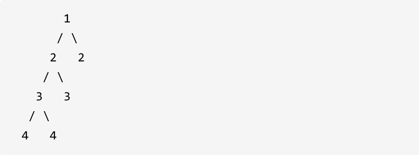
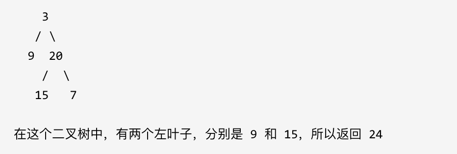
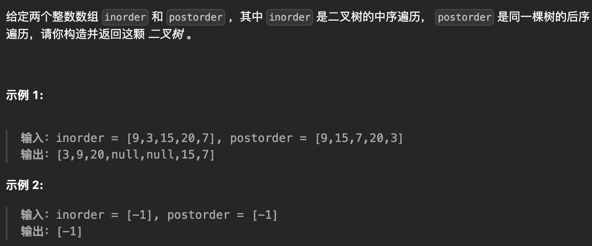
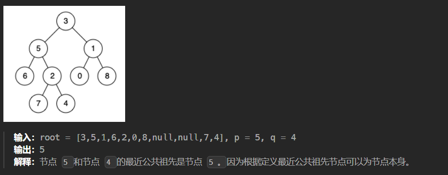

## 翻转二叉树

> 给你一棵二叉树的根节点 `root` ，翻转这棵二叉树，并返回其根节点。

递归版本的前序遍历

```go
func invertTree(root *TreeNode) *TreeNode {
    if root == nil {
        return nil
    }
    root.Left, root.Right = root.Right, root.Left    //交换
    
    invertTree(root.Left)
    invertTree(root.Right)

    return root
}
```

层序遍历

```go
func invertTree(root *TreeNode) *TreeNode {
	if root == nil {
		return root
	}

	queue := []*TreeNode{root}
	for len(queue) > 0 {
		levelSize := len(queue)
		for i := 0; i < levelSize; i++ {
			queue[i].Left, queue[i].Right = queue[i].Right,queue[i].Left
			if queue[i].Left != nil {
				queue = append(queue, queue[i].Left)
			}
			if queue[i].Right != nil {
				queue = append(queue, queue[i].Right)
			}
		}

		queue = queue[levelSize:]
	}

	return root
}
```


---

## 对称二叉树

> 给定一个二叉树，检查它是否是镜像对称的。
>
> 

本题遍历只能是“后序遍历”，因为我们要通过递归函数的返回值来判断两个子树的内侧节点和外侧节点是否相等。

**正是因为要遍历两棵树而且要比较内侧和外侧节点，所以准确的来说是一个树的遍历顺序是左右中，一个树的遍历顺序是右左中。**

单层递归的逻辑，单层递归的逻辑就是处理 左右节点都不为空，且数值相同的情况。

- 比较二叉树外侧是否对称：传入的是左节点的左孩子，右节点的右孩子。
- 比较内侧是否对称，传入左节点的右孩子，右节点的左孩子。
- 如果左右都对称就返回true ，有一侧不对称就返回false 。

```go
func compare(left *TreeNode, right *TreeNode) bool {
    // 首先排除空节点的情况
	if left == nil && right == nil {
		return true
	} else if left == nil && right != nil {
		return false
	} else if left != nil && right == nil {
		return false
	} else if left.Val != right.Val {
		return false
	}
	// 左右节点都不为空，且数值相同的情况
	outside := compare(left.Left, right.Right)
	inside := compare(left.Right, right.Left)
	isSame := outside && inside

	return isSame
}

func isSymmetric(root *TreeNode) bool {
	if root == nil {
		return true
	}
	return compare(root.Left, root.Right)
}
```

---

## 平衡二叉树

> 给定一个二叉树，判断它是否是高度平衡的二叉树。
>
> 示例 1:
>
> 给定二叉树 [3,9,20,null,null,15,7]
>
> 
>
> 返回 true 。
>
> 示例 2:
>
> 给定二叉树 [1,2,2,3,3,null,null,4,4]
>
> 
>
> 返回 false 。

自底向上递归的做法类似于后序遍历，对于当前遍历到的节点，先递归地判断其左右子树是否平衡，再判断以当前节点为根的子树是否平衡。如果一棵子树是平衡的，则返回其高度（高度一定是非负整数），否则返回 −1 。如果存在一棵子树不平衡，则整个二叉树一定不平衡。

```go
func isBalanced(root *TreeNode) bool {
	h := getHeight(root)
	return h != -1
}

// 返回以该节点为根节点的二叉树的高度，如果不是平衡二叉树了则返回-1
func getHeight(root *TreeNode) int {
	if root == nil {
		return 0
	}
	l, r := getHeight(root.Left), getHeight(root.Right)
	if l == -1 || r == -1 {
		return -1
	}
	if abs(l-r) > 1 {
		return -1
	}
	return max(l, r) + 1
}

func abs(x int) int {
	if x < 0 {
		return -x
	}
	return x
}
```

---

## 二叉树的所有路径

> 给定一个二叉树，返回所有从根节点到叶子节点的路径。
>
> 说明: 叶子节点是指没有子节点的节点。
>
> 

dfs，遇到nil返回

```go
var res []string

func dfs(root *TreeNode, path string) {
	if root == nil {
		return
	}
	if root.Left == nil && root.Right == nil {
		res = append(res, path+strconv.Itoa(root.Val))
	}
	if root.Left != nil {
		dfs(root.Left, path+strconv.Itoa(root.Val)+"->")
	}
	if root.Right != nil {
		dfs(root.Right, path+strconv.Itoa(root.Val)+"->")
	}
}

func binaryTreePaths(root *TreeNode) []string {
	res = []string{}
	dfs(root, "")
	return res
}
```

---

## 左叶子之和

> 计算给定二叉树的所有左叶子之和
>
> 

一看就会，一写就废，写不懂递归逻辑

```go
func sumOfLeftLeaves(root *TreeNode) int {
	if root == nil {
		return 0
	}

	leftValue := sumOfLeftLeaves(root.Left)
	if root.Left != nil && root.Left.Left == nil && root.Left.Right == nil {
		leftValue = root.Left.Val
	}
	rightValue := sumOfLeftLeaves(root.Right)

	return leftValue + rightValue
}
```

---

## 找树左下角的值

> 

### BFS

```go
func findBottomLeftValue(root *TreeNode) int {
	if root == nil {
		return -1
	}

	queue := []*TreeNode{root}
	res := 0
	for len(queue) > 0 {
		length := len(queue)
		for i := 0; i < length; i++ {
			if i == 0 {
				res = queue[i].Val
			}
			if queue[i].Left != nil {
				queue = append(queue, queue[i].Left)
			}
			if queue[i].Right != nil {
				queue = append(queue, queue[i].Right)
			}
		}
		queue = queue[length:]
	}

	return res
}
```

### DFS

```go
var leftMostValue int
var maxDepth int

func findBottomLeftValue(root *TreeNode) int {
		leftMostValue = 0 // 初始化左下角的值
    maxDepth = -1     // 初始化最大深度

    dfs(root, 0)
    
    return leftMostValue
}

func dfs(node *TreeNode, depth int) {
    if node == nil {
        return
    }

    // 如果当前节点深度大于最大深度，更新左下角的值
    if depth > maxDepth {
        leftMostValue = node.Val
        maxDepth = depth
    }

    // 递归遍历左子树和右子树，深度加1
    dfs(node.Left, depth+1)
    dfs(node.Right, depth+1)
}
```

---

## 路经总和

> 给定一个二叉树和一个目标和，判断该树中是否存在根节点到叶子节点的路径，这条路径上所有节点值相加等于目标和。
>
> 
>
> 返回 true, 因为存在目标和为 22 的根节点到叶子节点的路径 5->4->11->2

```go
func hasPathSum(root *TreeNode, targetSum int) bool {
	if root == nil {
		return false
	}
	if root.Left == nil && root.Right == nil && root.Val == targetSum {
		return true
	}
	return hasPathSum(root.Left, targetSum-root.Val) || hasPathSum(root.Right, targetSum-root.Val)
}
```

---

## 路径总和II

> 给你二叉树的根节点 `root` 和一个整数目标和 `targetSum` ，找出所有 **从根节点到叶子节点** 路径总和等于给定目标和的路径。

**思考问题**：为什么不能直接使用`res = append(res, path)`

当要使用 path 中的值的时候，不应该直接将 path 放入 ans 中，因为 path 指向的值还会改变，放入的应该是什么呢，放入的应该是一个当前状态的 path 的 "拷贝"。

```go
var res [][]int

func findPath(root *TreeNode, targetSum int, path []int) {
	if root == nil {
		return
	}

	path = append(path, root.Val)
	targetSum -= root.Val
	if root.Left == nil && root.Right == nil && targetSum == 0 {
    	//important
		cp := make([]int, len(path))
		copy(cp, path)
		res = append(res, cp)
	} else {
		findPath(root.Left, targetSum, path)
		findPath(root.Right, targetSum, path)
	}
}

func pathSum(root *TreeNode, targetSum int) [][]int {
	res = [][]int{}
	var path []int
	findPath(root, targetSum, path)
	return res
}
```

---

## 路径总和III

> 给定一个二叉树的根节点 `root` ，和一个整数 `targetSum` ，求该二叉树里节点值之和等于 `targetSum` 的 **路径** 的数目。**路径** 不需要从根节点开始，也不需要在叶子节点结束，但是路径方向必须是向下的（只能从父节点到子节点）
>
> 
>
> ```
> 输入：root = [10,5,-3,3,2,null,11,3,-2,null,1], targetSum = 8
> 输出：3
> 解释：和等于 8 的路径有 3 条，如图所示。
> ```

前缀和

```go
func pathSum(root *TreeNode, targetSum int) int {
    ans := 0
    m := map[int]int{0: 1}
    var dfs func(*TreeNode, int)
    dfs = func(root *TreeNode, preSum int) {
        if root == nil {
            return
        }
        preSum += root.Val
        ans += m[preSum-targetSum]
        m[preSum] += 1
        dfs(root.Left, preSum)
        dfs(root.Right, preSum)
        // 清除状态
        m[preSum] -= 1
    }

    dfs(root, 0)
    return ans
}
```

---

## 从中序与后序遍历序列构造二叉树

> 

递归是个好东西 可惜我不会

**`arr[len(arr):]` 是合理的**

```go
func buildTree(inorder []int, postorder []int) *TreeNode {
	inLen := len(inorder)
	postLen := len(postorder)
	if inLen == 0 || postLen == 0 {
		return nil
	}

	//通过后序序列，查找子树的根节点
	root := &TreeNode{
		Val: postorder[postLen-1],
	}
	//遍历中序序列，确定根结点在中序序列中的位置，从而确定左右子树
	split := 0
	for i, val := range inorder {
		if val == root.Val {
			split = i
			break
		}
	}
	//分割左右子树，分别创建左右子树的中序、后序序列
	left_inorder := inorder[:split]
	left_postorder := postorder[:split]
	root.Left = buildTree(left_inorder, left_postorder)
	right_inorder := inorder[split+1:]
	right_postorder := postorder[split : postLen-1]
	root.Right = buildTree(right_inorder, right_postorder)
	
	return root
}
```

---

## 合并二叉树

> 

如果t1 == NULL 了，两个树合并就应该是 t2 了（如果t2也为NULL也无所谓，合并之后就是NULL）。

反过来如果t2 == NULL，那么两个数合并就是t1（如果t1也为NULL也无所谓，合并之后就是NULL）。

```go
func mergeTrees(root1 *TreeNode, root2 *TreeNode) *TreeNode {
    if root1 == nil {
        return root2
    }
    if root2 == nil {
        return root1
    }
    root1.Val += root2.Val
    root1.Left = mergeTrees(root1.Left, root2.Left)
    root1.Right = mergeTrees(root1.Right, root2.Right)
    return root1
}

```

---

## 验证二叉搜索树

> 一个二叉搜索树具有如下特征：
>
> - 节点的左子树只包含小于当前节点的数。
> - 节点的右子树只包含大于当前节点的数。
> - 所有左子树和右子树自身必须也是二叉搜索树。

中序遍历的两个写法：

1. 将 `traversal` 函数作为 `isValidBST` 函数的内部嵌套函数。这样，`traversal` 就能够访问 `isValidBST` 函数的局部变量，包括 `nums`。

```go
func isValidBST(root *TreeNode) bool {
    nums := make([]int, 0)

    var traversal func(root *TreeNode)
    traversal = func(root *TreeNode) {
        if root == nil {
            return
        }
        traversal(root.Left)
        nums = append(nums, root.Val)
        traversal(root.Right)
    }

    traversal(root)

    for i := 1; i < len(nums); i++ {
        if nums[i] <= nums[i-1] {
            return false
        }
    }

    return true
}
```

2. 传递 `nums` 的引用

```go
func isValidBST(root *TreeNode) bool {
	nums := make([]int, 0)
  //直接传递nums，传递的是拷贝，不会修改nums的值
	traversal(root, &nums)
	for i := 1; i < len(nums); i++ {
		if nums[i] <= nums[i-1] {
			return false
		}
	}
	return true
}

func traversal(root *TreeNode, nums *[]int) {
	if root == nil {
		return
	}
	traversal(root.Left, nums)
	*nums = append(*nums, root.Val)
	traversal(root.Right, nums)
}

```

---

## 二叉搜索树中的众数

> 给你一个含重复值的二叉搜索树（BST）的根节点 `root` ，找出并返回 BST 中的所有 [众数](https://baike.baidu.com/item/众数/44796)（即，出现频率最高的元素）。
>
> 如果树中有不止一个众数，可以按 **任意顺序** 返回。

如果 频率count 等于 maxCount（最大频率），当然要把这个元素加入到结果集中（以下代码为result数组）

频率count 大于 maxCount的时候，不仅要更新maxCount，而且要清空结果集

```go
func findMode(root *TreeNode) []int {
    res := make([]int, 0)
    var prev *TreeNode
    maxcount, count := 1, 0

    var traversal func(root *TreeNode) 
    traversal = func(root *TreeNode) {
        if root == nil {
            return
        }
        traversal(root.Left)
        if prev != nil && root.Val == prev.Val {
            count++
        } else {
            count = 1
        }
        if count == maxcount {
            res = append(res, root.Val)
        }
        if count > maxcount {
            res = []int{root.Val}
            maxcount = count
        }
        prev = root
        traversal(root.Right)
    }
    traversal(root)
    return res
}
```

---

## 二叉树的最近公共祖先

> 给定一个二叉树, 找到该树中两个指定节点的最近公共祖先。
>
> 百度百科中最近公共祖先的定义为：“对于有根树 T 的两个结点 p、q，最近公共祖先表示为一个结点 x，满足 x 是 p、q 的祖先且 x 的深度尽可能大（一个节点也可以是它自己的祖先）。”
>
> 

二刷的理解：

为什么 root 遇到 p、q 就返回？因为再往下遍历没有意义，祖先只有可能是 root 或者是 root 上面的祖先。

left、right 的逻辑是什么？当 left 和 right 都不为空时，说明 p、q 分别在左子树、右子树，祖先为 root；而当有一个为空时，说明 p 是 q 的祖先，或者 q 是 p 的祖先，因此直接返回 p 或 q 即可。

```go
func lowestCommonAncestor(root, p, q *TreeNode) *TreeNode {
	if root == nil || root == p || root == q {
		return root
	}
	left := lowestCommonAncestor(root.Left, p, q)
	right := lowestCommonAncestor(root.Right, p, q)
	if left != nil && right != nil {
		return root
	}
	if left != nil {
		return left
	}
	return right
}
```

---

## 删除二叉搜索树中的节点

> 

右子树为空，返回左子树；左子树为空，返回右子树

左、右子树不为空，找到右子树最左下角的节点 `node`，并将左子树绑定到 `node.Left`，返回右子树

```go
func deleteNode(root *TreeNode, key int) *TreeNode {
	if root == nil {
		return root
	}
	if root.Val == key {
		if root.Right == nil {
			return root.Left
		} else if root.Left == nil {
			return root.Right
		} else {
			cur := root.Right
			for cur.Left != nil {
				cur = cur.Left
			}
			cur.Left = root.Left
			return root.Right
		}
	}
	if root.Val > key {
		root.Left = deleteNode(root.Left, key)
	}
	root.Right = deleteNode(root.Right, key)
	return root
}
```

---

## 修剪二叉搜索树

> 给你二叉搜索树的根节点 `root` ，同时给定最小边界`low` 和最大边界 `high`。通过修剪二叉搜索树，使得所有节点的值在`[low, high]`中。
>
> 

第一次秒写出来

```go
func trimBST(root *TreeNode, low int, high int) *TreeNode {
	if root == nil {
		return root
	}
	if root.Val < low {
		return trimBST(root.Right, low, high)
	} else if root.Val > high {
		return trimBST(root.Left, low, high)
	} else {
		root.Left = trimBST(root.Left, low, high)
		root.Right = trimBST(root.Right, low, high)
		return root
	}
}
```

---

## 二叉树的右视图

> 给定一个二叉树的 **根节点** `root`，想象自己站在它的右侧，按照从顶部到底部的顺序，返回从右侧所能看到的节点值。
>
> 
>
> 输入: [1,2,3,null,5,null,4]
> 输出: [1,3,4]

层序遍历比较简单，加入每一层最后一个结点的值即可，记录一下递归

```go
func rightSideView(root *TreeNode) (res []int) {
    // 每一层depth添加一个值
    var dfs func(root *TreeNode, depth int)
    dfs = func(root *TreeNode, depth int) {
        if root == nil {
            return
        }
        // 保证第一个遍历到的一定是最右侧的节点
        if depth == len(res) {
            res = append(res, root.Val)
        }
        dfs(root.Right, depth+1)
        dfs(root.Left, depth+1)
    }

    dfs(root, 0)
    return
}
```

---

## 

> 


```go

```

---

## 

> 


```go

```

---

## 

> 


```go

```

---

## 

> 


```go

```

---

## 

> 


```go

```

---

## 

> 


```go

```

---

