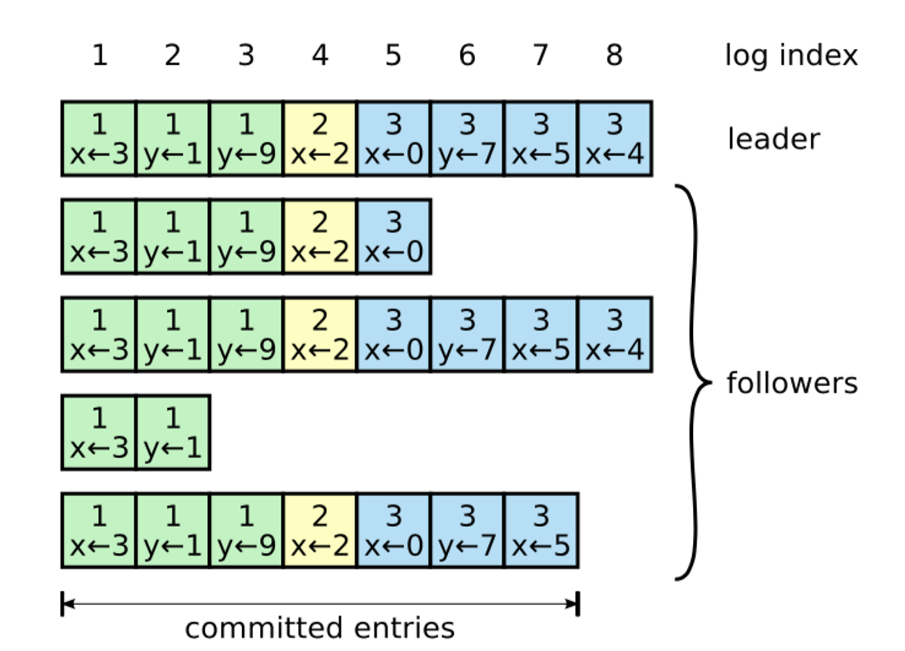
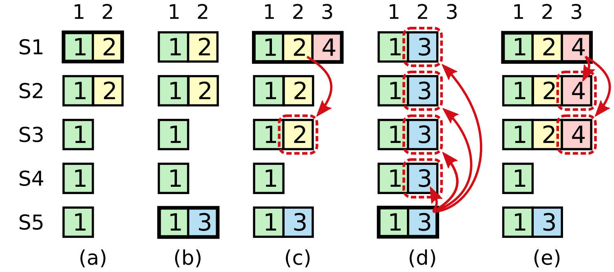
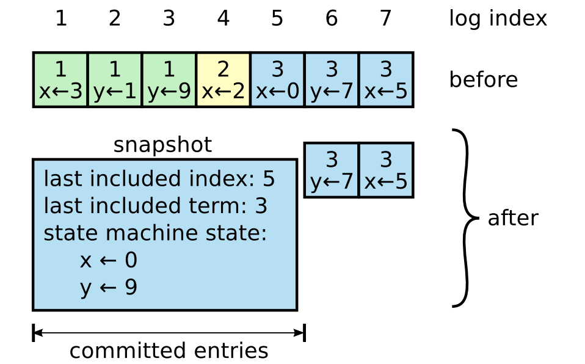
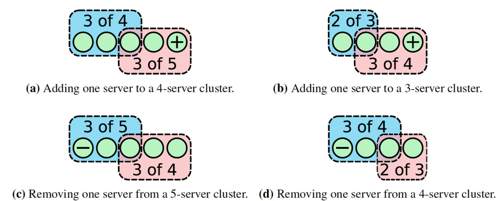
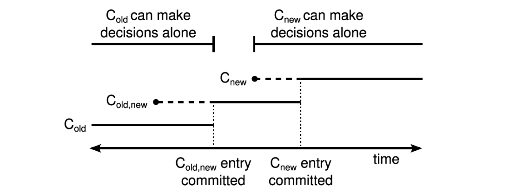

## Raft原理

Raft首先选举一个`leader`，然后`leader`负责管理所有的`replicated log`。`Leader`从`client`接受`log entries`，并将其复制到集群中的其他`server`，然后告诉它们何时能够安全的应用这些`log entries`到他们的状态机。通过这种方式，Raft将共识算法的实现分成三个相对独立的部分：

- **选主（Leader election）**：当前`leader`失效时必须选举新的`leader`。
- **复制日志（Log replication）**：`Leader`必须接收来自`client`的`log entires`并将其复制到整个`cluster`，强制其他`log`认同自身的`log`。
- **安全（Safety）**：如果某个`server`的状态机在某个特定的`index`应用了某条`log entry`，则其他任何`server`都不能在相同的`index`应用一条不同的`log entry`。

### Leader选举

Raft 使用心跳机制来触发 `Leader` 选举。当服务器启动时，它们会初始化为 `Follower`。一台服务器会一直保持 `Follower` 的状态，只要它们能够收到来自 `Leader` 或者 `Candidate` 的效 `RPC`。`Leader` 会向所有 `Follower` 周期性发送心跳（不带有任何日志条目的 `AppendEntries RPC`）来保证它们的 `Leader` 地位。如果一个 `Follower` 在一个周期内没有收到心跳信息，就会触发选举超时，然后它就会认为没有可用的 `Leader`，并且开始一次选举以选出一个新的 `Leader`。

为了开始选举，一个 `Follower` 会自增它的当前任期并且转换状态为 `Candidate`。然后，它会给自己投票并且给集群中的其他服务器发送 `RequestVote RPC`。一个 `Candidate` 会一直处于该状态，直到下列三种情形之一发生：

### 日志复制

一旦选出了 `Leader`，它就开始接收客户端的请求。每一个客户端请求都包含一条需要被复制状态机（`Replicated State Machine`）执行的命令。`Leader`把这条命令作为新的日志条目加入到它的日志中去，然后并行的向其它服务器发起 `AppendEntries RPC`，要求其它服务器复制这个条目。当这个条目被安全的复制之后（下面的部分会详细阐述），`Leader`会将这个条目应用到它的状态机中并且会向客户端返回执行结果。如果 `Follower`崩溃了或者运行缓慢或者是网络丢包了，`Leader`会无限的重试 `AppendEntries RPC`（甚至在它向客户端响应之后），直到有的 `Follower`最终存储了所有的日志条目。

Leader 决定什么时候将日志条目应用到状态机是安全的；这种条目被称为是已提交的（Committed）。Raft 保证已提交的日志条目是持久化的，并且最终会被所有可用的状态机执行。**一旦被 Leader 创建的条目已经复制到了大多数的服务器上，这个条目就称为已提交的（7号条目）**。

在Raft算法中，Leader 通过**强制 Follower 复制它的日志**来处理日志的不一致。这就意味着，在 Follower 上的冲突日志会被领导者的日志覆盖。Leader 给每一个Follower 维护了一个 nextIndex，它表示 Leader 将要发送给该追随者的下一条日志条目的索引。

### 安全性

如果一个Follower相比Leader少提交了几条日志，这个Follower在之后的选举中仍然能被选举为新的Leader，那么之前Leader已提交的日志则可能被覆盖。因此Raft仍然需要添加几条限制来保证安全性。

- 多数投票规则

**已经commit的消息，一定会存在于后续的Leader节点上，并且绝对不会在后续操作中被删除。**

- ##### 提交规则

 **Leader只对自己任期内的日志条目适用该规则，先前任期的条目只能由当前任期的提交而间接被提交。** 也就是说，当前任期的Leader，不会去负责之前term的日志提交，之前term的日志提交，只会随着当前term的日志提交而间接提交。

**要避免！！！！**
**(c) 中 S1 恢复并成为了 Leader，并且将日志复制给了多数结点，之后进行了一个致命操作，将 index 为 2 的日志提交了，然后 S1 下线。** (d) 中 S5 恢复，并从 S2、S3、S4 处获得了足够投票，然后将已提交的 index 为 2 的日志覆盖了。

### 日志压缩

在实际的系统中，不能让日志无限增长，否则系统重启时需要花很长的时间进行回放，从而影响可用性。Raft采用对整个系统进行snapshot来解决，**snapshot之前的日志都可以丢弃**。

每个副本独立的对自己的系统状态进行snapshot，并且**只能对已经提交的日志记录进行snapshot**。

当Leader要发给某个日志落后太多的Follower的log entry被丢弃，Leader会将snapshot发给Follower。或者当新加进一台机器时，也会发送snapshot给它。

### 动态成员变更存在的问题

在Raft中有一个很重要的安全性保证就是只有一个Leader，如果我们在不加任何限制的情况下，动态的向集群中添加成员，那么就可能导致同一个任期下存在多个Leader的情况，这是非常危险的。

#### 单节点成员变更

在同一个Term中，Cold和Cnew中交集的那一个节点只会进行一次投票，要么投票给Cold，要么投票给Cnew，这样就避免了同一Term下出现两个Leader。

#### 多节点联合共识

采用了两阶段提交的思想。

1. Cold,new日志在提交之前，在这个阶段，Cold,new中的所有节点有可能处于Cold的配置下，也有可能处于Cold,new的配置下，如果这个时候原Leader宕机了，无论是发起新一轮投票的节点当前的配置是Cold还是Cold,new，都需要Cold的节点同意投票，所以不会出现两个Leader。也就是old节点不可能同时follow两个leader。 
2. Cold,new提交之后，Cnew下发之前，此时所有Cold,new的配置已经在Cold和Cnew的大多数节点上，如果集群中的节点超时，那么肯定只有有Cold,new配置的节点才能成为Leader，所以不会出现两个Leader 
3. Cnew下发以后，Cnew提交之前，此时集群中的节点可能有三种，Cold的节点（可能一直没有收到请求）， Cold,new的节点，Cnew的节点，其中Cold的节点因为没有最新的日志的，集群中的大多数节点是不会给他投票的，剩下的持有Cnew和Cold,new的节点，无论是谁发起选举，都需要Cnew同意，那么也是不会出现两个Leader