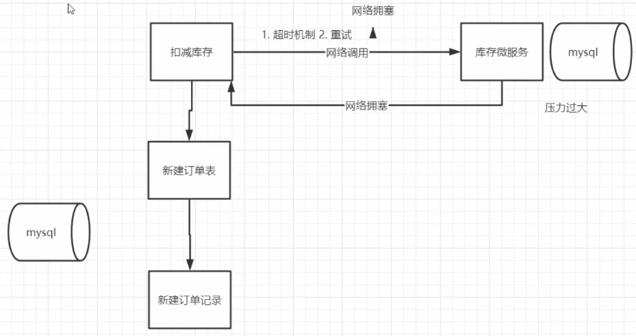

# 零

## 1. 项目架构


---

## 2.


# 一. 用户服务

## 1. srv接口

```go
// UserServer is the server API for User service.
type UserServer interface {
	GetUserInfoList(context.Context, *PageInfo) (*UserListResponse, error) //用户列表
	GetUserByMobile(context.Context, *MobileRequest) (*UserInfoResponse, error) //通过mobile查询用户
	GetUserById(context.Context, *IdRequest) (*UserInfoResponse, error) //通过id查询用户
	CreateUser(context.Context, *CreateUserInfo) (*UserInfoResponse, error) //创建用户
	UpdateUser(context.Context, *UpdateUserInfo) (*empty.Empty, error) //更新用户
	CheckPassWord(context.Context, *PasswordCheckInfo) (*CheckResponse, error) //检查密码
}
```


## 2. 获取用户信息列表

1. 数据分页

```go
// Paginate 将数据进行分页
func Paginate(page, pageSize int) func(db *gorm.DB) *gorm.DB {
	return func(db *gorm.DB) *gorm.DB {
		if page == 0 {
			page = 1
		}

		switch {
		case pageSize > 100:
			pageSize = 100
		case pageSize <= 0:
			pageSize = 10
		}

		offset := (page - 1) * pageSize
		return db.Offset(offset).Limit(pageSize)
	}
}

global.DB.Scopes(Paginate(int(req.Pn), int(req.Psize))).Find(&users)
```

2. `Birthday` 字段是一个指针类型（ `*time.Time`），这意味着它可以为 `nil`。在将其转换为 `proto.UserInfoResponse` 时，需要检查该字段是否为 `nil`，以避免在对其调用方法时出现 `nil pointer dereference` 错误。

```go
	if user.Birthday != nil {
		userInfoRsp.Birthday = uint64(user.Birthday.Unix())
	}
```


## 3. 创建用户

### 3.1 加密算法

- **MD5信息摘要算法**

MD5生成的哈希值长度固定为128位；MD5已经被证明存在**碰撞攻击**；常用密码可以用**彩虹表暴力破解**

```go
func GenerateMD5Hash(input string) string {
    hasher := md5.New()
    // hasher := sha256.New() 
    hasher.Write([]byte(input))
    // 计算 MD5 哈希值并将其转换为十六进制字符串形式
    // Sum方法是追加一个值一并生成hash。传入nil得到str的hash值
    hash := hasher.Sum(nil)
    return hex.EncodeToString(hash)
}
```

- 加盐：将密码变为：随机字符串+用户密码

数据库保存密码时保存 **加密算法-盐值-加密后的密码**

用户登录时，

1. 用户输入【账号】和【密码】；
2. 系统通过用户名找到与之对应的【Hash值】和【Salt值】；
3. 系统将【Salt值】和【用户输入的密码】连接到一起；
4. 对连接后的值进行散列，得到【Hash值2】（注意是即时运算出来的值）；
5. 比较【Hash值1】和【Hash值2】是否相等，相等则表示密码正确，否则表示密码错误。


- **Bcrypt算法**

BCrypt算法**将salt随机并混入最终加密后的密码**，验证时也无需单独提供之前的salt，从而无需单独处理salt问题。

**`$2a$10$WzDl/B/Fo5g6upN4 dykWveqP5HrNw8fJ9KZZswEjh0L6LpZ8EzQ0K`**

`其中：$是分割符；2a是bcrypt加密版本号；10是cost的值；而后的前22位是salt值；再然后的字符串就是密码的密文`

生成密码和校验密码：

```java
// HashPassword hashes a plain text password using bcrypt.
func HashPassword(password string) (string, error) {
	// Generate hashed password with default cost.
	hashedPassword, err := bcrypt.GenerateFromPassword([]byte(password), bcrypt.DefaultCost)
	if err != nil {
		return "", err
	}
	return string(hashedPassword), nil
}

// CheckPasswordHash compares a bcrypt hashed password with its possible plaintext equivalent.
func CheckPasswordHash(password, hashedPassword string) bool {
	err := bcrypt.CompareHashAndPassword([]byte(hashedPassword), []byte(password))
	return err == nil
}
```

1. 虽然对同一个密码，每次生成的hash不一样，但是hash中包含了salt（hash产生过程：先随机生成salt，salt跟password进行hash）；
2. 在下次校验时，从hash中取出salt，salt跟password进行hash；得到的结果跟保存在DB中的hash进行比对。

---


## 4. test

### 4.1 gRPC测试

`UserClient` 是由 **gRPC 自动生成的客户端接口**，用于与远程的 User 服务进行通信。它提供了一系列方法，这些方法对应于 User 服务定义中的 **RPC**（Remote Procedure Call）方法。通过 `UserClient`，客户端应用可以调用远程服务的方法，就像调用本地方法一样。

```go
	Conn, err = grpc.Dial("localhost:58496", grpc.WithInsecure())
	if err != nil {
		log.Panicln("连接失败", err)
	}
	userClient = proto.NewUserClient(Conn)
```

---


# 二. 用户web

## 0. 架构

服务：1. 获取用户列表 2. 密码登录 3. 用户注册

```go
	//1. 初始化logger
    initialize.InitLogger()
    //2. 初始化配置
    initialize.InitConfig()
    //3. 初始化Router--配置跨域、路由分发、注册验证码路由、注册短信路由
    Router := initialize.Routers()
    //4. 初始化翻译
    if err := initialize.InitTrans("zh"); err != nil {
       panic(err)
    }
    //5. 初始化grpc Client--做负载均衡
    initialize.InitSrvConn()

    //将线上线下address隔离，固定本地端口，线上动态端口
    viper.AutomaticEnv()
    debug := viper.GetBool("MXSHOP_DEBUG")
    if !debug {
       port, err := utils.GetFreePort()
       global.ServerConfig.Port = port
       if err != nil {
          zap.S().Errorw("获取端口失败", err)
       }
    }

    //注册验证器,将自定义validator放入翻译器中
    if v, ok := binding.Validator.Engine().(*validator.Validate); ok {
       v.RegisterValidation("mobile", myvalidator.ValidatorMobile)
       _ = v.RegisterTranslation("mobile", global.Trans, func(ut ut.Translator) error {
          return ut.Add("mobile", "{0} 非法的手机号码!", true) // see universal-translator for details
       }, func(ut ut.Translator, fe validator.FieldError) string {
          t, _ := ut.T("mobile", fe.Field())
          return t
       })
    }

	//注册服务到consul
    registry_client := consul.NewRegistryClient(global.ServerConfig.ConsulInfo.Host, global.ServerConfig.ConsulInfo.Port)
    id := uuid.NewV4()
    serverIdstr := fmt.Sprintf("%s", id)
    err := registry_client.Register(global.ServerConfig.Host, global.ServerConfig.Port, global.ServerConfig.Name, global.ServerConfig.Tag, serverIdstr)
    if err != nil {
       zap.S().Panic("服务注册失败", err.Error())
    }

    //启动服务
    go func() {
       zap.S().Debugf("服务启动：%d", global.ServerConfig.Port)
       if err := Router.Run(fmt.Sprintf(":%d", global.ServerConfig.Port)); err != nil {
          zap.S().Panic("启动失败", err.Error())
       }
    }()

    //接收终止信号 Signal表示操作系统信号
    qiut := make(chan os.Signal)
    //接收control+c
    signal.Notify(qiut, syscall.SIGINT, syscall.SIGTERM)
    <-qiut
    err = registry_client.DeRegister(serverIdstr)
    if err != nil {
       zap.S().Info("注销失败", err)
    } else {
       zap.S().Info("注销成功")
    }
```


## 1. zap日志

`logger.Sugar()` 方法可以将一个 `Logger` 对象转换成一个 `SugaredLogger` 对象，`SugaredLogger` 提供了更人性化的接口

S() 获取一个全局的sugar，日志分级别：debug info warn error fetal（生产环境不显示debug）

```go
	// logger, _ := zap.NewProduction()
	logger, _ := zap.NewDevelopment()
    // 替代全局 logger
	zap.ReplaceGlobals(logger)

	// S()可以获取一个全局的sugar，提供锁安全访问logger
    // 使用 Info 记录简单的信息
    zap.S().Info("This is a simple info message")

    // 使用 Infof 记录格式化的信息
    zap.S().Infof("This is a formatted info message with a value: %d", 42)

    // 使用 Infow 记录结构化的信息
    zap.S().Infow("This is a structured info message",
        "key1", "value1",
        "key2", 42,
        "key3", true,
    )
```


## 2. viper配置文件

1. 隔离线上线下环境
2. 读取配置文件并将其实例化到结构体中（使用 `mapstructure` 标签来指定结构体字段和配置文件键之间的映射）

```go
	// GetEnvInfo 通过环境变量 将线上线下环境隔离
	func GetEnvInfo(env string) bool {
		viper.AutomaticEnv()
		return viper.GetBool(env)
	}

	configFileName...
	v := viper.New()
	v.SetConfigFile(configFileName)
	if err := v.ReadInConfig(); err != nil {
		panic(err)
	}
	// 将数据放入global.ServerConfig 
	if err := v.Unmarshal(global.NacosConfig); err != nil {
		panic(err)
	}
	zap.S().Info("配置信息：", global.NacosConfig)
```


## 3. validator库-参数验证

1. 对请求参数进行验证并返回错误信息
2. **自定义翻译器**，返回中文信息；处理json数据返回想要的部分
3. **自定义验证器**，对mobile进行校验，并注册翻译器

```go
type PassWordLoginForm struct {
	Mobile    string `from:"mobile" json:"mobile" binding:"required,mobile"`
	Password  string `from:"password" json:"password" binding:"required,min=3,max=20"`
}

//ValidatorMobile 自定义手机号码的验证器
func ValidatorMobile(fl validator.FieldLevel) bool {
	mobile := fl.Field().String()
	//使用正则表达式准标准库：regexp
	ok, _ := regexp.MatchString(`^1([38][0-9]|14[579]|5[^4]|16[6]|7[1-35-8]|9[189])\d{8}$`, mobile)
	if !ok {
		return false
	}
	return true
}

//注册验证器,将自定义validator放入翻译器中
if v, ok := binding.Validator.Engine().(*validator.Validate); ok {
    v.RegisterValidation("mobile", myvalidator.ValidatorMobile)
    _ = v.RegisterTranslation("mobile", global.Trans, func(ut ut.Translator) error {
       return ut.Add("mobile", "{0} 非法的手机号码!", true) // see universal-translator for details
    }, func(ut ut.Translator, fe validator.FieldError) string {
       t, _ := ut.T("mobile", fe.Field())
       return t
    })
}
```


## 4. 登陆验证 JWT

### 4.1 Cookie + Session

- 首次登录验证成功之后，后端会创建一个 Session 对象然后保存到缓存或者数据库里
- 然后在响应登录接口的响应头里，**设置 Set-Cookie 字段，并把 SessionId 等信息写入进去**，并设置过期时间，这些信息就是 Cookie，然后浏览器会保存这些 Cookie 信息
- 然后之后再发送请求的时候，如果当前域名有保存 Cookie 信息的话，浏览器会自动在请求头上添加 Cookie 字段，并带上保存的 Cookie 信息
- 然后后端接收到请求后，会把请求头中的 Cookie 信息提取出来和存在服务器的对应的 Session 信息作对比，如果一致就说明登录验证成功了，不需要再重复登录

基于session验证登陆：**session需要保存到数据库，使用分布式集群存储**；
cookie容易被截获；


---

### 4.2   json web token

JWT 的格式：

```css
header.payload.signature
```

Header 部分是一个 JSON 对象，描述 JWT 的元数据，通常是下面的样子。`alg`属性表示**签名的算法**（algorithm），默认是 HMAC SHA256（写成 HS256）；`typ`属性表示这个令牌（token）的类型（type），JWT 令牌统一写为`JWT`。

> ```javascript
> {
> "alg": "HS256",
> "typ": "JWT"
> }
> ```

Payload 部分也是一个 JSON 对象，用来存放**实际需要传递的数据**。JWT 规定了7个官方字段，供选用。注意，JWT 默认是不加密的，任何人都可以读到，所以不要把秘密信息放在这个部分。

> - iss (issuer)：签发人
> - exp (expiration time)：**过期时间**
> - sub (subject)：主题
> - aud (audience)：受众
> - nbf (Not Before)：生效时间
> - iat (Issued At)：签发时间
> - jti (JWT ID)：编号

```go
jwt.StandardClaims{
	NotBefore: time.Now().Unix(),
	ExpiresAt: time.Now().Unix() + 60*60*24*30, //30天过期
	Issuer:    "ice_moss",
}
```

**Signature 部分是对前两部分的签名**，防止数据篡改。需要指定一个密钥（secret）。这个密钥只有服务器才知道，不能泄露给用户。然后，使用 Header 里面指定的签名算法（默认是 HMAC SHA256），按照下面的公式产生签名。

> ```javascript
> HMACSHA256(
> base64UrlEncode(header) + "." +
> base64UrlEncode(payload),
> secret)
> ```

- **JWT 的缺点**

  由于服务器不保存 session 状态，因此无法在使用过程中**废止某个 token**，或者更改 token 的权限。也就是说，一旦 JWT 签发了，在到期之前就会始终有效，除非服务器部署额外的逻辑。

- 验证 JWT **合法性**的方法

  通过**使用密钥对 JWT 的头部和载荷进行签名**，并与 JWT 中的签名进行比较，从而确保 JWT 是合法的

- 实现**单一设备登录**

  服务器为每次登录生成一个唯一的 Session ID（例如使用 **UUID**）。将 Session ID **存储在 JWT 的 Payload** 中。服务器查询存储中的 Session ID 并与 JWT 中的 Session ID 进行比较。

---

### 4.3 跨域请求

在非简单请求且跨域的情况下，浏览器会在发起实际的跨域请求之前先发送一个 **`OPTIONS` 预检请求**。

> 1. **使用了除 GET、HEAD 以外的 HTTP 方法**：
>
> - 如 POST、PUT、DELETE、PATCH 等。
>
> 2. **自定义的 HTTP 头**：
>
> - 请求包含自定义的头信息（例如 Authorization）。
>
> 3. **Content-Type 不为以下三种之一**：
>
> - `application/x-www-form-urlencoded`
> - `multipart/form-data`
> - `text/plain`

`````go
// Cors 解决浏览器跨越问题，后端解决方法
func Cors() gin.HandlerFunc {
	return func(c *gin.Context) {
		Method := c.Request.Method

		// 允许所有域名进行跨域请求
		c.Header("Access-Control-Allow-Origin", "*")
		c.Header("Access-Control-Allow-Headers", "Content-Type,AccessToken,X-CSRF-Token, Authorization, Token, x-token")
		c.Header("Access-Control-Allow-Methods", "POST, GET, OPTIONS, DELETE, PATCH, PUT")
		c.Header("Access-Control-Expose-Headers", "Content-Length, Access-Control-Allow-Origin, Access-Control-Allow-Headers, Content-Type")
		c.Header("Access-Control-Allow-Credentials", "true")

		if Method == "OPTIONS" {
			c.AbortWithStatus(http.StatusNoContent)
		}
	}
}
`````

---


## 5. 图片验证码和短信

验证码路由：前端返回 **验证码id** 和 **用户输入**

短信路由：将生成的验证码保存到**redis**，前端返回 **用户输入**

```go
//InitBaseRouter 注册图片验证码路由
func InitBaseRouter(router *gin.RouterGroup) {
	//设置路由
	BaseRouter := router.Group("base")
	{
		BaseRouter.GET("captcha", api.GetChaptcha)
		BaseRouter.POST("send_sms", api.SendSms)
	}
}
```

图片验证部分代码：

```go
	// 图片验证对象
	var store = base64Captcha.DefaultMemStore

	// GetChaptcha 生成图片验证码
	func GetChaptcha(ctx *gin.Context) {
    	// 单个数字的最大绝对倾斜因子：0.7  噪点：80
    	digit := base64Captcha.NewDriverDigit(80, 240, 4, 0.7, 80)
    	cp := base64Captcha.NewCaptcha(digit, store)
    	// base64可以直接解码成验证码图片
    	id, base64, err := cp.Generate()
	}

	//图片验证码验证
	if !store.Verify(PasswordLoginForm.CaptchaId, PasswordLoginForm.Captcha, true) {
		c.JSON(http.StatusBadRequest, gin.H{
			"msg": "验证码错误",
		})
		return
	}
```


# 三. 微服务

## 1. [consul 注册中心](https://yushen611.github.io/post/goBE-consul&grpc/)


1. 当 Producer 启动的时候，会向 Consul 发送一个 post 请求，告诉 Consul 自己的 IP 和 Port；

2. Consul 接收到 Producer 的注册后，每隔 10s（默认）会向 Producer 发送一个**健康检查**的请求，检验 Producer 是否健康；

3. 当 Consumer 发送 GET 方式请求 /api/address 到 Producer 时，会先从 Consul 中拿到一个**存储服务 IP 和 Port 的临时表**，从表中拿到 Producer 的 IP 和 Port 后再发送 GET 方式请求 /api/address；

4. 该临时表每隔 10s 会更新，只包含有通过了健康检查的 Producer。

---


## 2. 负载均衡

1. 集中式load balance：基于硬件或软件，流量大，要做分布式处理，成为性能瓶颈

2. 进程内load balance：服务注册中心维护服务提供方的节点列表；消费者维护这个列表，自己做load balance。
   不同语言要开发不同的sdk。

3. 独立进程load balance：这个组件的可用性怎么维护？

   

负载均衡算法：

1. 轮询法：一个一个发       

2. 加权轮询：权重高的服务器分配更多请求，适用于服务器性能不均衡的情况

3. 源地址哈希：同一ip的请求映射到同一台服务器

   > 一致性哈希算法将 key 映射到 2^32 的空间中，将这个数字首尾相连，形成一个环。
   >
   > - 计算节点/机器(通常使用节点的名称、编号和 IP 地址)的哈希值，放置在环上。
   > - 计算 key 的哈希值，放置在环上，顺时针寻找到的第一个节点，就是应选取的节点/机器。
   >
   > 
   >
   > 环上有 peer2，peer4，peer6 三个节点，`key11`，`key2`，`key27` 均映射到 peer2，`key23` 映射到 peer4。此时，如果新增节点/机器 peer8，假设它新增位置如图所示，那么只有 `key27` 从 peer2 调整到 peer8，其余的映射均没有发生改变。
   >
   > 如果服务器的节点过少，容易引起 key 的倾斜。为了解决这个问题，引入了虚拟节点的概念，一个真实节点对应多个虚拟节点。虚拟节点扩充了节点的数量，解决了节点较少的情况下数据容易倾斜的问题。而且代价非常小，只需要增加一个字典(map)维护真实节点与虚拟节点的映射关系即可。

4. 最小连接数法：谁的连接少，就连谁

5. CPU 使用率最少法

```go
/*
grpc.Dial 方法用于创建一个 gRPC 连接。
使用 fmt.Sprintf 构建 Consul URL，包含主机、端口和服务名，还设置了一些查询参数（如 wait=14s 和 tag=srv）。
grpc.WithInsecure() 表示不使用 TLS 连接（仅在开发或内部网络中使用）。
grpc.WithDefaultServiceConfig 设置 gRPC 的负载均衡策略为 round_robin，即轮询。
grpc.WithUnaryInterceptor 使用 OpenTracing 进行追踪，拦截每一个 Unary RPC 调用。
*/
conn, err := grpc.Dial(
    fmt.Sprintf("consul://%s:%d/%s?wait=14s&tag=srv", consul.Host, consul.Port, global.ServerConfig.UserSerInfo.Name),
    grpc.WithInsecure(),
    grpc.WithDefaultServiceConfig(`{"loadBalancingPolicy": "round_robin"}`),
    grpc.WithUnaryInterceptor(otgrpc.OpenTracingClientInterceptor(opentracing.GlobalTracer())),
)
```

---


# 三. 库存服务

### 1. 库存扣减



