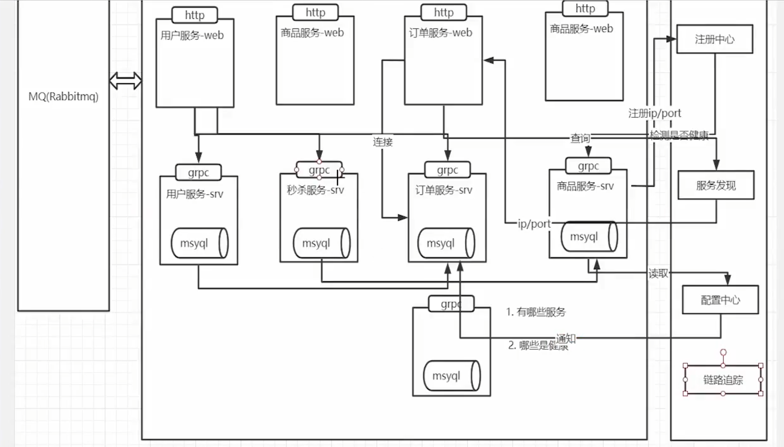
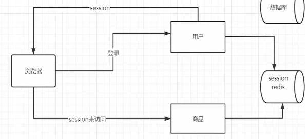

# 零

## 1. 项目架构




---

## 2.


# 一. 用户服务

## 0. srv接口

```go
// UserServer is the server API for User service.
type UserServer interface {
	GetUserInfoList(context.Context, *PageInfo) (*UserListResponse, error) //用户列表
	GetUserByMobile(context.Context, *MobileRequest) (*UserInfoResponse, error) //通过mobile查询用户
	GetUserById(context.Context, *IdRequest) (*UserInfoResponse, error) //通过id查询用户
	CreateUser(context.Context, *CreateUserInfo) (*UserInfoResponse, error) //创建用户
	UpdateUser(context.Context, *UpdateUserInfo) (*empty.Empty, error) //更新用户
	CheckPassWord(context.Context, *PasswordCheckInfo) (*CheckResponse, error) //检查密码
}
```


## 1. 获取用户信息列表

1. 数据分页

```go
// Paginate 将数据进行分页
func Paginate(page, pageSize int) func(db *gorm.DB) *gorm.DB {
	return func(db *gorm.DB) *gorm.DB {
		if page == 0 {
			page = 1
		}

		switch {
		case pageSize > 100:
			pageSize = 100
		case pageSize <= 0:
			pageSize = 10
		}

		offset := (page - 1) * pageSize
		return db.Offset(offset).Limit(pageSize)
	}
}

global.DB.Scopes(Paginate(int(req.Pn), int(req.Psize))).Find(&users)
```

2. `Birthday` 字段是一个指针类型（ `*time.Time`），这意味着它可以为 `nil`。在将其转换为 `proto.UserInfoResponse` 时，需要检查该字段是否为 `nil`，以避免在对其调用方法时出现 `nil pointer dereference` 错误。

```go
	if user.Birthday != nil {
		userInfoRsp.Birthday = uint64(user.Birthday.Unix())
	}
```


## 2. 创建用户

### 2.1 加密算法

- **MD5信息摘要算法**

MD5生成的哈希值长度固定为128位；MD5已经被证明存在**碰撞攻击**；常用密码可以用**彩虹表暴力破解**

```go
func GenerateMD5Hash(input string) string {
    hasher := md5.New()
    // hasher := sha256.New() 
    hasher.Write([]byte(input))
    // 计算 MD5 哈希值并将其转换为十六进制字符串形式
    // Sum方法是追加一个值一并生成hash。传入nil得到str的hash值
    hash := hasher.Sum(nil)
    return hex.EncodeToString(hash)
}
```

- 加盐：将密码变为：随机字符串+用户密码

数据库保存密码时保存 **加密算法-盐值-加密后的密码**

用户登录时，

1. 用户输入【账号】和【密码】；
2. 系统通过用户名找到与之对应的【Hash值】和【Salt值】；
3. 系统将【Salt值】和【用户输入的密码】连接到一起；
4. 对连接后的值进行散列，得到【Hash值2】（注意是即时运算出来的值）；
5. 比较【Hash值1】和【Hash值2】是否相等，相等则表示密码正确，否则表示密码错误。


- **Bcrypt算法**

BCrypt算法**将salt随机并混入最终加密后的密码**，验证时也无需单独提供之前的salt，从而无需单独处理salt问题。

**`$2a$10$WzDl/B/Fo5g6upN4 dykWveqP5HrNw8fJ9KZZswEjh0L6LpZ8EzQ0K`**

`其中：$是分割符；2a是bcrypt加密版本号；10是cost的值；而后的前22位是salt值；再然后的字符串就是密码的密文`

生成密码和校验密码：

```java
// HashPassword hashes a plain text password using bcrypt.
func HashPassword(password string) (string, error) {
	// Generate hashed password with default cost.
	hashedPassword, err := bcrypt.GenerateFromPassword([]byte(password), bcrypt.DefaultCost)
	if err != nil {
		return "", err
	}
	return string(hashedPassword), nil
}

// CheckPasswordHash compares a bcrypt hashed password with its possible plaintext equivalent.
func CheckPasswordHash(password, hashedPassword string) bool {
	err := bcrypt.CompareHashAndPassword([]byte(hashedPassword), []byte(password))
	return err == nil
}
```

1. 虽然对同一个密码，每次生成的hash不一样，但是hash中包含了salt（hash产生过程：先随机生成salt，salt跟password进行hash）；
2. 在下次校验时，从hash中取出salt，salt跟password进行hash；得到的结果跟保存在DB中的hash进行比对。

---


## 3. test

### 3.1 gRPC测试

`UserClient` 是由 **gRPC 自动生成的客户端接口**，用于与远程的 User 服务进行通信。它提供了一系列方法，这些方法对应于 User 服务定义中的 **RPC**（Remote Procedure Call）方法。通过 `UserClient`，客户端应用可以调用远程服务的方法，就像调用本地方法一样。

```go
	Conn, err = grpc.Dial("localhost:58496", grpc.WithInsecure())
	if err != nil {
		log.Panicln("连接失败", err)
	}
	userClient = proto.NewUserClient(Conn)
```

---


# 二. 用户web

## 0. 架构

服务：1. 获取用户列表 2. 密码登录 3. 用户注册

```go
	//1. 初始化logger
    initialize.InitLogger()
    //2. 初始化配置
    initialize.InitConfig()
    //3. 初始化Router--配置跨域、路由分发、注册验证码路由、注册短信路由
    Router := initialize.Routers()
    //4. 初始化翻译
    if err := initialize.InitTrans("zh"); err != nil {
       panic(err)
    }
    //5. 初始化grpc Client--做负载均衡
    initialize.InitSrvConn()

    //将线上线下address隔离，固定本地端口，线上动态端口
    viper.AutomaticEnv()
    debug := viper.GetBool("MXSHOP_DEBUG")
    if !debug {
       port, err := utils.GetFreePort()
       global.ServerConfig.Port = port
       if err != nil {
          zap.S().Errorw("获取端口失败", err)
       }
    }

    //注册验证器,将自定义validator放入翻译器中
    if v, ok := binding.Validator.Engine().(*validator.Validate); ok {
       v.RegisterValidation("mobile", myvalidator.ValidatorMobile)
       _ = v.RegisterTranslation("mobile", global.Trans, func(ut ut.Translator) error {
          return ut.Add("mobile", "{0} 非法的手机号码!", true) // see universal-translator for details
       }, func(ut ut.Translator, fe validator.FieldError) string {
          t, _ := ut.T("mobile", fe.Field())
          return t
       })
    }

	//注册服务到consul
    registry_client := consul.NewRegistryClient(global.ServerConfig.ConsulInfo.Host, global.ServerConfig.ConsulInfo.Port)
    id := uuid.NewV4()
    serverIdstr := fmt.Sprintf("%s", id)
    err := registry_client.Register(global.ServerConfig.Host, global.ServerConfig.Port, global.ServerConfig.Name, global.ServerConfig.Tag, serverIdstr)
    if err != nil {
       zap.S().Panic("服务注册失败", err.Error())
    }

    //启动服务
    go func() {
       zap.S().Debugf("服务启动：%d", global.ServerConfig.Port)
       if err := Router.Run(fmt.Sprintf(":%d", global.ServerConfig.Port)); err != nil {
          zap.S().Panic("启动失败", err.Error())
       }
    }()

    //接收终止信号 Signal表示操作系统信号
    qiut := make(chan os.Signal)
    //接收control+c
    signal.Notify(qiut, syscall.SIGINT, syscall.SIGTERM)
    <-qiut
    err = registry_client.DeRegister(serverIdstr)
    if err != nil {
       zap.S().Info("注销失败", err)
    } else {
       zap.S().Info("注销成功")
    }
```


## 1. zap日志

`logger.Sugar()` 方法可以将一个 `Logger` 对象转换成一个 `SugaredLogger` 对象，`SugaredLogger` 提供了更人性化的接口

S() 获取一个全局的sugar，日志分级别：debug info warn error fetal（生产环境不显示debug）

```go
	// logger, _ := zap.NewProduction()
	logger, _ := zap.NewDevelopment()
    // 替代全局 logger
	zap.ReplaceGlobals(logger)

	// S()可以获取一个全局的sugar，提供锁安全访问logger
    // 使用 Info 记录简单的信息
    zap.S().Info("This is a simple info message")

    // 使用 Infof 记录格式化的信息
    zap.S().Infof("This is a formatted info message with a value: %d", 42)

    // 使用 Infow 记录结构化的信息
    zap.S().Infow("This is a structured info message",
        "key1", "value1",
        "key2", 42,
        "key3", true,
    )
```


## 2. viper配置文件

1. 隔离线上线下环境
2. 读取配置文件并将其实例化到结构体中（使用 `mapstructure` 标签来指定结构体字段和配置文件键之间的映射）

```go
	// GetEnvInfo 通过环境变量 将线上线下环境隔离
	func GetEnvInfo(env string) bool {
		viper.AutomaticEnv()
		return viper.GetBool(env)
	}

	configFileName...
	v := viper.New()
	v.SetConfigFile(configFileName)
	if err := v.ReadInConfig(); err != nil {
		panic(err)
	}
	// 将数据放入global.ServerConfig 
	if err := v.Unmarshal(global.NacosConfig); err != nil {
		panic(err)
	}
	zap.S().Info("配置信息：", global.NacosConfig)
```


## 3. validator库-参数验证

1. 对请求参数进行验证并返回错误信息
2. **自定义翻译器**，返回中文信息；处理json数据返回想要的部分
3. **自定义验证器**，对mobile进行校验，并注册翻译器

```go
type PassWordLoginForm struct {
	Mobile    string `from:"mobile" json:"mobile" binding:"required,mobile"`
	Password  string `from:"password" json:"password" binding:"required,min=3,max=20"`
}

//ValidatorMobile 自定义手机号码的验证器
func ValidatorMobile(fl validator.FieldLevel) bool {
	mobile := fl.Field().String()
	//使用正则表达式准标准库：regexp
	ok, _ := regexp.MatchString(`^1([38][0-9]|14[579]|5[^4]|16[6]|7[1-35-8]|9[189])\d{8}$`, mobile)
	if !ok {
		return false
	}
	return true
}

//注册验证器,将自定义validator放入翻译器中
if v, ok := binding.Validator.Engine().(*validator.Validate); ok {
    v.RegisterValidation("mobile", myvalidator.ValidatorMobile)
    _ = v.RegisterTranslation("mobile", global.Trans, func(ut ut.Translator) error {
       return ut.Add("mobile", "{0} 非法的手机号码!", true) // see universal-translator for details
    }, func(ut ut.Translator, fe validator.FieldError) string {
       t, _ := ut.T("mobile", fe.Field())
       return t
    })
}
```


## 4. 登陆验证 JWT

### 4.1 Cookie + Session

- 首次登录验证成功之后，后端会创建一个 Session 对象然后保存到缓存或者数据库里
- 然后在响应登录接口的响应头里，**设置 Set-Cookie 字段，并把 SessionId 等信息写入进去**，并设置过期时间，这些信息就是 Cookie，然后浏览器会保存这些 Cookie 信息
- 然后之后再发送请求的时候，如果当前域名有保存 Cookie 信息的话，浏览器会自动在请求头上添加 Cookie 字段，并带上保存的 Cookie 信息
- 然后后端接收到请求后，会把请求头中的 Cookie 信息提取出来和存在服务器的对应的 Session 信息作对比，如果一致就说明登录验证成功了，不需要再重复登录

基于session验证登陆：**session需要保存到数据库，使用分布式集群存储**；
cookie容易被截获；



---

### 4.2   json web token

JWT 的格式：

```css
header.payload.signature
```

Header 部分是一个 JSON 对象，描述 JWT 的元数据，通常是下面的样子。`alg`属性表示**签名的算法**（algorithm），默认是 HMAC SHA256（写成 HS256）；`typ`属性表示这个令牌（token）的类型（type），JWT 令牌统一写为`JWT`。

> ```javascript
> {
> "alg": "HS256",
> "typ": "JWT"
> }
> ```

Payload 部分也是一个 JSON 对象，用来存放**实际需要传递的数据**。JWT 规定了7个官方字段，供选用。注意，JWT 默认是不加密的，任何人都可以读到，所以不要把秘密信息放在这个部分。

> - iss (issuer)：签发人
> - exp (expiration time)：**过期时间**
> - sub (subject)：主题
> - aud (audience)：受众
> - nbf (Not Before)：生效时间
> - iat (Issued At)：签发时间
> - jti (JWT ID)：编号

```go
jwt.StandardClaims{
	NotBefore: time.Now().Unix(),
	ExpiresAt: time.Now().Unix() + 60*60*24*30, //30天过期
	Issuer:    "ice_moss",
}
```

**Signature 部分是对前两部分的签名**，防止数据篡改。需要指定一个密钥（secret）。这个密钥只有服务器才知道，不能泄露给用户。然后，使用 Header 里面指定的签名算法（默认是 HMAC SHA256），按照下面的公式产生签名。

> ```javascript
> HMACSHA256(
> base64UrlEncode(header) + "." +
> base64UrlEncode(payload),
> secret)
> ```

- **JWT 的缺点**

  由于服务器不保存 session 状态，因此无法在使用过程中**废止某个 token**，或者更改 token 的权限。也就是说，一旦 JWT 签发了，在到期之前就会始终有效，除非服务器部署额外的逻辑。

- 验证 JWT **合法性**的方法

  通过**使用密钥对 JWT 的头部和载荷进行签名**，并与 JWT 中的签名进行比较，从而确保 JWT 是合法的

- 实现**单一设备登录**

  服务器为每次登录生成一个唯一的 Session ID（例如使用 **UUID**）。将 Session ID **存储在 JWT 的 Payload** 中。服务器查询存储中的 Session ID 并与 JWT 中的 Session ID 进行比较。

---

### 4.3 跨域请求

在非简单请求且跨域的情况下，浏览器会在发起实际的跨域请求之前先发送一个 **`OPTIONS` 预检请求**。

> 1. **使用了除 GET、HEAD 以外的 HTTP 方法**：
>
> - 如 POST、PUT、DELETE、PATCH 等。
>
> 2. **自定义的 HTTP 头**：
>
> - 请求包含自定义的头信息（例如 Authorization）。
>
> 3. **Content-Type 不为以下三种之一**：
>
> - `application/x-www-form-urlencoded`
> - `multipart/form-data`
> - `text/plain`

`````go
// Cors 解决浏览器跨越问题，后端解决方法
func Cors() gin.HandlerFunc {
	return func(c *gin.Context) {
		Method := c.Request.Method

		// 允许所有域名进行跨域请求
		c.Header("Access-Control-Allow-Origin", "*")
		c.Header("Access-Control-Allow-Headers", "Content-Type,AccessToken,X-CSRF-Token, Authorization, Token, x-token")
		c.Header("Access-Control-Allow-Methods", "POST, GET, OPTIONS, DELETE, PATCH, PUT")
		c.Header("Access-Control-Expose-Headers", "Content-Length, Access-Control-Allow-Origin, Access-Control-Allow-Headers, Content-Type")
		c.Header("Access-Control-Allow-Credentials", "true")

		if Method == "OPTIONS" {
			c.AbortWithStatus(http.StatusNoContent)
		}
	}
}
`````

---


## 5. 图片验证码和短信

验证码路由：前端返回 **验证码id** 和 **用户输入**

短信路由：将生成的验证码保存到**redis**，前端返回 **用户输入**

```go
//InitBaseRouter 注册图片验证码路由
func InitBaseRouter(router *gin.RouterGroup) {
	//设置路由
	BaseRouter := router.Group("base")
	{
		BaseRouter.GET("captcha", api.GetChaptcha)
		BaseRouter.POST("send_sms", api.SendSms)
	}
}
```

图片验证部分代码：

```go
	// 图片验证对象
	var store = base64Captcha.DefaultMemStore

	// GetChaptcha 生成图片验证码
	func GetChaptcha(ctx *gin.Context) {
    	// 单个数字的最大绝对倾斜因子：0.7  噪点：80
    	digit := base64Captcha.NewDriverDigit(80, 240, 4, 0.7, 80)
    	cp := base64Captcha.NewCaptcha(digit, store)
    	// base64可以直接解码成验证码图片
    	id, base64, err := cp.Generate()
	}

	//图片验证码验证
	if !store.Verify(PasswordLoginForm.CaptchaId, PasswordLoginForm.Captcha, true) {
		c.JSON(http.StatusBadRequest, gin.H{
			"msg": "验证码错误",
		})
		return
	}
```


# 三. 微服务

## 1. [consul 注册中心](https://yushen611.github.io/post/goBE-consul&grpc/)


1. 当 Producer 启动的时候，会向 Consul 发送一个 post 请求，告诉 Consul 自己的 IP 和 Port；

2. Consul 接收到 Producer 的注册后，每隔 10s（默认）会向 Producer 发送一个**健康检查**的请求，检验 Producer 是否健康；

3. 当 Consumer 发送 GET 方式请求 /api/address 到 Producer 时，会先从 Consul 中拿到一个**存储服务 IP 和 Port 的临时表**，从表中拿到 Producer 的 IP 和 Port 后再发送 GET 方式请求 /api/address；

4. 该临时表每隔 10s 会更新，只包含有通过了健康检查的 Producer。

---


## 2. 负载均衡

1. 集中式load balance：基于硬件或软件，流量大，要做分布式处理，成为性能瓶颈

2. 进程内load balance：服务注册中心维护服务提供方的节点列表；消费者维护这个列表，自己做load balance。
   不同语言要开发不同的sdk。

3. 独立进程load balance：这个组件的可用性怎么维护？

   

负载均衡算法：

1. 轮询法：一个一个发       

2. 加权轮询：权重高的服务器分配更多请求，适用于服务器性能不均衡的情况

3. 源地址哈希：同一ip的请求映射到同一台服务器；服务器增减后会导致取模运算发生很大的改变。

   > 一致性哈希算法将 key 映射到 2^32 的空间中，将这个数字首尾相连，形成一个环。
   >
   > - 计算节点/机器(通常使用节点的名称、编号和 IP 地址)的哈希值，放置在环上。
   > - 计算 key 的哈希值，放置在环上，顺时针寻找到的第一个节点，就是应选取的节点/机器。
   >
   > 
   >
   > 环上有 peer2，peer4，peer6 三个节点，`key11`，`key2`，`key27` 均映射到 peer2，`key23` 映射到 peer4。此时，如果新增节点/机器 peer8，假设它新增位置如图所示，那么只有 `key27` 从 peer2 调整到 peer8，其余的映射均没有发生改变。
   >
   > 如果服务器的节点过少，容易引起 key 的倾斜。为了解决这个问题，引入了虚拟节点的概念，一个真实节点对应多个虚拟节点。虚拟节点扩充了节点的数量，解决了节点较少的情况下数据容易倾斜的问题。而且代价非常小，只需要增加一个字典(map)维护真实节点与虚拟节点的映射关系即可。

4. 最小连接数法：谁的连接少，就连谁

5. CPU 使用率最少法

```go
/*
grpc.Dial 方法用于创建一个 gRPC 连接。
使用 fmt.Sprintf 构建 Consul URL，包含主机、端口和服务名，还设置了一些查询参数（如 wait=14s 和 tag=srv）。
grpc.WithInsecure() 表示不使用 TLS 连接（仅在开发或内部网络中使用）。
grpc.WithDefaultServiceConfig 设置 gRPC 的负载均衡策略为 round_robin，即轮询。
grpc.WithUnaryInterceptor 使用 OpenTracing 进行追踪，拦截每一个 Unary RPC 调用。
*/
conn, err := grpc.Dial(
    fmt.Sprintf("consul://%s:%d/%s?wait=14s&tag=srv", consul.Host, consul.Port, global.ServerConfig.UserSerInfo.Name),
    grpc.WithInsecure(),
    grpc.WithDefaultServiceConfig(`{"loadBalancingPolicy": "round_robin"}`),
    grpc.WithUnaryInterceptor(otgrpc.OpenTracingClientInterceptor(opentracing.GlobalTracer())),
)
```

---

## 3. nacos 分布式配置中心

基于本地文件配置：修改配置文件后需要重启服务；很多服务都依赖同一个配置，全部需要改；多语言多框架

1. 命名空间：可以隔离配置集，命名空间用来区分微服务
2. 组：可以用来区分 开发、测试、生产环境

根据yaml文件配置全局变量 nacosconfig  读取：

```go
nacos:
  host: '127.0.0.1'
  port: 8848
  namespace_id: 'f571d8e2-908c-4446-951c-9e9b8fb36ab1'
  user: 'nacos'
  password: 'nacos'
  data_id: 'user-srv.json'
  group: 'dev'

	//服务端配置
	sc := []constant.ServerConfig{
		{
			IpAddr: global.NacosConfig.Host,
			Port:   global.NacosConfig.Port,
		},
	}

	//客户端配置
	cc := constant.ClientConfig{
		NamespaceId:         global.NacosConfig.NamespaceId, 
		TimeoutMs:           5000,
		NotLoadCacheAtStart: true,
		LogDir:              "tmp/nacos/log",
		CacheDir:            "tmp/nacos/cache",
		LogLevel: "debug",
	}

	configClient, err := clients.CreateConfigClient(map[string]interface{}{
		"clientConfig":  cc,
		"serverConfigs": sc,
	})
	if err != nil {
		panic(err)
	}

	//获取配置
	content, err := configClient.GetConfig(vo.ConfigParam{
		DataId: global.NacosConfig.DataId,
		Group:  global.NacosConfig.Group,
	})

	if err != nil {
		panic(err)
	}
	// 读取到全局变量ServerConfig
	err = json.Unmarshal([]byte(content), &global.ServerConfig)
	if err != nil {
		panic(err)
	}
	fmt.Println(global.ServerConfig)
```

---


# 四. 商品服务

## 0. srv接口


```go
service Goods{
  //商品接口
  rpc GoodsList(GoodsFilterRequest) returns(GoodsListResponse);  //根据条件获取商品列表
  //用户提交订单有多个商品，批量查询商品的信息
  rpc BatchGetGoods(BatchGoodsIdInfo) returns(GoodsListResponse); //批量获取商品信息
  rpc CreateGoods(CreateGoodsInfo) returns (GoodsInfoResponse);   //添加商品
  rpc DeleteGoods(DeleteGoodsInfo) returns (google.protobuf.Empty); //删除商品
  rpc UpdateGoods(CreateGoodsInfo) returns (google.protobuf.Empty); //更新商品
  rpc GetGoodsDetail(GoodInfoRequest) returns(GoodsInfoResponse);   //根据id获取商品内容

  //商品分类
  rpc GetAllCategorysList(google.protobuf.Empty) returns(CategoryListResponse); //获取所有的分类
  //获取子分类
  rpc GetSubCategory(CategoryListRequest) returns(SubCategoryListResponse); //商品子分类列表
  rpc CreateCategory(CategoryInfoRequest) returns(CategoryInfoResponse); //新建分类信息
  rpc DeleteCategory(DeleteCategoryRequest) returns(google.protobuf.Empty); //删除分类
  rpc UpdateCategory(CategoryInfoRequest) returns(google.protobuf.Empty); //修改分类信息

  //品牌
  rpc BrandList(BrandFilterRequest) returns(BrandListResponse); //批量获取品牌信息
  rpc CreateBrand(BrandRequest) returns(BrandInfoResponse); //新建品牌信息
  rpc DeleteBrand(BrandRequest) returns(google.protobuf.Empty); //删除品牌
  rpc UpdateBrand(BrandRequest) returns(google.protobuf.Empty); //修改品牌信息

  //轮播图
  rpc BannerList(google.protobuf.Empty) returns(BannerListResponse); //获取轮播列表信息
  rpc CreateBanner(BannerRequest) returns(BannerResponse); //添加banner图
  rpc DeleteBanner(BannerRequest) returns(google.protobuf.Empty); //删除轮播图
  rpc UpdateBanner(BannerRequest) returns(google.protobuf.Empty); //修改轮播图

  //品牌分类
  rpc CategoryBrandList(CategoryBrandFilterRequest) returns(CategoryBrandListResponse); //获取品牌分类列表
  //通过category获取brands
  rpc GetCategoryBrandList(CategoryInfoRequest) returns(BrandListResponse);     //根据品牌分类返回品牌列表
  rpc CreateCategoryBrand(CategoryBrandRequest) returns(CategoryBrandResponse); //新增分类关联品牌
  rpc DeleteCategoryBrand(CategoryBrandRequest) returns(google.protobuf.Empty); //删除分类关联品牌
  rpc UpdateCategoryBrand(CategoryBrandRequest) returns(google.protobuf.Empty); //修改分类关联品牌
}
```

----


## 1. 阿里云oss-单体应用和微服务下的图片存储

使用gin做中转保存url和返回url有很大的性能限制。

阿里云提供了安全的**服务端签名后直传服务**。


## 1.1 内网穿透做回传

服务提供商将内网主机，内网网口映射到HTTP网站，提供外网访问。将oss的callbackUrl修改为对应的HTTP网站。


## 1.2 oss流程

1. 生成上传凭证，用户需要从服务器获取一个上传凭证，这个凭证通常包含上传策略和签名，用于权限验证。
2. 客户端上传文件，客户端使用获取到的上传凭证，将文件上传到OSS。上传凭证包含上传URL和必要的头信息，用于OSS服务的权限验证。
3. OSS回调通知，上传成功后，OSS可以配置回调通知服务器，以便服务器可以对上传的文件进行处理或记录。回调请求包含上传的文件信息和验证签名。
4. 客户端获取文件URL，服务器在处理回调请求后，返回文件的URL或其他信息给客户端。客户端可以使用这个URL来访问或下载文件。

---


# 五. 库存服务

## 0. 架构


```protobuf
service Inventory {
    rpc SetInv(GoodsInventoryInfo) returns (google.protobuf.Empty); //设置库存
    rpc InvDetail(GoodsInventoryInfo) returns (GoodsInventoryInfo); //查询库存
    rpc Sell(SellInfo) returns (google.protobuf.Empty);   //扣减库存
    rpc Reback(SellInfo) returns (google.protobuf.Empty); //归还库存
}
```


## 1. 扣减库存

1. 库存的扣减：必须确保全部成功或全部失败

```go
	tx := global.DB.Begin()
	// 失败进行事务回滚
	tx.Rollback()
	tx.Save(&inventory)
	tx.Commit()
```

2. 并发情况下可能会出现超卖、数据不一致：分布式锁

   1. 互斥性：setnx

   2. 死锁：设置**过期时间**；业务没执行完----加入守护线程延长锁

   3. 安全性：锁只能被持有该锁的用户删除，保证value值的唯一性可以防止锁在释放时被误删

      释放锁：**Lua 脚本**，先 GET 判断锁是否归属自己，再DEL 释放锁


## 2. 分布式锁

**悲观锁**：总是假设最坏的情况，每次去拿数据的时候都认为别人会修改，所以每次在拿数据的时候都会上锁，这样别人想拿这个数据就会阻塞直到它拿到锁（共享资源每次只给一个线程使用，其它线程阻塞，用完后再把资源转让给其它线程）。传统的关系型数据库里边就用到了很多这种锁机制，比如行锁，表锁等，读锁，写锁等，都是在做操作之前先上锁。

**乐观锁**：总是假设最好的情况，每次去拿数据的时候都认为别人不会修改，所以不会上锁，但是在更新的时候会判断一下在此期间别人有没有去更新这个数据，可以使用版本号机制和CAS算法实现。乐观锁适用于多读的应用类型，这样可以提高吞吐量。


### 2.1 MySQL实现悲观锁 for update

悲观锁的基本思想是“悲观地”认为并发事务会发生冲突，因此在对数据进行读写操作之前，先对数据加锁，以确保只有一个事务可以访问数据。**保证了数据一致性，但会降低并发性能**。

使用`for update`时：sql语句是默认提交的，需要关闭 `autocommit`

在**有索引**的时候：**行锁**；只会锁住满足条件的数据；只会**锁住更新语句**，select 不受影响；
没有索引会升级成**表锁**


### 2.2 乐观锁

乐观锁：事务开始时不加锁，只在提交前检查数据是否被修改，如果数据被修改则回滚并重试。乐观锁适用于**并发写操作较少**的场景，可以提高并发性能。

乐观锁基本都是基于 CAS（Compare and swap）算法来实现的。
**ABA 问题**：CAS 不能检测到值从 `A` 变成 `B`，然后又变回 `A` 的情况。这种情况下，CAS 认为值没有变化，可能导致错误。解决 ABA 问题的方法之一是**使用版本号**或标记。

```c
int cas(long *addr, long old, long new)
{
    /* Executes atomically. */
    if(*addr != old)
        return 0;
    *addr = new;
    return 1;
}
```


### 2.3 [基于redis实现分布式锁-redsync](https://cloud.tencent.com/developer/article/2211973)

1. **创建redsync对象**

在该包中创建redsync对象是通过以下函数实现的：

```go
redsync.NewPool(pool ...redis.Pool) *Redsync
```

首先，我们看到该NewPool函数接收多个redis.Pool参数，我们再看Redsync的结构体，结构体中只有一个pool属性，并且是一个redis连接池的切片，说明可以有多个redis客户端连接池。同时通过注释可以得知，Redsync可以使用多个Redis连接池创建分布式锁。


2. **创建互斥锁**

创建完Redsync实例后，就可以通过该实例中的NewMutex方法创建一个互斥锁了。就是实例化了一个Mutex对象。如下：

```go
// NewMutex returns a new distributed mutex with given name.
func (r *Redsync) NewMutex(name string, options ...Option) *Mutex {
    m := &Mutex{
        name:   name,
        expiry: 8 * time.Second,
        tries:  32,
        delayFunc: func(tries int) time.Duration {
            return time.Duration(rand.Intn(maxRetryDelayMilliSec-minRetryDelayMilliSec)+minRetryDelayMilliSec) * time.Millisecond
        },
        genValueFunc:  genValue,
        driftFactor:   0.01,
        timeoutFactor: 0.05,
        quorum:        len(r.pools)/2 + 1,
        pools:         r.pools,
    }
    for _, o := range options {
        o.Apply(m)
    }
    return m
}
```

- genValueFunc：用于生成key的value。该value值会在删除锁时用到。其作用是防止被误删锁。
- quorum：赋值len(r.pools)/2+1，也就是redis连接池数的一半+1。作用是用于**高可用性**。


3. **加锁**

加锁的本质就是使用setnx操作。

> Redis Setnx（**SET** if **N**ot e**X**ists） 命令在指定的 key 不存在时，为 key 设置指定的值。
>
> 如果 SETNX 返回1，说明该进程获得锁；如果 SETNX 返回0，说明其他进程已经获得了锁。

将mutex对象中的name作为**key**，通过genValueFunc函数生成的随机值作为**value**，并且将mutex对象中的expiry属性作为**过期时间**

```sql
SET lock_key $unique_id EX $expire_time NX
```

判断加锁成功的条件：

1. 在进行加锁操作时，循环pools（存储的是redis的连接池），让每一个客户端连接都尝试进行setnx操作，如果**操作成功的数量多余所有连接的一半**，那么才认为是加锁成功。
2. 进行加锁过程的处理时间已经接近过期时间，剩余的时间根本来不及处理加锁后的业务逻辑？？？
   用有效期时间乘以一个**driftFactro因子**，该因子默认值是0.01，**根据业务设置**。

```go
now := time.Now()
until := now.Add(m.expiry - now.Sub(start) - time.Duration(int64(float64(m.expiry)*m.driftFactor)))

if n >= m.quorum && now.Before(until) {
    m.value = value
    m.until = until
    return nil
}
```


4. **释放锁**

在加锁时给key设置了一个唯一的value值，在删除时进行判断，该value值是否是当前线程的
**Lua 脚本**，先 GET 判断锁是否归属自己，再DEL 释放锁。

```lua
var deleteScript = redis.NewScript(1, `
    if redis.call("GET", KEYS[1]) == ARGV[1] then
        return redis.call("DEL", KEYS[1])
    else
        return 0
    end
`)
```


---


# 六. 订单服务

## 0. srv接口

```protobuf
service Order {
    //购物车
    rpc CartItemList(UserInfo) returns (CartItemListResponse); //获取用户购物车列表
    rpc CreateCarItem(CartItemRequest) returns (ShopCartInfoResponse); //加入购物车
    rpc UpdateCartItem(CartItemRequest) returns (google.protobuf.Empty); //修改购物车
    rpc DeleteCartItem(CartItemRequest) returns (google.protobuf.Empty); //删除购物车

    //订单
    rpc CreateOrder(OrderRequest)returns (OrderInfoResponse); //创建订单
    rpc OrderList(OrderFilterRequest) returns (OrderListResponse); // 订单列表
    rpc OrderDetail(OrderRequest) returns (OrderInfoDetailResponse); // 订单详情,需要给出商品信息
    rpc UpdateOrderStatus(OrderStatus) returns (google.protobuf.Empty); // 修改订单状态
}
```

订单表结构：

```go
// OrderInfo 订单信息
type OrderInfo struct {
    BaseModel

    User    int32  `gorm:"type:int;index"`
    OrderSn string `gorm:"type:varchar(30);index"` //订单号，平台自己生成的订单号
    PayType string `gorm:"type:varchar(20) comment 'alipay(支付宝)， wechat(微信)'"`

    //status大家可以考虑使用iota来做
    Status     string     `gorm:"type:varchar(20)  comment 'PAYING(待支付), TRADE_SUCCESS(成功)， TRADE_CLOSED(超时关闭), WAIT_BUYER_PAY(交易创建), TRADE_FINISHED(交易结束)'"`
    TradeNo    string     `gorm:"type:varchar(100) comment '交易号'"` //交易号，其实就是支付宝或者微信的的订单号，用于查账
    OrderMount float32    //订单金额
    PayTime    *time.Time `gorm:"type:datetime"`

    Address      string `gorm:"type:varchar(100)"`
    SignerName   string `gorm:"type:varchar(20)"`
    SingerMobile string `gorm:"type:varchar(11)"`
    Post         string `gorm:"type:varchar(20)"` //留言信息
}

// OrderGoods 订单商品信息
type OrderGoods struct {
	BaseModel

	Order int32 `gorm:"type:int;index"`
	Goods int32 `gorm:"type:int;index"`

	//把商品信息保存下来，但是字段冗余，不符合mysql三范式，但是高并发系统一般都不遵循三范式
	// 商品的价格信息会变，以order为准
	GoodsName  string `gorm:"type:varchar(100);index"`
	GoodsImage string `gorm:"type:varchar(200)"`
	GoodsPrice float32
	Nums       int32 `gorm:"type:int"`
}
```


## 1. 新建订单

1.  从购物车获取商品信息
2.  去查询商品服务(跨服务)
3.  调用库存服务扣减库存(跨服务)
4.  生成订单的基本信息表和订单的商品信息表
5.  从购物车中删除已购买记录


## 13. 支付宝沙箱环境

生成RSA密钥对（2048位）。将生成的公钥上传到支付宝开放平台对应应用的“开发设置”中，保存好私钥。通过API调用将**签名**后的请求数据发送到支付宝沙箱环境的URL，支付宝接收到请求后，会使用开发者上传的**公钥**验证签名的有效性。支付宝处理完请求后，会通过配置的回调地址通知支付结果。在回调接口中，需要使用**支付宝的公钥**验证回调数据的签名，确保数据的完整性和来源的可信。

---


## 14. elasticsearch

> MySQL性能低下，没有相关性排名，无法全文搜索，搜索不准确 没有分词
> es 可以当MySQL使用，但更多是互补的关系  
> es用来搜索，一般只将搜索要用到的字段保存到es中

- 分布式的搜索引擎和数据分析引擎
- 全文检索、结构化检索、数据分析
- 对海量数据进行近实时的处理

批量查询 GET _mget 批量插入 POST _bulk

### 14.1 全文搜索

- match：对输入进行分词，部分匹配的模糊查询

- match_phase：需要结果包含所有分词，且顺序要求一样，必须要连着

- multi_match：对多个字段进行查询，并指明权重

  ```go
  {
      "multi_match": {
          "query":  "Quick brown fox",
          "fields": [ "*_title", "chapter_title^2" ] 
      }
  }
  ```

- term：精确值查找，不会做分词，大写也不会转化为小写

- terms：在一个字段中查找多个值

- range：范围查询，"gt" "gte" "lt" "lte"

- exists

- fuzzy：模糊查询，根据编辑距离判断

- bool："must" "must_not" "should"

```go
	//初始化筛选器
	q := elastic.NewBoolQuery()
	//关键词搜索、查询新品、查询热门商品、通过价格区间筛选
	//创建一个临时筛选条件的DB
	var localDB = global.DB.Model(model.Goods{})

	if req.KeyWords != "" {
		q = q.Must(elastic.NewMultiMatchQuery(req.KeyWords, "name", "goods_brief")) //在name和goods_brief查询
	}
	if req.IsNew {
		//不参与算分，使用filter
		q = q.Filter(elastic.NewTermsQuery("is_new", req.IsNew))
	}
	if req.IsHot {
		q = q.Filter(elastic.NewTermsQuery("is_hot", req.IsHot))
	}
	if req.PriceMin > 0 {
		q = q.Filter(elastic.NewRangeQuery("shop_price").Gte(req.PriceMin))
	}
	if req.PriceMax > 0 {
		q = q.Filter(elastic.NewRangeQuery("shop_price").Lte(req.PriceMax))
	}
	if req.Brand > 0 {
		q = q.Filter(elastic.NewTermsQuery("brand_id", req.Brand))
	}
```


### 14.2 中文分词器插件 ik

ik_max_word、ik_smart

```go
GET _analyze 
{
  "text": "中国科学技术大学",
  "analyzer": "ik_max_word"
}
```

### 14.3 mapping

1. **`text` 类型**
   - **描述**：用于存储大段文本数据，会进行分词和倒排索引。
   - **效果**：适用于全文搜索，可以对文本进行分词、匹配关键词。例如，搜索商品名称或描述时，可以分词匹配相关词汇。
2. **`keyword` 类型**
   - **描述**：用于存储不需要分词的文本数据（如标签、ID、状态等），适合精确匹配。
   - **效果**：适用于过滤和聚合操作，支持排序、聚合等操作。例如，搜索商品分类、品牌名称时可以使用精确匹配。
3. **`integer` 类型**
   - **描述**：用于存储整数数据。
   - **效果**：适用于数值范围查询和排序操作。例如，查询商品的库存数量、商品的点击数等。
4. **`float` 和 `double` 类型**
   - **描述**：用于存储浮点数数据。
   - **效果**：适用于数值计算、范围查询和排序操作。例如，查询商品的价格区间、市场价格等。
5. **`boolean` 类型**
   - **描述**：用于存储布尔值（true/false）。
   - **效果**：适用于过滤操作，快速判断条件是否成立。例如，筛选是否上架商品、是否包邮等。
6. **`date` 类型**
   - **描述**：用于存储日期数据，支持多种日期格式。
   - **效果**：适用于时间范围查询、排序和聚合。例如，查询商品的发布时间、活动的开始时间等。
7. **`long` 类型**
   - **描述**：用于存储长整数数据。
   - **效果**：适用于大数值的范围查询和排序操作。例如，统计商品的销售数量等。

```go
func (EsGoods) GetMapping() string {
	goodsMapping := `
	{
		"mappings" : {
			"properties" : {
				"brands_id" : {
					"type" : "integer"
				},
				"category_id" : {
					"type" : "integer"
				},
				"click_num" : {
					"type" : "integer"
				},
				"fav_num" : {
					"type" : "integer"
				},
				"id" : {
					"type" : "integer"
				},
				"is_hot" : {
					"type" : "boolean"
				},
				"is_new" : {
					"type" : "boolean"
				},
				"market_price" : {
					"type" : "float"
				},
				"name" : {
					"type" : "text",
					"analyzer":"ik_max_word"
				},
				"goods_brief" : {
					"type" : "text",
					"analyzer":"ik_max_word"
				},
				"on_sale" : {
					"type" : "boolean"
				},
				"ship_free" : {
					"type" : "boolean"
				},
				"shop_price" : {
					"type" : "float"
				},
				"sold_num" : {
					"type" : "long"
				}
			}
		}
	}`
	return goodsMapping
}
```

### 14.4 钩子绑定到MySQL

```go
// AfterCreate Gorm中的钩子，调用对象后自动调用该方法，保存商品信息到es
func (g *Goods) AfterCreate(tx *gorm.DB) (err error) {
	goods := EsGoods{
		ID:          g.ID,
		CategoryID:  g.CategoryID,
		...
	}

	_, err = global.EsClient.Index().Index(EsGoods{}.GetIndexName()).BodyJson(goods).Id(strconv.Itoa(int(goods.ID))).Do(context.Background())
	...
}

// AfterUpdate 在同一个事务中更新数据
func (g *Goods) AfterUpdate(tx *gorm.DB) (err error) {
	_, err = global.EsClient.Update().Index(EsGoods{}.GetIndexName()).Doc(goods).Id(strconv.Itoa(int(goods.ID))).Do(context.Background())
	...
}

// AfterDelete 在同一个事务中更新数据,删除es对应的数据
func (g *Goods) AfterDelete(tx *gorm.DB) (err error) {
	_, err = global.EsClient.Delete().Index(EsGoods{}.GetIndexName()).Id(strconv.Itoa(int(g.ID))).Do(context.Background())
	...
}
```

---


## 15. 分布式事务


### 15.1 单机数据库事务

扣减库存涉及事务逻辑，执行的逻辑必须全部成功或者全部失败并且失败后数据可恢复,不能中途失败。

利用数据库事务实现扣减库存的逻辑：原子性、一致性、隔离性、持久性

```go
tx := global.DB.Begin()
//失败进行事务回滚
tx.Rollback()
//提交事务
tx.Commit()
```

### 15.2.1 CAP理论

> - Consistency（强一致性）
>   对于客户端的每次读操作，要么读到的是最新的数据，要么读取失败。换句话说，一致性是站在分布式系统的角度，对访问本系统的客户端的一种承诺：要么我给您返回一个错误，要么我给你返回绝对一致的最新数据，不难看出，其强调的是**数据正确**。
>
> - Availability（可用性）
>
>   任何客户端的请求都能得到响应数据，不会出现响应错误。换句话说，可用性是站在分布式系统的角度，对访问本系统的客户的另一种承诺：我**一定会返回数据**，不会给你返回错误，但**不保证数据最新**，强调的是不出错。
>
> - Partition tolerance（分区容错性）
>   由于分布式系统通过网络进行通信，网络是不可靠的。当任意数量的消息丢失或延迟到达时，系统仍会继续提供服务，**不会挂掉**。换句话说，分区容忍性是站在分布式系统的角度，对访问本系统的客户端的再一种承诺：我会一直运行，不管我的内部出现何种数据同步问题，强调的是不挂掉。

### 15.2.2 BASE理论  raft  弱一致性

> - 基本可用（Basically Available）
>   分布式系统在出现故障的时候，允许损失部分可用性（例如响应时间、功能上的可用性）。
> - 软状态（ Soft State）
>   允许系统存在中间状态，而该中间状态不会影响系统整体可用性。
> - 最终一致性（ Eventual Consistency）
>   系统中的所有数据副本经过一定时间后，最终能够达到一致的状态。

### 15.3  2PC

两阶段提交，将事务的提交过程分为资源准备和资源提交两个阶段，并且由事务协调者来协调所有事务参与者。

- 所有参与节点都是事务阻塞性的
- 协调者发生故障
- commit阶段协调者宕机 数据不一致


### 15.4  TCC（Try Confirm Cancel）

TCC的执行流程可以分为两个阶段，分别如下：

（1）第一阶段：Try，业务系统做检测并预留资源 (加锁，锁住资源)，比如常见的下单，在try阶段，我们不是真正的减库存，而是把下单的库存给锁定住。

（2）第二阶段：根据第一阶段的结果决定是执行confirm还是cancel

- Confirm：执行真正的业务（执行业务，释放锁）
- Cancle：是对Try阶段预留资源的释放（出问题，释放锁）


由于网络原因或者重试操作都有可能导致 Try - Confirm - Cancel 3个操作的重复执行，所以使用 TCC 时需要注意这三个操作的幂等控制，通常我们可以使用事务 xid 或业务主键判重来控制。
允许cancel空回滚；处理cancel空回滚后记录事务id，不再处理延迟到大的try操作；业务耦合度较高

### 15.5 基于本地消息的最终一致性


将消息写到日志表后，启动独立的线程，定时扫描日志表中的消息并发送到消息中间件，只有在反馈发送成功后才删除消息日志，否则等待定时任务重试。

### 15.6 基于MQ事务消息的最终一致性

业务逻辑简单、高并发


在断网或者应用重启等异常情况下，图中的步骤④提交的二次确认超时未到达 MQ Server，此时的处理逻辑如下：

- 步骤⑤：MQ Server 对该消息发起消息回查
- 步骤⑥：发送方收到消息回查后，需要检查对应消息的本地事务执行的最终结果
- 步骤⑦：发送方根据检查得到的本地事务的最终状态再次提交二次确认。
- 最终步骤：MQ Server基于 commit/rollback 对消息进行投递或者删除。

### 15.7 最大努力通知

最大努力通知，事务主动方仅仅是尽最大努力（重试，轮询....）将事务发送给事务接收方，所以存在事务被动方接收不到消息的情况，此时需要**事务被动方主动调用事务主动方的消息校对接口**查询业务消息并消费，这种通知的可靠性是由事务被动方保证的。

---


## 16. MQ

> 解耦、削峰、数据分发
>
> 选择rocketmq：延迟消息简单有效；完善的事务消息功能

### 16.1 重要概念

- **Name 服务器（NameServer）**：充当注册中心，类似 Kafka 中的 Zookeeper。
- **Broker**: 一个独立的 RocketMQ 服务器就被称为 broker，broker 接收来自生产者的消息，为消息设置偏移量。
- **主题（Topic）**：消息的第一级类型，一条消息必须有一个 Topic。
- **子主题（Tag）**：消息的第二级类型，同一业务模块不同目的的消息就可以用相同 Topic 和不同的 Tag 来标识。
- **分组（Group）**：一个组可以订阅多个 Topic，包括生产者组和消费者组。**负载均衡**：不重复消费
- **队列（Queue）**：可以类比 Kafka 的分区 Partition。


### 16.2 RocketMQ 工作原理

RockerMQ 中的消息模型就是按照主题模型所实现的，包括 Producer Group、Topic、Consumer Group 三个角色。

**为了提高并发能力，一个 Topic 包含多个 Queue**，生产者组根据主题将消息放入对应的 Topic，下图是采用轮询的方式找到里面的 Queue。

RockerMQ 中的消费群组和 Queue，可以类比 Kafka 中的消费群组和 Partition：**不同的消费者组互不干扰，一个 Queue 只能被一个消费者消费，一个消费者可以消费多个 Queue。**

消费 Queue 的过程中，通过偏移量记录消费的位置。


### 16.3 RocketMQ 架构

RocketMQ 技术架构中有四大角色 NameServer、Broker、Producer 和 Consumer，下面主要介绍 Broker。

**Broker 用于存放 Queue，一个 Broker 可以配置多个 Topic，一个 Topic 中存在多个 Queue。**

如果某个 Topic 消息量很大，应该给它多配置几个 Queue，并且尽量多分布在不同 broker 上，以减轻某个 broker 的压力。Topic 消息量都比较均匀的情况下，如果某个 broker 上的队列越多，则该 broker 压力越大。


简单提一下，Broker 通过集群部署，并且提供了 master/slave 的结构，slave 定时从 master 同步数据（同步刷盘或者异步刷盘），如果 master 宕机，则 slave 提供消费服务，但是不能写入消息。

### 16.4 订单服务和库存服务

调用库存服务前先发送一个归还库存的mq，成功调用库存创建订单就commit
下单不支付？订单服务完成后发送一个延迟消息，未支付就commit，库存服务收到延时消息归还库存


## 17.服务雪崩

在微服务之间进行服务调用是由于某一个服务故障，导致级联服务故障的现象，称为雪崩效应。
要防止系统发生雪崩，就必须要有容错设计。如果遇到突增流量，一般的做法是**对非核心业务功能采用熔断和服务降级**的措施来保护核心业务功能正常服务，而**对核心功能服务需要采用限流**的措施。

### 17.1 服务限流(预热、冷启动)

系统长时间处理低水平请求状态，当大量请求突然到来时，并非所有请求都放行，而是慢慢的增加请求，目的时防止大量请求冲垮应用，达到保护应用的目的。Sentinel中冷启动是采用令牌桶算法实现。令牌桶算法图例如下：


### 17.2 服务熔断 sentinel

> 向调用方法返回一个符合预期的、可处理的备选响应（FallBack），保证服务调用方的线程不会被⻓时间占用，避免故障在分布式系统中蔓延，乃至雪崩。如果目标服务情况好转则恢复调用。

1. 熔断器的状态

- `CLOSED`：默认状态。断路器观察到请求失败比例没有达到阈值，断路器认为被代理服务状态良好。
- `OPEN`：断路器观察到请求失败比例已经达到阈值，断路器认为被代理服务故障，打开开关，请求不再到达被代理的服务，而是快速失败。
- `HALF OPEN`：断路器打开后，为了能自动恢复对被代理服务的访问，会切换到半开放状态，去尝试请求被代理服务以查看服务是否已经故障恢复。如果成功，会转成`CLOSED`状态，否则转到`OPEN`状态。


2. 熔断策略

   > 支持设置静默期（MinRequestAmount），资源请求数小于该值时，不用遵守以下策略修改熔断器状态。

- 慢调用比例策略 (SlowRequestRatio)：

该策略下需要设置允许的调用 RT 临界值（即**最大的响应时间**），对该资源访问的响应时间大于该阈值则统计为**慢调用**。

- 错误比例策略 (ErrorRatio)：

统计周期内**资源请求访问异常的比例大于设定的阈值**，则接下来的熔断周期内对资源的访问会自动地被熔断。

- 错误计数策略 (ErrorCount)：

统计周期内**资源请求访问异常数大于设定的阈值**，则接下来的熔断周期内对资源的访问会自动地被熔断。


### 17.3 幂等性

解决雪崩，可以加入**超时和重试机制**，否则请求堆积，服务扛不住并发。
调用方对一个系统进行重复调用（参数全部相同），不论重复调用多少次，这些**调用对系统的影响都是相同的效果**。

### 17.3.1 控制重复请求(从源头)

1. 控制操作次数，例如：提交按钮仅可操作一次（提交动作后按钮置灰）。
2. 及时重定向，例如：下单/支付成功后跳转到成功提示页面，这样消除了浏览器前进或后退造成的重复提交问题。

### 17.3.2 **过滤重复请求

#### 17.3.2.1 分布式锁

利用 Redis 记录当前处理的业务标识，当检测到没有此任务在处理中，就进入处理，否则判为重复请求，可做过滤处理。

1. 订单发起支付请求，支付系统会去 Redis 缓存中查询是否存在该订单号的 Key。
2. 如果缓存key不存在，则向 Redis 增加缓存 Key为订单号（主要是通过Redis的SETNX命令来实现），添加Key成功的那个线程开始执行业务逻辑。业务逻辑处理完成后需要删除该订单号的缓存 Key，进行释放锁资源。
3. 如果缓存key存在，则直接返回重复标记给客户端，这样通过 Redis做到了分布式锁，只有这次请求完成，下次请求才能进来。

#### 17.3.2.2 token 令牌

1. 服务端提供了发送 token 的接口。执行业务前先去获取 token，同时服务端会把 token 保存到 redis 中；
2. 业务端发起业务请求时，携带 token，一般放在请求头部；
3. 服务器判断 token 是否存在 redis 中，存在即第一次请求，执行业务完成后将 token 从 redis 中删除；
4. 如果 token 不存在 redis 中，表示是重复操作，直接返回重复标记给 client，保证了业务代码不被重复执行。


- 问题一：先执行业务再删除token

  > 如果**业务逻辑比较耗时**或者其他原因，有可能出现第一次访问时token存在，开始执行具体业务操作。但**在还没有删除token时，客户端又携带token发起同样的请求**，此时，因为token还存在，第二次请求也会验证通过，执行具体业务操作。这样就没有保证幂等性。
  >
  > 解决办法：先删除token再执行业务直接执行redis的del()方法，成功说明当前线程占有资源，可以执行业务逻辑，后面的请求进来，调用del()方法失败，则将其放行即可。从而达到幂等目的。

- 问题二：先删除token再执行业务

> 这种方案也会存在一个问题，假设**具体业务代码执行超时或失败，没有向客户端返回明确结果**，那客户端就很有可能会进行**重试**，但此时之前的token已经被删除了，则会**被认为是重复请求**，不再进行业务处理。
>
> 注意：这种方案一个token只能代表一次请求。一旦业务执行出现异常，则**让客户端重新获取令牌**，重新发起一次访问即可。恰恰对于我们解决幂等的场景来说没有影响，因此推荐这种方案！！！


## 18. 链路追踪

### 18.1 openTracing

- **Trace 和 sapn**

在 OpenTracing 中，跟踪信息被分为 Trace和Span 两个部分，它们按照一定的结构存储跟踪信息，所以它们是 OpenTracing 中数据模型的核心。

Trace 是一次完整的跟踪，Trace 由多个 Span 组成。下图是一个 Trace 示例，由 8 个 Span 组成。**Trace 是多个 Span 组成的有向非循环图。**

```javascript
        [Span A]  ←←←(the root span)
            |
     +------+------+
     |             |
 [Span B]      [Span C] ←←←(Span C is a `ChildOf` Span A)
     |             |
 [Span D]      +---+-------+
               |           |
           [Span E]    [Span F] >>> [Span G] >>> [Span H]
                                       ↑
                                       ↑
                                       ↑
                         (Span G `FollowsFrom` Span F)
```

在上面的示例中，一个 Trace 经过了 8 个服务，A -> C -> F -> G 是有严格顺序的，但是从时间上来看，B 、C 是可以并行的。为了准确表示这些 Span 在时间上的关系，我们可以用下图表示：

```javascript
––|–––––––|–––––––|–––––––|–––––––|–––––––|–––––––|–––––––|–> time

 [Span A···················································]
   [Span B··············································]
      [Span D··········································]
    [Span C········································]
         [Span E·······]        [Span F··] [Span G··] [Span H··]
```

**有个要注意的地方， 并不是 A -> C -> F 表示 A 执行结束，然后 C 开始执行，而是 A 执行过程中，依赖 C，而 C 依赖 F。因此，当 A 依赖 C 的过程完成后，最终回到 A 继续执行。所以上图中 A 的跨度最大。**

- **Span 格式**

要深入学习，就必须先了解 Span对应的json数据： [https://github.com/whuanle/DistributedTracing/issues/1](https://cloud.tencent.com/developer/tools/blog-entry?target=https%3A%2F%2Fgithub.com%2Fwhuanle%2FDistributedTracing%2Fissues%2F1&source=article&objectId=2327280)

- **Trace**

一个简化的 Trace 如下：

```javascript
            "traceID": "790e003e22209ca4",
            "spans":[...],
            "processes":{...}
```

Trace 是一个有向非循环图，那么 Trace 必定有且只有一个起点。这个起点会创建一个 Trace 对象，这个对象一开始初始化了 trace id 和 process，trace id 是一个 32 个长度的字符串组成，它是一个时间戳，而 process 是起点进程所在主机的信息。

每个**Span**封装了如下状态:

- 操作名称
- 开始时间戳
- 结束时间戳
- 一组零或多个键:值结构的 **Span标签** (Tags)。键必须是字符串。值可以是字符串，布尔或数值类型.
- 一组零或多个 **Span日志** (Logs)，其中每个都是一个键:值映射并与一个时间戳配对。键必须是字符串，值可以是任何类型。 并非所有的 OpenTracing 实现都必须支持每种值类型。
- 一个 **SpanContext** (见下文)
- 零或多个因果相关的 **Span** 间的 **References** (通过那些相关的 **Span** 的 **SpanContext** )

每个 **SpanContext** 封装了如下状态:

-  任何需要跟跨进程 **Span** 关联的，依赖于 OpenTracing 实现的状态(例如 Trace 和 Span 的 id) 
-  键:值结构的跨进程的 **Baggage Items**（区别于 span tag，baggage 是全局范围，在 span 间保持传递，而tag 是 span 内部，不会被子 span 继承使用。） 

-  **Inject** 和 **Extract** 操作

既然是分布式的追踪，那肯定涉及到跨进程/机器通讯，在进程间通过传递 Spancontext 来提供足够的信息建立 span 间的关系。在上游服务中，SpanContext 通过 **Inject** 操作向 **Carrier** 中注入tracing信息，传递后在下游服务中通过 **Extract** 从 **Carrier** 中提取tracing数据。

[关于inject 和 extract](https://cloud.tencent.com/developer/tools/blog-entry?target=https%3A%2F%2Fwu-sheng.gitbooks.io%2Fopentracing-io%2Fcontent%2Fpages%2Fapi%2Fcross-process-tracing.html&source=article&objectId=2327280)

- **Sampling** 采样

OpenTracing API 不强调采样的概念，但是大多数追踪系统通过不同方式实现采样。有些情况下，应用系统需要通知追踪程序，这条特定的调用需要被记录，即使根据默认采样规则，它不需要被记录。sampling.priority tag 提供这样的方式。追踪系统不保证一定采纳这个参数，但是会尽可能的保留这条调用。 sampling.priority - integer

-  如果大于 0, 追踪系统尽可能保存这条调用链 
-  等于 0, 追踪系统不保存这条调用链 
-  如果此tag没有提供，追踪系统使用自己的默认采样规则


