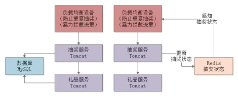

## 1. 抽奖系统设计

- 负载均衡层的限流
  **防止用户重复抽奖**；
  **开奖后暴力拦截流量**，抽奖服务一旦全部开奖完毕，直接更新一个共享状态。然后负载均衡感知到了之后，后续请求全部拦截掉返回一个抽奖结束的标识就可以了。

- 在抽奖服务和礼品服务之间，引入消息中间件，进行**限流削峰**。

  

## 2. go 底层实现

### 2.1 map实现

> map**不是并发安全**的，解决方案：读写锁；分片锁；sync.Map(读多写少)

Go map 底层实现方式是 **Hash 表**。Go map 的数据被置入一个由桶组成的有序数组中，每个桶最多可以存放 8 个 key/value 对。**key 的 Hash 值低位用于在该数组中定位到桶，而高 8 位则用于在桶中区分 key/value 对。**

Go map 的 hash 表中的基本单位是桶，每个桶最多存 8 个键值对，超了则会链接到额外的溢出桶。所以 Go map 基本数据结构是**hash数组+桶内的key-value数组+溢出的桶链表**。


当 Hash 表超过阈值需要扩容增长时，会分配一个新的桶数组，新数组的大小一般是旧数组的 2 倍。这里从旧数组将数据迁移到新数组，不会一次全量拷贝，因为耗时太大，Go 会在每次读写 Map 时以桶为单位做动态搬迁。


### 2.2 sync锁 

```go
type Mutex struct {
    state int32
    sema  uint32
}
```

state存储的是互斥锁的状态，加锁和解锁，都是通过**atomic包提供的函数原子性**，操作该字段。sema用作一个信号量，主要用于等待队列。

Mutex有两种模式，在正常模式下，一个尝试加锁的goroutine会先自旋四次，自旋锁(如果不成功就一直尝试)，尝试通过原子操作获得锁，若**几次自旋之后仍不能获得锁，则通过信号量排队等待**。

当一个goroutine本次**加锁等待时间超过了1ms**后，它会把当前Mutex从正常模式切换至**“饥饿模式”**。在饥饿模式下，**Mutex的所有权直接传递给等待队列头部的goroutine**，后来者不会自旋，也不会尝试获得锁，


### 2.3 channel


1. Channel本质上是由**三个FIFO（First In FirstOut，先进先出）队列**组成的用于**协程之间传输数据**的**协程安全**的通道；FIFO的设计是为了保障公平，让事情变得简单，原则是让等待时间最长的协程最有资格先从channel发送或接收数据；
2. 三个FIFO队列依次是**buf循环队列，sendq待发送者队列，recvq待接收者队列**。buf循环队列是大小固定的用来存放channel接收的数据的队列；**sendq待发送者队列**，用来存放等待发送数据到channel的goroutine的双向链表，**recvq待接收者队列**，用来存放等待从channel读取数据的goroutine的双向链表；sendq和recvq**可以认为不限大小**；
3. 跟函数调用传参本质都是传值一样，channel传递数据的本质就是值拷贝，引用类型数据的传递也是地址拷贝；有从缓冲区buf地址拷贝数据到接收者receiver栈内存地址，也有从发送者sender栈内存地址拷贝数据到缓冲区buf；
4. Channel里面参数的修改不是并发安全的，包括对三个队列及其他参数的访问，因此需要加锁，本质上，channel就是一个有锁队列；
5. Channel 的性能跟 sync.Mutex 差不多，没有谁比谁强。Go官方之所以推荐使用Channel进行并发协程的数据交互，是因为channel的设计理念能让程序变得简单，在大型程序、高并发复杂的运行状况中也是如此。


## 3. go gc

**追踪式 GC：从根对象（全局变量、执行栈，堆内存指针）出发**，根据对象之间的引用信息，一步步推进直到扫描完毕整个堆并确定需要保留的对象，从而回收所有可回收的对象。Go、 Java、V8 对 JavaScript 的实现等均为追踪式 GC。
**STW**：全称是stop the word，GC期间某个阶段会停止所有的赋值器，中断你的程序逻辑，以确定引用关系。
观察GC：设置**`GODEBUG=gctrace=1`**环境变量；**pprof**包查看CPU使用、内存分配以及协程的使用情况

**三色标记法**：（解决STW问题）

白色对象（可能死亡）：未被回收器访问到的对象。在回收开始阶段，所有对象均为白色，当回收结束后，白色对象均不可达。
灰色对象（波面）：已被回收器访问到的对象，但回收器需要对其中的一个或多个指针进行扫描，因为他们可能还指向白色对象。
黑色对象（确定存活）：已被回收器访问到的对象，其中所有字段都已被扫描，黑色对象中任何一个指针都不可能直接指向白色对象。

**当垃圾回收开始时，只有白色对象**。随着标记过程开始进行时，**灰色对象开始出现**（着色），这时候波面便开始扩大。当一个对象的所有子节点均完成扫描时，会被着色为**黑色**。当整个堆遍历完成时，**只剩下黑色和白色对象**，这时的黑色对象为可达对象，即存活；而白色对象为不可达对象，即死亡。这个过程可以视为以灰色对象为波面，将黑色对象和白色对象分离，使波面不断向前推进，直到所有可达的灰色对象都变为黑色对象为止的过程。


在三色标记法的过程中对象丢失，需要同时满足下面两个条件：

条件一：白色对象被黑色对象引用
条件二：灰色对象与白色对象之间的可达关系遭到破坏

- **插入写屏障**

  规则：**当一个对象引用另外一个对象时，将另外一个对象标记为灰色**

  满足：强三色不变式。不会存在黑色对象引用白色对象

这里需要注意一点，**插入屏障仅会在堆内存中生效，不对栈内存空间生效**，这是因为go在并发运行时，大部分的操作都发生在栈上，函数调用会非常频繁。数十万goroutine的栈都进行屏障保护自然会有性能问题。

插入写屏障最大的弊端就是，在一次正常的三色标记流程结束后，**需要对栈上重新进行一次stw，然后再rescan一次**。

- **删除写屏障**

  规则：**在删除引用时，如果被删除引用的对象自身为灰色或者白色，那么被标记为灰色。**

  满足：弱三色不变式。灰色对象到白色对象的路径不会断。

弊端：一个对象的引用被删除后，即使没有其他存活的对象引用它，它**仍然会活到下一轮**。

- **混合写屏障机制**

  GC刚开始的时候，会将栈上的可达对象全部标记为黑色。

  **GC期间，任何在栈上新创建的对象，均为黑色**。（避免了二次扫描）

  > 屏障限制只在堆内存中生效。避免了最后节点对栈进行STW的问题，提升了GC效率 

  **堆上被删除的对象标记为灰色**

  **堆上新添加的对象标记为灰色**


## 4. 内存逃逸原理 举例

内存逃逸（Memory Escape）是指变量的内存分配位置从栈上转移到堆上。

通过逃逸分析，可以尽量把那些不需要分配到堆上的变量直接分配到栈上，堆上的变量变少了，会减轻堆内存分配的开销，同时也会减少垃圾回收（Garbage Collction，GC）的压力，提高程序运行速度。

- 如果变量在函数外部没有被引用，则优先放到栈上。
- 如果变量在函数外部存在引用，则必定放在堆上。

```go
func  foo() *int {
    t :=  3
    return  &t
}

func  main() {
    x :=  foo()
    fmt.Println(*x)
}
// foo 函数里的变量 t 逃逸了，和预想的一致，不解的是为什么 main 函数里的 x 也逃逸了？这是因为有些函数的参数为 interface 类型，比如 fmt.Println(a ...interface{}) ，编译期间很难确定其参数的具体类型，也会发生逃逸。
```

- **减少指针使用**：尽量避免返回指向局部变量的指针。
- **限制变量作用域**：避免将其暴露给外部。
- **合理使用闭包**：尽量减少闭包捕获的局部变量数量。


## 5. 值传递

- Go里面没有`引用传递`，Go语言是`值传递`。
- 如果需要函数内部的修改能影响到函数外部，那么就传指针。
- `map/channel` 本身就是指针，是引用类型，所以直接传 `map和channel` 本身就可以。
- slice` 的赋值操作其实是针对 `slice` 结构体内部的指针进行操作，也是指针，可以直接传 `slice` 本身。` 
- `slice` 的 `append 操作` 同时需要修改结构体的 `len/cap`，类似于 `struct`，如果需要传递到函数外部，需要传指针。（或者使用函数返回值）


## 6. Goroutine | 协程

- **轻量级**：Goroutine 的栈空间初始大小只有 2KB，可以动态扩容，最大可达 1GB
- **快速启动**：Goroutine 的启动时间只有 1~2us
- **高效调度**：Goroutine 的调度器采用 M:N 模型，可以将 M 个 Goroutine 映射到 N 个 OS 线程上，实现高效调度
- **通信简单**：Goroutine 之间通过 Channel 进行通信，实现数据共享
- **无锁**：Goroutine 之间通过 Channel 进行通信，无需加锁
- **高并发**：Goroutine 可以轻松创建数十万个，实现高并发
- **高性能**：Goroutine 的调度器采用抢占式调度，实现高性能

**进程、线程与协程的区别？**

进程是操作系统分配资源和调度的基本单位。
线程是进程中的一个执行单元，线程共享进程的资源（如内存、文件描述符），但有独立的栈和寄存器。
协程是比线程更轻量级的并发单位，协程由程序员手动调度而非操作系统调度。**内核线程依然叫 “线程 (thread)”，用户线程叫 “协程 (co-routine)”。**

线程由 CPU 调度是抢占式的，**协程由用户态调度是协作式的，一个协程让出 CPU 后，才执行下一个协程**。


## 7. GMP 调度器

在 Go 中，线程是运行 goroutine 的实体，调度器的功能是把可运行的 goroutine 分配到工作线程上。

- **全局队列**：存放所有正在等待运行的 `G`
- **本地队列**：每个 `P` 都有一个本地队列， 用于存放当前 `P` 等待和正在运行的 `G`，每个 `P` 的本地队列中最多存放 `256` 个 `G` 。创建 `G` 时，会优先放入本地队列，如果本地队列满了， 则会将队列中一半的 `G` 移动到全局队列中。

- **P 的数量**：`P` 的数量是固定的，由 `GOMAXPROCS` 决定，即最大并发数, 默认为 `CPU` 核数。
- **M 的数量**：`M` 的数量是动态的，由调度器决定，根据当前的负载情况动态调整, GO默认设置为 10000，实际上内核很难达到该限制，可以认为是没有限制。`M` 想要运行任务就需要获取 `P`，如果没有 `P`，`M` 就会阻塞。如果 `P` 的本地队列为空，`M` 会从全局队列中获取 `G`，放入本地队列。 如果全局队列也为空，`M` 会从其他随机一个 `P` 的本地队列中获取一半的 `G` 放到本地队列中。


- 调度器策略

  | 策略       | 描述                                                         |
  | ---------- | ------------------------------------------------------------ |
  | 抢占式调度 | 在协程中需要一个协程主动让出 CPU 下一个协程才能使用 CPU， 而 Goroutine 规定一个 Goroutine 每次**最多只能占用 10ms 的 CPU**，然后就要切换到下一个, 防止其他协程长时间不被执行 |
  | 复用线程   | 调度器会复用线程，而不是每次都创建新的线程，这样可以减少线程创建和销毁的开销，提高性能。 - **工作偷取(Work stealing)**:当 `M` 没有可运行的 `G` 时，会尝试从其他线程绑定的 `P` 的本地队列中偷取一半的 `G`来运行，而不是销毁 `M` - **挂起机制(Hand off)**: 当 `G` 由于系统调用而阻塞时, `M` 会释放绑定的 `P` 供其他 `M` 使用 |
  | 并行       | 通过 `GOMAXPROCS` 配置 `P` 的数量，从而实现并行执行，`P` 的数量决定了并行度，`P` 的数量等于 CPU 核数时，可以实现最大并行度。 |
  | 全局队列   | 当本地队列中没有可运行的 `G`， `M` 会先去全局队列尝试获取 `G`， 若全局队列中没有待运行的 `G` 则会尝试去其他 `P` 的本地队列中偷取 `G` |


## 8. 计网基础

### 8.1 TCP和IP模型

| OSI七层模型 | TCP/IP 五层模型 | TCP/IP 四层模型 | 功能                                     | TCP/IP协议族                             |
| ----------- | --------------- | --------------- | ---------------------------------------- | ---------------------------------------- |
| 应用层      | 应用层          | 应用层          | 文件传输，电子邮件，文件服务，虚拟终端等 | SMTP，DNS，Telnet，TFTP，HTTP，SNHP，FTP |
| 表示层      | 应用层          | 应用层          | 数据格式化，代码转换，数据加密           | 无                                       |
| 会话层      | 应用层          | 应用层          | 解除或建立与别的接点的联系               | 无                                       |
| 传输层      | 传输层          | 传输层          | 提供端对端的接口                         | TCP，UDP                                 |
| 网络层      | 网络层          | 网络层          | 为数据包选择路由                         | IP，ICHP，RIP，OSPF，BCP，ICMF           |
| 数据链路层  | 数据链路层      | 网络接口层      | 传输有地址的顿以及错误检测功能           | SLIP，CSLIP，PPP，ARP，RARP，MTU         |
| 物理层      | 物理层          | 网络接口层      | 以二进制数据形式在物理媒介上传输数据     | IS02110，IEEE802，IEEE802.2              |


### 8.2 HTTP

- **基于文本：** HTTP的消息是以文本形式传输，易于阅读和调试，但相比二进制协议效率较低。
- **可扩展性**：HTTP协议本身不限制数据的内容和格式，可以通过扩展头部、方法等来支持新的功能。
- **灵活性：** HTTP支持不同的数据格式（如HTML、JSON、XML等），适用于多种应用场景。
- **无状态：** **每个请求之间相互独立，服务器不会保留之前请求的状态信息**，需要通过其他手段（如Cookies、Session）来维护状态。


### 8.3 HTTP 版本/状态码

| 特性     | HTTP 1.0                                             | HTTP 1.1                                                     | HTTP 2.0                                                     |
| -------- | ---------------------------------------------------- | ------------------------------------------------------------ | ------------------------------------------------------------ |
| 连接方式 | 无连接，每次请求都要建立连接                         | **长连接**，减少了 TCP 连接的重复建立和断开所造成的额外开销  | **多路复用**，一个 TCP 连接上可以并发多个 HTTP 请求          |
| 队头阻塞 | 存在，下一个请求必须在前一个请求响应到达之前才能发送 | 存在，虽然可以发起多个请求，但服务器必须按照接收请求的顺序发送响应 | 解决，可以在一个连接中并发多个请求或回应，而不用按照顺序一一对应 |

| 数字 | 含义                                                         |
| ---- | ------------------------------------------------------------ |
| 1XX  | 指示信息，表示请求以接收，继续处理                           |
| 2XX  | 成功，表示请求已经被成功接收、理解、接受                     |
| 3XX  | 状态码表示客户端请求的资源发送了变动，需要客户端用新的 URL 重新发送请求获取资源，也就是**重定向** |
| 4XX  | 状态码表示客户端发送的报文有误，服务器无法处理，也就是**错误码**的含义。 |
| 5XX  | 状态码表示客户端请求报文正确，但是服务器处理时内部发生了错误，属于**服务器端的错误码** |


### 8.4 HTTPS

HTTP协议运⾏在TCP之上，所有传输的内容都是明⽂，客户端和服务器端都⽆法验证对⽅的⾝份。

HTTPS是运⾏在SSL/TLS之上的HTTP协议，SSL/TLS 运⾏在TCP之上。所有传输的内容都经过加密，加密采⽤对称加密(DES AES)，但对称加密的密钥⽤服务器⽅的证书进⾏了⾮对称加密（RSA DSA）。


- TLS 协议（RSA算法）

1. 客户端向服务器**发起加密通信请求**，也就是 `ClientHello` 请求。

客户端主要向服务器发送以下信息：TLS 协议版本；生产的随机数（`Client Random`），后面用于生成「会话秘钥」条件之一；加密算法；

2. **服务器响应**，也就是 `SeverHello`。服务器回应的内容有如下内容：

（1）确认 TLS 协议版本，如果浏览器不支持，则关闭加密通信。

（2）服务器生产的随机数（`Server Random`），也是后面用于生产「会话秘钥」条件之一。

（3）确认的密码套件列表，如 RSA 加密算法。

（4）**服务器的数字证书**。

3. 客户端验证服务器

客户端通过浏览器或者操作系统中的 **CA 公钥**，确认服务器的数字证书的真实性。如果证书没有问题，客户端会**从数字证书中取出服务器的公钥**，然后使用它加密发送的随机数（`pre-master key`）。

**服务器和客户端有了这三个随机数（Client Random、Server Random、pre-master key），接着就用双方协商的加密算法，各自生成本次通信的「会话秘钥」**。

4. 服务器解密并生成会话密钥

收到客户端的第三个随机数（`pre-master key`）之后，通过协商的加密算法，计算出本次通信的「会话秘钥」。


### 8.5 有HTTP 为什么还需要rpc

HTTP 的本质是什么？**就是客户端和服务端约定好的一种通信格式。**HTTP 就规定了请求先搞请求行、再搞请求报头、再搞请求体。响应就状态行、响应报头、响应体。**写一大份接口文档**，严格地标明输入输出是什么。

RPC 框架，屏蔽这些底层调用细节。 HTTP 协议比较的冗余，RPC 都是内部调用所以不需要太考虑通用性。RPC，因为它定制化程度更高，可以采用体积更小的 Protobuf 或其他序列化协议去保存结构体数据，同时也不需要像 HTTP 那样考虑各种浏览器行为，比如 302 重定向跳转啥的。**因此性能也会更好一些。**

很多RPC框架包含了**重试机制，路由策略，负载均衡策略，高可用策略，流量控制策略**等等。 如果应用进程之间只使用HTTP协议通信，显然是无法完成上述功能的。


### 8.6 打开https://www.baidu.com的过程

- **DNS 解析**：当用户输入一个网址并按下回车键的时候，浏览器获得一个域名，而在实际通信过程中，我们需要的是一个 IP 地址，因此我们需要先把域名转换成相应 IP 地址。
- **TCP 连接**：浏览器通过 DNS 获取到 Web 服务器真正的 IP 地址后，便向 Web 服务器发起 TCP 连接请求，通过 TCP 三次握手建立好连接。
- 建立TCP协议时，需要发送数据，发送数据**在网络层使用IP协议， 通过IP协议将IP地址封装为IP数据报**；然后此时会用到**ARP协议**，主机发送信息时将包含目标IP地址的ARP请求广播到网络上的所有主机，并接收返回消息，以此**确定目标的物理地址，找到目的MAC地址**；
- IP数据包在路由器之间，**路由选择使用OPSF(开放式最短路径优先)协议**， 采用Dijkstra算法来计算最短路径树，抵达服务端。
- **发送 HTTP 请求**：建立 TCP 连接之后，浏览器向 Web 服务器发起一个 HTTP 请求（如果是HTTPS协议，发送HTTP 请求之前还需要完成**TLS四次握手**）；
- **处理请求并返回**：服务器获取到客户端的 HTTP 请求后，会根据 HTTP 请求中的内容来决定如何获取相应的文件，并将文件发送给浏览器。
- **浏览器渲染**：浏览器根据响应开始显示页面，首先解析 HTML 文件构建 DOM 树，然后解析 CSS 文件构建渲染树，等到渲染树构建完成后，浏览器开始布局渲染树并将其绘制到屏幕上。


## 9. 操作系统基础

### 9.1 虚拟内存

**操作系统会提供一种机制，将不同进程的虚拟地址和不同内存的物理地址映射起来。**程序所使用的内存地址叫做**虚拟内存地址**。

### 9.2 进程间的通信方式

1. 管道

```bash
$ ps auxf | grep mysql
```

「`|`」竖线就是一个**管道**，它的功能是将前一个命令（`ps auxf`）的输出，作为后一个命令（`grep mysql`）的输入，可以看出**管道传输数据是单向的**。

2. 消息队列

**消息队列是保存在内核中的消息链表**。**消息队列不适合比较大数据的传输**。**消息队列通信过程中，存在用户态与内核态之间的数据拷贝开销**

3. 共享内存（使用信号量 互斥写）

**共享内存的机制，就是拿出一块虚拟地址空间来，映射到相同的物理内存中**

4. 信号

信号是进程间通信机制中**唯一的异步通信机制**。

- Ctrl+C 产生 `SIGINT` 信号，表示终止该进程；
- Ctrl+Z 产生 `SIGTSTP` 信号，表示停止该进程，但还未结束；

- kill -9 1050 ，表示给 PID 为 1050 的进程发送 `SIGKILL` 信号，用来立即结束该进程；

5. socket

```go
	// 监听端口
	listener, err := net.Listen("tcp", ":8080")
	for {
		// 接受连接
		conn, err := listener.Accept()
		// 处理连接
		go handleRequest(conn)
	}
```


服务端调用 `accept` 时，连接成功了会返回一个已完成连接的 socket，后续用来传输数据。

所以，监听的 socket 和真正用来传送数据的 socket，是「**两个**」 socket，一个叫作**监听 socket**，一个叫作**已完成连接 socket**。


## 10. TCP 三次握手 四次挥手


### 10.1 三次握手

1. 客户端发送`SYN=1`，并指明客户端的初始序列号`ISN`，即`x`.
2. 服务端发送自己的`SYN`段作为应答，同样指明自己的`ISN` 即 `y`。为了确认客户端的`SYN`，将`x+1`作为`ACK`数值。这样，每发送一个`SYN`，序列号就会加1. 如果有丢失的情况，则会重传。
3. 为了确认服务器端的`SYN`，客户端将`y+1`作为返回的`ACK`数值。

> **TCP 建立连接的过程就是同步序列号的过程，SYN (Synchronize Sequence Numbers)就是同步序列号。因此，三次握手的目的就是使客户端(Client)和服务端(Service)获取到对方的序列号。**
>
> 三次握手的**首要原因是为了防止旧的重复连接初始化造成混乱。**

### 10.2 四次挥手

（1）客户端发送⼀个FIN
⽤来关闭客户端到服务器的数据传送，此后客户端进⼊FIN_WAIT_1状态。
（2）服务器收到FIN后
进⼊CLOSE_WAIT状态。正常情况下会发送⼀个ACK给客户端，确认序号为收到序号+1（与SYN相同，⼀个FIN占
⽤⼀个序号）。
（3）服务器发送⼀个FIN
⽤来关闭服务器到客户端的数据传送，服务器进⼊LAST_ACK状态。
（4）客户端收到FIN后
客户端进⼊TIME_WAIT状态，接着发送⼀个ACK给服务器，确认序号为收到序号+1，服务器进⼊CLOSED状态，
完成四次挥⼿。

> - 为什么需要四次挥手

**之所以需要四次挥手，是因为 tcp 是全双工协议，即客户端和服务端都可以主动发送消息，因此需要两端分别在传输完成后发送断开连接的指令，需要分别发送 `FIN=1` 指令断开，通过 `ACK` 判断是否发送成功。**

当被动关闭方（上图的服务端）在 TCP 挥手过程中，**「没有数据要发送」并且「开启了 TCP 延迟确认机制」**，那么第二和第三次挥手就会合并传输，这样就出现了**三次挥手**。

> - 为什么 TIME_WAIT 等待的时间是 2MSL（报文最大生存时间）

 **2MSL时长** 这其实是相当于**至少允许报文丢失一次**。比如，若 ACK 在一个 MSL 内丢失，这样被动方重发的 FIN 会在第 2 个 MSL 内到达，TIME_WAIT 状态的连接可以应对。

> - 为什么需要 TIME_WAIT

防止历史连接中的数据，被后面相同四元组的连接错误的接收：**让两个方向上的数据包都被丢弃，使得原来连接的数据包在网络中都自然消失，再出现的数据包一定都是新建立连接所产生的。**

保证「被动关闭连接」的一方，能被正确的关闭；

> - 服务器出现大量 TIME_WAIT

- 第一个场景：HTTP 没有使用长连接
- 第二个场景：HTTP 长连接超时
- 第三个场景：HTTP 长连接的请求数量达到上限

> - 服务器出现大量 CLOSE_WAIT

当服务端出现大量 CLOSE_WAIT 状态的连接的时候，通常都是代码的问题，这时候我们需要针对具体的代码一步一步的进行排查和定位，主要分析的方向就是服务端为什么**没有调用 close**。


### 10.3 超时重传

在快速重传机制下，在数据包丢失后，接收端每接收一个失序的数据包就立即返回重复的确认报文段，告知发送端缺少的报文段。当发送方**收到三个重复的确认报文段**后，会立即重传缺失的报文段。

### 10.4 流量控制 点到点

TCP 使用滑动窗口来控制流量，使得发送端可以根据接收端的接收能力控制发送数据的速度。

### 10.5 拥塞控制

###### [**快重传和快恢复**](https://goguide.ryansu.tech/guide/concepts/network/3-tcp-udp.html#快重传和快恢复)

快重传在前面已介绍过，即如果连续收到三个重复的确认就会立即发送尚未接收到的报文段。快恢复算法需要配合快重传算法使用。

快恢复算法：

- 当发送端连续收到三个重复的确认时，将 `ssthresh` 减半。
- 将 `cwnd` (拥塞窗口)设置为 `ssthresh` (慢开始门限)的大小


## 11. UDP

> 无连接、速度快、不可靠性、应用广泛

| 特性/指标              | TCP（Transmission Control Protocol）                         | UDP（User Datagram Protocol）                                |
| ---------------------- | ------------------------------------------------------------ | ------------------------------------------------------------ |
| **连接方式**           | 面向连接，需建立连接（三次握手）                             | 无连接，直接发送数据包                                       |
| **可靠性**             | 提供可靠的传输服务，确保数据包按顺序到达，不丢失、不重复     | 不可靠传输，不保证数据包的可靠性和顺序性                     |
| **流控制**             | 有流控制，通过滑动窗口机制控制发送速率                       | 无流控制，发送方可以快速发送数据                             |
| **拥塞控制**           | 有拥塞控制，通过算法调整发送速率，避免网络拥塞               | 无拥塞控制，不对网络状况进行调整                             |
| **传输开销**           | 较高，需建立和维护连接                                       | 低，无需建立和维护连接                                       |
| **传输延迟**           | 较高，由于可靠性和流控机制                                   | 低，由于没有可靠性和流控机制                                 |
| **适用场景**           | 文件传输（FTP、SFTP）、电子邮件（SMTP）、网页浏览（HTTP/HTTPS）、数据库连接（如 MySQL、PostgreSQL） | 实时应用（音视频流、VoIP、在线游戏）、广播和组播（实时更新、状态信息广播）、简单的查询响应协议（如 DNS） |
| **实例比较：视频会议** | 不太适合，重传机制会导致延迟增加，影响实时性                 | 适合，需要低延迟，即使偶尔丢失一些数据包也不影响太大         |
| **实例比较：文件传输** | 适合，需要确保数据的完整性和顺序性，避免文件损坏             | 不适合，不保证数据的可靠性和顺序性，容易导致文件损坏         |


## 12. MySQL

### 12.1 B+树

MySQL数据库索引采⽤的是B+Tree结构，在B-Tree结构上做了优化改造。

- B-Tree结构

1. 索引值和data数据**分布在整棵树**结构中

2. 每个节点可以存放多个索引值及对应的data数据

3. 树节点中的多个索引值从左到右升序排列


- B+Tree结构：

1. ⾮叶⼦节点不存储data数据，只存储索引值，这样便于存储更多的索引值
2. **叶⼦节点包含了所有的索引值和data数据**
3. 叶⼦节点⽤**指针连接**，提⾼区间的访问性能

B+Tree 存储千万级的数据只需要 3-4 层高度就可以满足，这意味着从千万级的表查询目标数据最多需要 3-4 次磁盘 I/O，所以**B+Tree 相比于 B 树和二叉树来说，最大的优势在于查询效率很高，因为即使在数据量很大的情况，查询一个数据的磁盘 I/O 依然维持在 3-4次。**

**B+ 树的插入和删除效率更高**。

B+Tree 叶子节点采用的是**双链表连接**，适合 MySQL 中常见的**基于范围的顺序查找**。

### 12.2 聚簇索引

**聚簇索引就是按照每张表的主键构造一颗B+树，同时叶子节点中存放的就是整张表的行记录数据，也将聚簇索引的叶子节点称为数据页**。              
**聚簇索引的数据的物理存放顺序是索引顺序是一致的**，如果不用自增id作为主键，需要不断调整数据的物理地址。               

从物理存储的角度来看，索引分为**聚簇索引（主键索引）**、二级索引（辅助索引）。

- 主键索引的 B+Tree 的叶子节点存放的是实际数据，所有完整的用户记录都存放在主键索引的 B+Tree 的叶子节点里；
- 二级索引的 B+Tree 的叶子节点存放的是主键值，而不是实际数据。

如果查询的数据能在二级索引里查询的到（刚好要查询主键），那么就不需要**回表**，这个过程就是**覆盖索引**。如果查询的数据不在二级索引里，就会先检索二级索引，找到对应的叶子节点，获取到主键值后，然后再检索主键索引，就能查询到数据了，这个过程就是回表。

### 12.3 索引失效

 6 种会发生索引失效的情况：

- 当我们使用**左或者左右模糊匹配**的时候，也就是 `like %xx` 或者 `like %xx%`这两种方式都会造成索引失效；
- 当我们在查询条件中**对索引列使用函数**，就会导致索引失效。
- 当我们在查询条件中**对索引列进行表达式计算**，也是无法走索引的。
- MySQL 在遇到字符串和数字比较的时候，会**自动把字符串转为数字**，然后再进行比较。如果字符串是索引列，而条件语句中的输入参数是数字的话，那么索引列会发生隐式类型转换，由于隐式类型转换是通过 CAST 函数实现的，等同于对索引列使用了函数，所以就会导致索引失效。
- 联合索引要能正确使用需要遵循最左匹配原则，也就是按照最左优先的方式进行索引的匹配，否则就会导致索引失效。
- 在 WHERE 子句中，如果在 **OR** 前的条件列是索引列，而在 OR 后的条件列不是索引列，那么索引会失效。

### 12.4 InnoDB存储数据


**数据页中的记录按照「主键」顺序组成单向链表**，数据页中有一个**页目录**，起到记录的索引作用。

**页目录就是由多个槽组成的，槽相当于分组记录的索引**。然后，因为记录是按照「主键值」从小到大排序的，所以**我们通过槽查找记录时，可以使用二分法快速定位要查询的记录在哪个槽（哪个记录分组），定位到槽后，再遍历槽内的所有记录，找到对应的记录**，无需从最小记录开始遍历整个页中的记录链表。

> - 第一个分组中的记录只能有 1 条记录；
> - 最后一个分组中的记录条数范围只能在 1-8 条之间；
> - 剩下的分组中记录条数范围只能在 4-8 条之间。

### 12.5 行级锁

行级锁的类型主要有三类：

- Record Lock，记录锁，也就是仅仅把一条记录锁上；

  当一个事务对一条记录加了 S 型记录锁后，其他事务也可以继续对该记录加 S 型记录锁（**S 型与 S 锁兼容**），但是不可以对该记录加 X 型记录锁（**S 型与 X 锁不兼容**）;

- Gap Lock，间隙锁，锁定一个范围，但是不包含记录本身；

  **间隙锁之间是兼容的，即两个事务可以同时持有包含共同间隙范围的间隙锁**。

- Next-Key Lock：Record Lock + Gap Lock 的组合，锁定一个范围，并且锁定记录本身。

- 插入意向锁：

  一个事务在插入一条记录的时候，需要判断插入位置是否已被其他事务加了间隙锁（next-key lock 也包含间隙锁）。如果有的话，插入操作就会发生**阻塞**，直到拥有间隙锁的那个事务提交为止（释放间隙锁的时刻），在此期间会生成一个**插入意向锁**，表明有事务想在某个区间插入新记录，但是现在处于等待状态。

  

### 12.6 避免死锁

- **设置事务等待锁的超时时间**。
- **开启主动死锁检测**。


### 12.7 Buffer Pool

Innodb 存储引擎设计了一个**缓冲池（\*Buffer Pool\*）**，来提高数据库的读写性能。

Buffer Pool 以页为单位缓冲数据，可以通过 `innodb_buffer_pool_size` 参数调整缓冲池的大小，默认是 128 M。

Innodb 通过三种链表来管理缓页：

- Free List （空闲页链表），管理空闲页；
- Flush List （脏页链表），管理脏页；
- LRU List，管理脏页+干净页，将最近且经常查询的数据缓存在其中，而不常查询的数据就淘汰出去。；

InnoDB 对 LRU 做了一些优化：

- 将 LRU 链表 分为**young 和 old 两个区域**，加入缓冲池的页，优先插入 old 区域；页被访问时，才进入 young 区域，目的是为了解决**预读失效**的问题。
- 当**「页被访问」且「 old 区域停留时间超过 `innodb_old_blocks_time` 阈值（默认为1秒）」**时，才会将页插入到 young 区域，否则还是插入到 old 区域，目的是为了解决批量数据访问，**大量热数据淘汰**的问题。


## 13. SQL事务

### 13.0 一条update语句的执行过程

具体更新一条记录 `UPDATE t_user SET name = 'xiaolin' WHERE id = 1;` 的流程如下:

1. 执行器负责具体执行，会调用存储引擎的接口，通过主键索引树搜索获取 id = 1 这一行记录：
   - 如果 id=1 这一行所在的数据页本来就在 **buffer pool** 中，就直接返回给执行器更新；
   - 如果记录不在 buffer pool，将数据页从磁盘读入到 buffer pool，返回记录给执行器。
2. 执行器得到聚簇索引记录后，会看一下更新前的记录和更新后的记录是否一样：
   - 如果一样的话就不进行后续更新流程；
   - 如果不一样的话就把更新前的记录和更新后的记录都当作参数传给 InnoDB 层，让 InnoDB 真正的执行更新记录的操作；
3. 开启事务， InnoDB 层更新记录前，首先要记录相应的 undo log，因为这是更新操作，需要把被更新的列的旧值记下来，也就是要**生成一条 undo log**，undo log 会写入 Buffer Pool 中的 Undo 页面，不过在内存修改该 Undo 页面后，需要记录对应的 redo log。
4. InnoDB 层开始更新记录，会先**更新内存**（同时标记为脏页），然后将记录**写到 redo log** 里面，这个时候更新就算完成了。为了减少磁盘I/O，不会立即将脏页写入磁盘，后续由后台线程选择一个合适的时机将脏页写入到磁盘。这就是 **WAL 技术**，MySQL 的写操作并不是立刻写到磁盘上，而是先写 redo 日志，然后在合适的时间再将修改的行数据写到磁盘上。
5. 至此，一条记录更新完了。
6. 在一条更新语句执行完成后，然后开始记录该语句对应的 **binlog**，此时记录的 binlog 会被保存到 binlog cache，并没有刷新到硬盘上的 binlog 文件，在**事务提交时**才会统一将该事务运行过程中的所有 binlog **刷新到硬盘**。
7. 事务提交（为了方便说明，这里不说组提交的过程，只说两阶段提交）：
   - **prepare 阶段**：将 redo log 对应的事务状态设置为 prepare，然后将 redo log 刷新到硬盘；
   - **commit 阶段**：将 binlog 刷新到磁盘，接着调用引擎的提交事务接口，将 redo log 状态设置为 commit（将事务设置为 commit 状态后，刷入到磁盘 redo log 文件）；
8. 至此，一条更新语句执行完成。


### 13.1 MySQL 保证一致性 三大日志

> 数据库通过原⼦性、隔离性、持久性来保证⼀致性。

- Mysql 怎么保证原子性的？（**undo log**）

  利⽤Innodb的 **undo log** 。undo log 名为回滚⽇志，是实现原⼦性的关键，当事务回滚时能够**撤销所有已经成功执⾏的sql语句**，他需要记录你要回滚的相应⽇志信息。
  例如：
  当你 delete ⼀条数据的时候，就需要记录这条数据的信息，回滚的时候，insert 这条旧数据;
  当你 update ⼀条数据的时候，就需要记录之前的旧值，回滚的时候，根据旧值执⾏ update 操作;
  当你 insert ⼀条数据的时候，就需要这条记录的主键，回滚的时候，根据主键执⾏ delete 操作.
  undo log 记录了这些回滚需要的信息，当事务执⾏失败或调⽤了 rollback，导致事务需要回滚，便可以利⽤undo
  log 中的信息将数据回滚到修改之前的样⼦。

- Mysql 怎么保证持久性的？(**redo log)**
  利⽤ Innodb 的 redo log。Mysql是先把磁盘上的数据加载到内存中，在内存中对数据进⾏修改，再刷回磁盘上。如果此时突然宕机，内存中的数据就会丢失。**redo log 是循环写**，日志空间大小是固定，全部写满就从头开始，保存未被刷入磁盘的脏页日志。

  **WAL（Write-Ahead Logging）技术**：MySQL 的写操作并不是立刻写到磁盘上，而是先写日志，然后在合适的时间再写到磁盘上。**在事务提交时，只要先将 redo log 持久化到磁盘即可**，可以不需要等到将缓存在 Buffer Pool 里的脏页数据持久化到磁盘。redo log 是物理日志，记录了某个数据页做了什么修改，比如**对 XXX 表空间中的 YYY 数据页 ZZZ 偏移量的地方做了AAA 更新**。

  - 为什么需要 redo log ？

  - **实现事务的持久性，让 MySQL 有 crash-safe 的能力**，能够保证 MySQL 在任何时间段突然崩溃，重启后之前已提交的记录都不会丢失；
  - **将写操作从「随机写」变成了「顺序写」**，提升 MySQL 写入磁盘的性能。


- MySQL 主从复制原理 **binlog** 

  Binary log（二进制日志）记录了数据库所有执行的DDL和DML等数据库更新事件的语句，但是不包含没有修改任何数据的语句（如数据查询语句select、show等）。它以`事件形式`记录并保存在`二进制文件`中。

  - 一是用于`数据恢复`，如果MySQL数据库意外停止，可以通过二进制日志文件来查看用户执行了哪些操作，对数据库服务器文件做了哪些修改，然后根据二进制日志文件中的记录来恢复数据库服务器。
  
  - 二是用于`数据复制`，由于日志的延续性和时效性，master把它的二进制日志传递给slaves来达到master-slave数据一致的目的。分三个阶段：**写入、同步、回放**
  
    


### 13.2 两阶段提交

MySQL 为了避免出现两份日志之间的逻辑不一致的问题，使用了「两阶段提交」来解决。**两阶段提交把单个事务的提交拆分成了 2 个阶段，分别是「准备（Prepare）阶段」和「提交（Commit）阶段」**。

> **将 redo log 的写入拆成了两个步骤：prepare 和 commit，中间再穿插写入binlog**


### 13.3 隔离级别

| 术语                     | 定义                                                         |
| ------------------------ | ------------------------------------------------------------ |
| **脏读**(读未提交级别)   | 脏读指的是读到了**其他事务未提交的数据**，未提交意味着这些数据可能会回滚，也就是不存在的数据。 |
| **不可重复读**(读已提交) | 对比可重复读，不可重复读指的是**在同一事务内，不同的时刻读到的同一批数据可能是不一样的**，可能会受到其他事务的影响，比如其他事务改了这批数据并**提交了**。不可重复读常在数据更新时出现。 |
| **幻读**(可重复读)       | 在一个事务中明明没有查到主键为 X 的数据，但主键为 X 的数据就是插入不进去 |

> 数据库的默认隔离级别是 `REPEATABLE-READ`（可重复读），这不能避免幻读
>
> 在 MySQL 中，主要通过 **MVCC**（多版本并发控制）来实现隔离级别，MVCC 是通过保存数据在某个时间点的快照来实现的，这样可以保证事务在执行过程中看到的数据是一致的。

- 不可重复读和脏读的区别：脏读可以读到其他事务中未提交的数据，而不可重复读是读取到了其他事务已经提交的数据，但前后两次读取的结果不同。

- 不可重复读和幻读的区别：二者描述的侧重点不同，不可重复读描述的侧重点是修改操作，而幻读描述的侧重点是添加和删除操作。

---

### 13.4 解决幻读？

MySQL InnoDB 引擎的默认隔离级别虽然是「可重复读」，但是它很大程度上避免幻读现象，解决的方案有两种：

- 针对**快照读**（普通 select 语句），是**通过 MVCC 方式解决了幻读**，因为可重复读隔离级别下，事务执行过程中看到的数据，一直跟这个事务启动时**看到的数据是一致的**，即使中途有其他事务插入了一条数据，是查询不出来这条数据的，所以就很好了避免幻读问题。
- 针对**当前读**（select ... for update 等语句），是**通过 next-key lock（记录锁+间隙锁）方式解决了幻读**，因为当执行 select ... for update 语句的时候，会加上 next-key lock，如果有其他事务在 next-key lock 锁范围内插入了一条记录，那么这个插入语句就会被阻塞，无法成功插入，所以就很好了避免幻读问题。


## 14. Redis

> Redis 是一种基于内存的数据库，对数据的读写操作都是在内存中完成，因此**读写速度非常快**，常用于**缓存，消息队列、分布式锁等场景**。

### 14.1 为什么用 Redis 作为 MySQL 的缓存？

主要是因为 **Redis 具备「高性能」和「高并发」两种特性**。
高性能：直接操作内存；高并发：单机QPS是mysql的十倍（10w+）

### 14.2 五种常见的 Redis 数据类型是怎么实现？


> String 类型内部实现

String 类型的底层的数据结构实现主要是 SDS（简单动态字符串）。 SDS 和我们认识的 C 字符串不太一样，之所以没有使用 C 语言的字符串表示，因为 SDS 相比于 C 的原生字符串：

- **SDS 不仅可以保存文本数据，还可以保存二进制数据**。因为 SDS 使用 len 属性的值而不是空字符来判断字符串是否结束，并且 SDS 的所有 API 都会以处理二进制的方式来处理 SDS 存放在 buf[] 数组里的数据。所以 SDS 不光能存放文本数据，而且能保存图片、音频、视频、压缩文件这样的二进制数据。
- **SDS 获取字符串长度的时间复杂度是 O(1)**。因为 C 语言的字符串并不记录自身长度，所以获取长度的复杂度为 O(n)；而 SDS 结构里用 len 属性记录了字符串长度，所以复杂度为 O(1)。
- **Redis 的 SDS API 是安全的，拼接字符串不会造成缓冲区溢出**。因为 SDS 在拼接字符串之前会检查 SDS 空间是否满足要求，如果空间不够会自动扩容，所以不会导致缓冲区溢出的问题。

> List 类型内部实现

List 类型的底层数据结构是由**双向链表或压缩列表**实现的：

- 如果列表的元素个数小于 512 个（默认值，可由 list-max-ziplist-entries 配置），列表每个元素的值都小于 64 字节（默认值，可由 list-max-ziplist-value 配置），Redis 会使用**压缩列表**作为 List 类型的底层数据结构；
- 如果列表的元素不满足上面的条件，Redis 会使用**双向链表**作为 List 类型的底层数据结构；

但是**在 Redis 3.2 版本之后，List 数据类型底层数据结构就只由 quicklist 实现了，替代了双向链表和压缩列表**。

> Hash 类型内部实现

Hash 类型的底层数据结构是由**压缩列表或哈希表**实现的：

- 如果哈希类型元素个数小于 512 个（默认值，可由 hash-max-ziplist-entries 配置），所有值小于 64 字节（默认值，可由 hash-max-ziplist-value 配置）的话，Redis 会使用**压缩列表**作为 Hash 类型的底层数据结构；
- 如果哈希类型元素不满足上面条件，Redis 会使用**哈希表**作为 Hash 类型的底层数据结构。

**在 Redis 7.0 中，压缩列表数据结构已经废弃了，交由 listpack 数据结构来实现了**。

> Set 类型内部实现

Set 类型的底层数据结构是由**哈希表或整数集合**实现的：

- 如果集合中的元素都是整数且元素个数小于 512 （默认值，set-maxintset-entries配置）个，Redis 会使用**整数集合**作为 Set 类型的底层数据结构；
- 如果集合中的元素不满足上面条件，则 Redis 使用**哈希表**作为 Set 类型的底层数据结构。

> ZSet 类型内部实现

Zset 类型的底层数据结构是由**压缩列表或跳表**实现的：

- 如果有序集合的元素个数小于 128 个，并且每个元素的值小于 64 字节时，Redis 会使用**压缩列表**作为 Zset 类型的底层数据结构；
- 如果有序集合的元素不满足上面的条件，Redis 会使用**跳表**作为 Zset 类型的底层数据结构；

**在 Redis 7.0 中，压缩列表数据结构已经废弃了，交由 listpack 数据结构来实现了。**

---

### 14.3 如何避免缓存雪崩、缓存击穿、缓存穿透？

> 如何避免缓存雪崩？


**当大量缓存数据在同一时间过期（失效）时，如果此时有大量的用户请求**，都无法在 Redis 中处理，于是全部请求都直接访问数据库，从而导致数据库的压力骤增，严重的会造成数据库宕机，从而形成一系列连锁反应，造成整个系统崩溃，这就是缓存雪崩的问题。

对于缓存雪崩问题，我们可以采用两种方案解决。

- **将缓存失效时间随机打散：** 我们可以在原有的失效时间基础上增加一个随机值（比如 1 到 10 分钟）这样每个缓存的过期时间都不重复了，也就降低了缓存集体失效的概率。
- **设置缓存不过期：** 我们可以通过后台服务来更新缓存数据，从而避免因为缓存失效造成的缓存雪崩，也可以在一定程度上避免缓存并发问题。

> 如何避免缓存击穿？

如果缓存中的**某个热点数据过期**了，此时大量的请求访问了该热点数据，就无法从缓存中读取，直接访问数据库，数据库很容易就被高并发的请求冲垮，这就是**缓存击穿**的问题。


可以发现缓存击穿跟缓存雪崩很相似，可以认为缓存击穿是缓存雪崩的一个子集。 应对缓存击穿可以采取前面说到两种方案：

- **互斥锁方案**（Redis 中使用 **setNX** 方法设置一个状态位，表示这是一种锁定状态），保证同一时间只有一个业务线程请求缓存，未能获取互斥锁的请求，要么等待锁释放后重新读取缓存，要么就返回空值或者默认值。
- **不给热点数据设置过期时间**，由后台异步更新缓存，或者在热点数据准备要过期前，提前通知后台线程更新缓存以及重新设置过期时间；

> 如何避免缓存穿透？

**用户访问的数据，既不在缓存中，也不在数据库中**，导致请求在访问缓存时，发现缓存缺失，再去访问数据库时，发现数据库中也没有要访问的数据，没办法构建缓存数据，来服务后续的请求。那么当有大量这样的请求到来时，数据库的压力骤增，这就是**缓存穿透**的问题。


缓存穿透的发生一般有这两种情况：

- **业务误操作**，缓存中的数据和数据库中的数据都被误删除了，所以导致缓存和数据库中都没有数据；
- 黑客恶意攻击，故意大量访问某些读取不存在数据的业务；

应对缓存穿透的方案，常见的方案有三种。

- **非法请求的限制**：当有大量恶意请求访问不存在的数据的时候，也会发生缓存穿透，因此在 API 入口处我们要判断求请求参数是否合理，请求参数是否含有非法值、请求字段是否存在，如果判断出是恶意请求就直接返回错误，避免进一步访问缓存和数据库。
- **设置空值或者默认值**：当我们线上业务发现缓存穿透的现象时，可以针对查询的数据，在缓存中设置一个空值或者默认值，这样**后续请求就可以从缓存中读取到空值或者默认值**，返回给应用，而不会继续查询数据库。
- **使用布隆过滤器快速判断数据是否存在，避免通过查询数据库来判断数据是否存在**：我们可以在写入数据库数据时，使用布隆过滤器做个标记，然后在用户请求到来时，业务线程确认缓存失效后，可以通过查询布隆过滤器快速判断数据是否存在，如果不存在，就不用通过查询数据库来判断数据是否存在，即使发生了缓存穿透，大量请求只会查询 Redis 和布隆过滤器，而不会查询数据库，保证了数据库能正常运行，Redis 自身也是支持布隆过滤器的。

### 14.4 缓存更新策略

常见的缓存更新策略共有3种：

- Cache Aside（旁路缓存）策略；
- Read/Write Through（读穿 / 写穿）策略；
- Write Back（写回）策略；

实际开发中，Redis 和 MySQL 的更新策略用的是 Cache Aside，另外两种策略应用不了。

> Cache Aside（旁路缓存）策略

**Cache Aside（旁路缓存）**策略是最常用的，应用程序直接与「数据库、缓存」交互，并负责对缓存的维护，该策略又可以细分为「读策略」和「写策略」。


**写策略的步骤：**

- **先更新数据库中的数据，再删除缓存中的数据。**

**读策略的步骤：**

- 如果读取的数据命中了缓存，则直接返回数据；
- **如果读取的数据没有命中缓存，则从数据库中读取数据，然后将数据写入到缓存**，并且返回给用户。

注意，写策略的步骤的顺序不能倒过来，即**不能先删除缓存再更新数据库**，原因是在「读+写」并发的时候，会出现缓存和数据库的数据不一致性的问题。


**为什么「先更新数据库再删除缓存」不会有数据不一致的问题？**

先更新数据库，再删除缓存也是会出现数据不一致性的问题，**但是在实际中，这个问题出现的概率并不高**。

**因为缓存的写入通常要远远快于数据库的写入**，所以在实际中很难出现请求 B 已经更新了数据库并且删除了缓存，请求 A 才更新完缓存的情况。而一旦请求 A 早于请求 B 删除缓存之前更新了缓存，那么接下来的请求就会因为缓存不命中而从数据库中重新读取数据，所以不会出现这种不一致的情况。


**Cache Aside 策略适合读多写少的场景，不适合写多的场景**，因为当写入比较频繁时，缓存中的数据会被频繁地清理，这样会对缓存的命中率有一些影响。如果业务对缓存命中率有严格的要求，那么可以考虑两种解决方案：

- 一种做法是**在更新数据时也更新缓存**，只是在**更新缓存前先加一个分布式锁**，因为这样在同一时间只允许一个线程更新缓存，就不会产生并发问题了。当然这么做对于写入的性能会有一些影响；
- 另一种做法同样也是在更新数据时更新缓存，只是**给缓存加一个较短的过期时间**，这样即使出现缓存不一致的情况，缓存的数据也会很快过期，对业务的影响也是可以接受。

### 14.5 redis实现延迟队列

在 Redis 可以使用**有序集合（ZSet）**的方式来实现延迟消息队列的，ZSet 有一个 **Score 属性可以用来存储延迟执行的时间**。使用 zadd score1 value1 命令就可以一直往内存中生产消息。再利用 zrangebysocre 查询符合条件的所有待处理的任务， 通过循环执行队列任务即可。

 


### 14.6 Redis 管道、redis不保证原子性


使用**管道技术可以解决多个命令执行时的网络等待**，它是把多个命令整合到一起发送给服务器端处理之后统一返回给客户端，这样就免去了每条命令执行后都要等待的情况，从而有效地提高了程序的执行效率。

**Redis 中并没有提供回滚机制**，虽然 Redis 提供了 **DISCARD** 命令，但是这个命令只能用来主动放弃事务执行，把暂存的命令队列清空，起不到回滚的效果。

> 事务执行过程中，如果命令入队时没报错，而事务提交后，实际执行时报错了，**正确的命令依然可以正常执行**，所以这可以看出 **Redis 并不一定保证原子性**


### 14.7 redis 分布式锁

基于 Redis 节点实现分布式锁时，对于加锁操作，我们需要满足三个条件。

- 加锁包括了读取锁变量、检查锁变量值和设置锁变量值三个操作，但需要以原子操作的方式完成，所以，我们使用 **SET 命令带上 NX 选项来实现加锁**；
- 锁变量需要设置过期时间，以免客户端拿到锁后发生异常，导致锁一直无法释放，所以，我们在 SET 命令执行时加上 **EX/PX 选项，设置其过期时间**；
- 锁变量的值需要能区分来自不同客户端的加锁操作，以免在释放锁时，出现误释放操作，所以，我们使用 SET 命令设置锁变量值时，**每个客户端设置的值是一个唯一值，用于标识客户端**；

满足这三个条件的分布式命令如下：

```c
SET lock_key unique_value NX PX 10000 
```

- lock_key 就是 key 键；
- unique_value 是客户端生成的唯一的标识，区分来自不同客户端的锁操作；
- NX 代表只在 lock_key 不存在时，才对 lock_key 进行设置操作；
- PX 10000 表示设置 lock_key 的过期时间为 10s，这是为了避免客户端发生异常而无法释放锁。

而**解锁的过程就是将 lock_key 键删除（del lock_key）**，但不能乱删，要保证执行操作的客户端就是加锁的客户端。所以，解锁的时候，我们要**先判断锁的 unique_value 是否为加锁客户端**，是的话，才将 lock_key 键删除。

可以看到，解锁是有两个操作，这时就需要 **Lua 脚本**来保证解锁的原子性，因为 Redis 在执行 Lua 脚本时，可以以原子性的方式执行，保证了锁释放操作的原子性。

> 不支持可重入锁：
> 在分布式系统中，有时候同一个客户端可能需要多次获取同一个锁。使用 SETNX 实现的锁**不支持可重入性**，即一个客户端在持有锁的情况下再次请求锁时会被拒绝，这在实际应用中可能导致问题。


> Redis 如何解决集群情况下分布式锁的可靠性？

为了保证集群环境下分布式锁的可靠性，Redis 官方已经设计了一个分布式锁算法 Redlock（红锁）。

它是基于**多个 Redis 节点**的分布式锁，即使有节点发生了故障，锁变量仍然是存在的，客户端还是可以完成锁操作。官方推荐是至少部署 5 个 Redis 节点，而且都是主节点，它们之间没有任何关系，都是一个个孤立的节点。

Redlock 算法的基本思路，**是让客户端和多个独立的 Redis 节点依次请求申请加锁，如果客户端能够和半数以上的节点成功地完成加锁操作，那么我们就认为，客户端成功地获得分布式锁，否则加锁失败**。


### 14.8 大key

- 使用 RdbTools 第三方开源工具，可以用来解析 Redis 快照（RDB）文件，找到其中的大 key。

比如，下面这条命令，将大于 10 kb 的  key  输出到一个表格文件。

```shell
rdb dump.rdb -c memory --bytes 10240 -f redis.csv
```

- 从 Redis 4.0 版本开始，可以采用**异步删除**法，**用 unlink 命令代替 del 来删除**。

这样 Redis 会将这个 key 放入到一个异步线程中进行删除，这样不会阻塞主线程。


### 14.9 AOF 持久化（丢失数据少）


1. 写操作命令执行成功后才记录到 AOF 日志，所以不会阻塞当前写操作命令的执行，但是**可能会给「下一个」命令带来阻塞风险**。
2. 写回策略（控制何时执行` fsync()` ）
   - **Always**，每次写操作命令执行完后，**同步**将 AOF 日志数据写回硬盘；
   - **Everysec**，先将命令写入到 AOF 文件的内核缓冲区，然后**每隔一秒**将缓冲区里的内容写回到硬盘；
   - **No**，先将命令写入到 AOF 文件的内核缓冲区，再**由操作系统决定**何时将缓冲区内容写回硬盘。

3. 重写机制

   


### 14.10 RDB快照（恢复数据快）

 RDB 快照是**全量快照**的方式，因此执行的频率不能太频繁，否则会影响 Redis 性能，而 AOF 日志可以以秒级的方式记录操作命令，所以丢失的数据就相对更少。

执行 **bgsave（background）** 命令的时候，会通过 **`fork()`** 创建子进程，子进程和父进程是共享同一片内存数据的，因为创建子进程的时候，会复制父进程的页表，但是页表**指向的物理内存还是一个**。（加快创建子进程的速度，毕竟创建子进程的过程中，是会**阻塞主线程**的。）

只有在发生修改内存数据的情况时，物理内存才会被复制一份。（**写时复制**）


- **混合持久化**

  在 AOF 重写日志时，`fork` 出来的重写子进程会先将与主线程共享的内存数据以 RDB 方式写入到 AOF 文件，然后主线程处理的操作命令会被记录在重写缓冲区里（数据更少丢失）。

  


## 15. RocketMQ

### 15.1 和kafka对比？

- kafka写性能降低：同时写多个文件带来了随机写问题。

  rocketmq：将单个broker下的多个topic数据**全部写入 commitLog**；主从备份时同步所有 commitLog 文件


### 15.2 解决重复消费问题？

- 状态判断法：消费者消费数据后把消费数据记录在 redis 中，下次消费时先到 redis 中查看是否存在该消息，存在则表示消息已经消费过，直接丢弃消息。
- 业务判断法：通常数据消费后都需要插入到数据库中，使用数据库的唯一性约束防止重复消费。每次消费直接尝试插入数据，如果提示唯一性字段重复，则直接丢失消息。一般都是通过这个业务判断的方法就可以简单高效地避免消息的重复处理了。


## 16. ElasticSearch

> **倒排索引**由单词（terms）和包含这些单词的文档（document）列表组成

### 16.1 分词器

- **IK 分词器** ik_max_word：查全率与准确度较高，性能也高，是业务中普遍采用的中文分词器


## 

## 

## 

## 

## 

## 

## 

## 

## 

## 

## 

## 

## 

## 

## 

## 

## 

## 

## 

## 

## 

## 

## 

## 

## 

## 

## 

## 

## 

## 

## 

## 

## 

## 

## 

## 

## 

## 

## 

## 

## 

## 

## 

## 

## 

## 

## 

## 

## 

## 

## 

## 

## 

## 

## 

## 

## 

## 

## 

## 

## 

## 

## 

## 

## 

## 

## 

## 

## 

## 

## 

## 

## 

## 

## 

## 

## 

