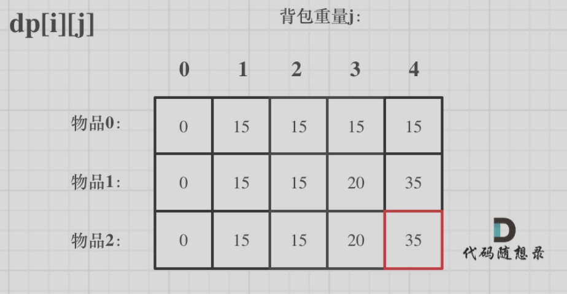
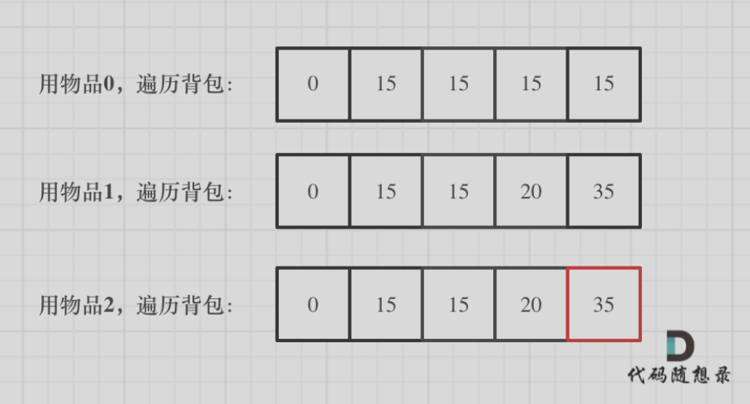
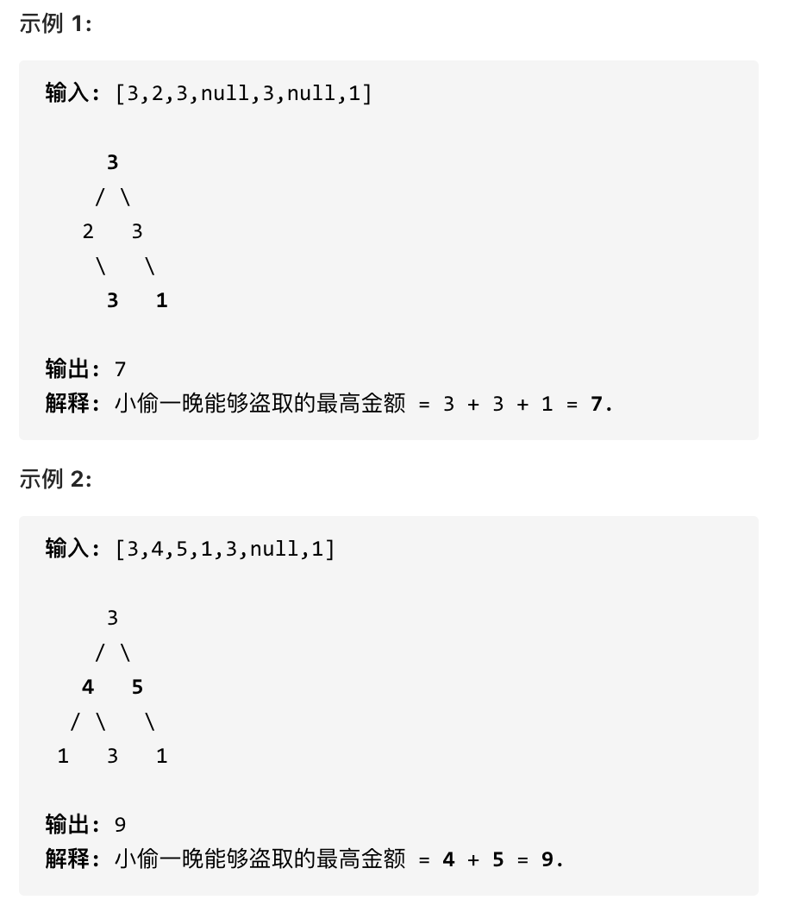
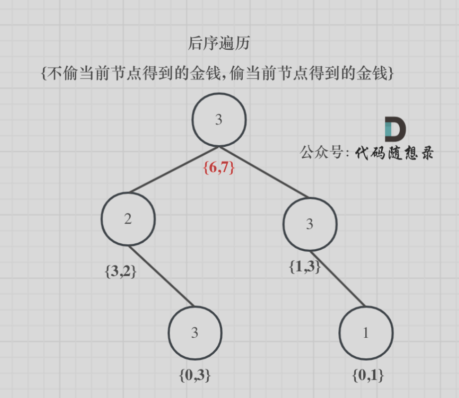
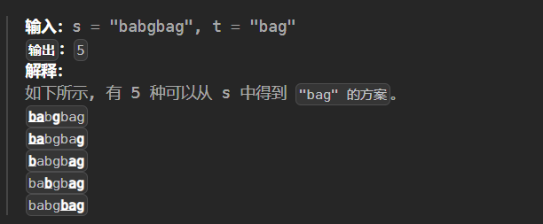
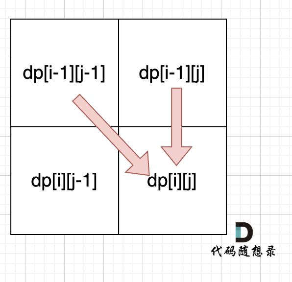
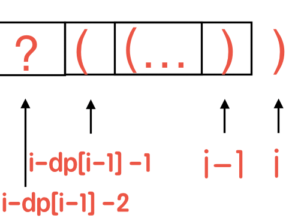

## 爬楼梯

> 假设你正在爬楼梯。需要 n 阶你才能到达楼顶。每次你可以爬 1 或 2 个台阶。你有多少种不同的方法可以爬到楼顶呢？
>
> - 输入： 3
> - 输出： 3
> - 解释： 有三种方法可以爬到楼顶。
>   - 1 阶 + 1 阶 + 1 阶
>   - 1 阶 + 2 阶
>   - 2 阶 + 1 阶

重要的是思想。类似斐波那契数列，比递归的时间复杂度会好很多。因为只需要前两个状态值，改进一下可以优化空间复杂度。

```go
func climbStairs(n int) int {
    if n <= 2 {
        return n
    }
    // dp[i] 为第 i 阶楼梯有多少种方法爬到楼顶
    // dp[i] = dp[i-1] + dp[i-2]
    dp := make([]int, n+1)
    dp[1], dp[2] = 1, 2
    for i := 3; i <= n; i++ {
        dp[i] = dp[i-1] + dp[i-2]
    }
    return dp[n]
}
```

---

## 不同路径

> 一个机器人位于一个 m x n 网格的左上角 （起始点在下图中标记为 “Start” ）。机器人每次只能向下或者向右移动一步。机器人试图达到网格的右下角（在下图中标记为 “Finish” ）。问总共有多少条不同的路径？
>
> 
>
> - 输入：m = 3, n = 7
> - 输出：28

很能代表 dp 的一道题，递推会超时

```go
func uniquePaths(m int, n int) int {
	dp := make([][]int, m)
	for i := range dp {
		dp[i] = make([]int, n)
		dp[i][0] = 1
	}
	for j := 0; j < n; j++ {	// 到达第一行和第一列的任何地方都只存在一条路径
		dp[0][j] = 1
	}
	for i := 1; i < m; i++ {
		for j := 1; j < n; j++ {
			dp[i][j] = dp[i-1][j] + dp[i][j-1]
		}
	}
	return dp[m-1][n-1]
}
```

---

## 不同路径 II

> 
>
> 3x3 网格的正中间有一个障碍物。从左上角到右下角一共有 2 条不同的路径：
>
> 1. 向右 -> 向右 -> 向下 -> 向下
> 2. 向下 -> 向下 -> 向右 -> 向右

```go
func uniquePathsWithObstacles(obstacleGrid [][]int) int {
    m, n := len(obstacleGrid), len(obstacleGrid[0])
    dp := make([][]int, m)
    for i := range dp {
        dp[i] = make([]int, n)
    }

    for i := 0; i < m; i++ {
        for j := 0; j < n; j++ {
            if obstacleGrid[i][j] == 1 {	// 遇到障碍置 0 
                dp[i][j] = 0
            } else {
                if i == 0 && j == 0 {	// 起点无障碍就初始化为 1
                    dp[0][0] = 1
                    continue
                }
                if i == 0 {	//递推公式
                    dp[i][j] = dp[i][j-1]
                } else if j == 0 {
                    dp[i][j] = dp[i-1][j]
                } else {
                    dp[i][j] = dp[i-1][j] + dp[i][j-1]
                }  
            }
        }
    }

    return dp[m-1][n-1]
}
```

---

## 不同的二叉搜索树

> 给定一个整数 n，求以 1 ... n 为节点组成的二叉搜索树有多少种？
>
> 
>
> 输入：n = 3
> 输出：5

递推公式：`dp[i] += dp[j - 1] * dp[i - j]` ，`j - 1` 为 j 为头结点左子树节点数量，`i - j` 为以 j 为头结点右子树节点数量

```go
func numTrees(n int) int {
    dp := make([]int, n+1)
    dp[0] = 1
    for i := 1; i <= n; i++ {
        for j := 1; j <= i; j++ {
            dp[i] += dp[j-1] * dp[i-j]
        }
    }
    return dp[n]
}
```

---

## 0-1 背包问题

背包最大重量为4。物品只有一个，为：

|       | 重量 | 价值 |
| ----- | ---- | ---- |
| 物品0 | 1    | 15   |
| 物品1 | 3    | 20   |
| 物品2 | 4    | 30   |

`dp[i][j]`的含义：从下标为 [0-i] 的物品里任意取，放进容量为 j 的背包，价值总和最大是多少。

那么可以有两个方向推出来`dp[i][j]`

- **不放物品i**：由`dp[i - 1][j]`推出，即背包容量为 j，里面不放物品 i 的最大价值，此时`dp[i][j]`就是`dp[i - 1][j]`。(其实就是当物品 i 的重量大于背包 j 的重量时，物品 i 无法放进背包中，所以背包内的价值依然和前面相同。)
- **放物品i**：由`dp[i - 1][j - weight[i]]`推出，`dp[i - 1][j - weight[i]]` 为背包容量为`j - weight[i]`的时候不放物品 i 的最大价值，那么`dp[i - 1][j - weight[i]] + value[i]` （物品i的价值），就是背包放物品 i 得到的最大价值

所以递归公式： `dp[i][j] = max(dp[i - 1][j], dp[i - 1][j - weight[i]] + value[i])`



```go
// 初始化 dp
vector<vector<int>> dp(weight.size(), vector<int>(bagweight + 1, 0));
for (int j = weight[0]; j <= bagweight; j++) {
    dp[0][j] = value[0];
}
// weight数组的大小 就是物品个数
for(int i = 1; i < weight.size(); i++) { // 遍历物品
    for(int j = 0; j <= bagweight; j++) { // 遍历背包容量
        if (j < weight[i]) dp[i][j] = dp[i-1][j];
        else dp[i][j] = max(dp[i-1][j], dp[i-1][j-weight[i]] + value[i]);
    }
}
```



一维数组的本质：用新数据覆盖掉上一层的数据，而新数据是通过上一层的数据得到的，这也能解释为什么要倒序遍历背包：防止一个物品添加多次。如果正序遍历，后面的数据是通过新数据得到的 -> dp[1] = 15 dp[2] = 30 dp[3] = 45 ...`

01背包中，dp[j] 表示： 容量为j的背包，所背的物品价值最大可以为dp[j]。01背包的递推公式为：`dp[j] = max(dp[j], dp[j - weight[i]] + value[i])`

```go
for(int i = 0; i < weight.size(); i++) { // 遍历物品
    for(int j = bagWeight; j >= weight[i]; j--) { // 倒序遍历背包容量
        dp[j] = max(dp[j], dp[j - weight[i]] + value[i]);
    }
}
```

---

## 分割等和子集（0-1 背包问题）

> 给你一个 **只包含正整数** 的 **非空** 数组 `nums` 。请你判断是否可以将这个数组分割成两个子集，使得两个子集的元素和相等。
>
> 输入：nums = [1,5,11,5]
> 输出：true
> 解释：数组可以分割成 [1, 5, 5] 和 [11] 。

**dp[j]表示 背包总容量（所能装的总重量）是j，放进物品后，背的最大重量为dp[j]**。本题，相当于背包里放入数值，那么物品i的重量是nums[i]，其价值也是nums[i]。所以递推公式：`dp[j] = max(dp[j], dp[j - nums[i]] + nums[i])`

```go
func canPartition(nums []int) bool {
    sum := 0
    for _, num := range nums {
        sum += num
    }
    // nums 的总和为奇数则不可能平分成两个子集
    if sum % 2 == 1 {
        return false
    }
    
    target := sum / 2
    dp := make([]int, target + 1)

    for _, num := range nums {
      	// 倒序遍历！！！每一个元素一定是不可重复放入
        for j := target; j >= num; j-- {
            dp[j] = max(dp[j], dp[j - num] + num)
        }
    }
    return dp[target] == target
}
```

---

## 最后一块石头的重量II

> 每一回合，从中选出任意两块石头，然后将它们一起粉碎。假设石头的重量分别为 x 和 y，且 x <= y。那么粉碎的可能结果如下：
>
> 如果 x == y，那么两块石头都会被完全粉碎；
>
> 如果 x != y，那么重量为 x 的石头将会完全粉碎，而重量为 y 的石头新重量为 y-x。
>
> 最后，最多只会剩下一块石头。返回此石头最小的可能重量。如果没有石头剩下，就返回 0。
>
> 示例：
>
> - 输入：[2,7,4,1,8,1]
> - 输出：1
>
> 解释：
>
> - 组合 2 和 4，得到 2，所以数组转化为 [2,7,1,8,1]，
> - 组合 7 和 8，得到 1，所以数组转化为 [2,1,1,1]，
> - 组合 2 和 1，得到 1，所以数组转化为 [1,1,1]，
> - 组合 1 和 1，得到 0，所以数组转化为 [1]，这就是最优值。

转变思路：本题其实就是尽量让石头分成重量相同的两堆，相撞之后剩下的石头最小，**这样就化解成01背包问题了**。

```go
func lastStoneWeightII(stones []int) int {
    sum := 0
    for _, num := range stones {
        sum += num
    }

    target := sum / 2
    dp := make([]int, target + 1)
    for _, num := range stones {
        for j := target; j >= num; j-- {
            dp[j] = max(dp[j], num + dp[j-num])
        }
    }
    return sum - 2 * dp[target]	// 大堆重 sum - dp[target] 小堆重 dp[target]
}
```

---

## 目标和

> 给定一个非负整数数组，a1, a2, ..., an, 和一个目标数，S。现在你有两个符号 + 和 -。对于数组中的任意一个整数，你都可以从 + 或 -中选择一个符号添加在前面。
>
> 返回可以使最终数组和为目标数 S 的所有添加符号的方法数。
>
> 示例：
>
> - 输入：nums: [1, 1, 1, 1, 1], S: 3
> - 输出：5
>
> 解释：
>
> - -1+1+1+1+1 = 3
> - +1-1+1+1+1 = 3
> - +1+1-1+1+1 = 3
> - +1+1+1-1+1 = 3
> - +1+1+1+1-1 = 3
>
> 一共有5种方法让最终目标和为3。

既然为target，那么就一定有 left组合 - right组合 = target。left + right = sum，而sum是固定的。推导出 left = (target + sum)/2 。

**此时问题就转化为，装满容量为x的背包，有几种方法**。

```go
func findTargetSumWays(nums []int, target int) int {
    sum := 0
    for _, num := range nums {
        sum += num
    }
    if (sum+target) % 2 == 1 {
        return 0
    }
    if int(math.Abs(float64(target))) > sum {
        return 0
    }

    x := (sum+target) / 2   // 找有多少种方案让结果等于 x
    dp := make([]int, x+1)
    dp[0] = 1
    for _, num := range nums {
        for j := x; j >= num; j-- {
            dp[j] += dp[j-num]	// 放入 num，有 dp[j-num] 种方法凑满背包
        }
    }
    return dp[x]
}
```

---

## 一和零

> 给你一个二进制字符串数组 strs 和两个整数 m 和 n 。请你找出并返回 strs 的最大子集的大小，该子集中 最多 有 m 个 0 和 n 个 1 。
>
> - 输入：strs = ["10", "0001", "111001", "1", "0"], m = 5, n = 3
> - 输出：4
> - 解释：最多有 5 个 0 和 3 个 1 的最大子集是 {"10","0001","1","0"} ，因此答案是 4 。

`dp[i][j]` ： 大小为 i 和 j 的背包最多可以装几个元素

```go
func findMaxForm(strs []string, m int, n int) int {
    dp := make([][]int, m+1)
    for i := range dp {
        dp[i] = make([]int, n+1)
    }
    for _, str := range strs {
        a, b := 0, 0	// a个0 b个1
        for _, ch := range str {
            if ch == '0' {
                a++
            } else {
                b++
            }
        }
        for i := m; i >= a; i-- { // 都要倒序遍历 避免重复计算
            for j := n; j >= b; j-- {
                dp[i][j] = max(dp[i][j], 1 + dp[i-a][j-b])
            }
        }
    }

    return dp[m][n]
}
```

---

## 完全背包

背包最大重量为4。物品有无数个，为：

|       | 重量 | 价值 |
| ----- | ---- | ---- |
| 物品0 | 1    | 15   |
| 物品1 | 3    | 20   |
| 物品2 | 4    | 30   |

顺序遍历背包，就可以添加多次了

```go
// 先遍历物品，再遍历背包
for(int i = 0; i < weight.size(); i++) { // 遍历物品
    for(int j = weight[i]; j <= bagWeight ; j++) { // 遍历背包容量
        dp[j] = max(dp[j], dp[j - weight[i]] + value[i]);
    }
}
```

---

## 零钱兑换II（完全背包问题）

> 给定不同面额的硬币和一个总金额。写出函数来计算可以凑成总金额的硬币组合数。假设每一种面额的硬币有无限个。
>
> - 输入: amount = 5, coins = [1, 2, 5]
> - 输出: 4
>
> 解释: 有四种方式可以凑成总金额:
>
> - 5=5
> - 5=2+2+1
> - 5=2+1+1+1
> - 5=1+1+1+1+1

**完全背包是凑成背包最大价值是多少，而本题是要求凑成总金额的物品组合个数！**

**求装满背包有几种方法，公式都是：dp[j] += dp[j - nums[i]];**

```go
func change(amount int, coins []int) int {
    dp := make([]int, amount+1)
    dp[0] = 1
    for _, coin := range coins {
        for i := coin; i <= amount; i++ {
            dp[i] += dp[i-coin] // 有几种组合
        }
    }

    return dp[amount]
}
```

---

## 组合总和 Ⅳ

> 给定一个由正整数组成且不存在重复数字的数组，找出和为给定目标正整数的组合的个数。
>
> 示例:
>
> - nums = [1, 2, 3]
> - target = 4
>
> 所有可能的组合为： (1, 1, 1, 1) (1, 1, 2) (1, 2, 1) (1, 3) (2, 1, 1) (2, 2) (3, 1)  请注意，顺序不同的序列被视作不同的组合。因此输出为 7。

对于元素之和等于 `i−num` 的每一种排列，在最后添加 `num` 之后即可得到一个元素之和等于 `i` 的排列，因此在计算 `dp[i]` 时，应该计算所有的 `dp[i−num]` 之和。

```go
func combinationSum4(nums []int, target int) int {
    dp := make([]int, target+1)
    dp[0] = 1
    for i := 1; i <= target; i++ {
        for _, num := range nums {
            if i >= num {
				dp[i] += dp[i-num]
			}
        }
    }

    return dp[target]
}
```

---

## 零钱兑换

> 给定不同面额的硬币 coins 和一个总金额 amount。编写一个函数来计算可以凑成总金额所需的最少的硬币个数。如果没有任何一种硬币组合能组成总金额，返回 -1。
>
> 你可以认为每种硬币的数量是无限的。
>
> 示例 1：
>
> - 输入：coins = [1, 2, 5], amount = 11
> - 输出：3
> - 解释：11 = 5 + 5 + 1
>
> 示例 2：
>
> - 输入：coins = [2], amount = 3
> - 输出：-1
>
> 示例 3：
>
> - 输入：coins = [1], amount = 0 
> - 输出：0

先遍历物品，再遍历背包。

```go
func coinChange(coins []int, amount int) int {
    dp := make([]int, amount+1)
    dp[0] = 0
    for i := 1; i <= amount; i++ {
        dp[i] = math.MaxInt
    }

    for _, coin := range coins {
        for j := coin; j <= amount; j++ {
            if dp[j-coin] != math.MaxInt {
                dp[j] = min(dp[j], dp[j-coin]+1)
            }
        }
    }

    if dp[amount] == math.MaxInt {
        dp[amount] = -1
    }
    return dp[amount]
}
```

---

## 完全平方数

> - 给你一个整数 `n` ，返回 *和为 `n` 的完全平方数的最少数量* 。
>
>   **完全平方数** 是一个整数，其值等于另一个整数的平方；换句话说，其值等于一个整数自乘的积。例如，`1`、`4`、`9` 和 `16` 都是完全平方数，而 `3` 和 `11` 不是。
>
>    
>
>   **示例 1：**
>
>   ```
>   输入：n = 12
>   输出：3 
>   解释：12 = 4 + 4 + 4
>   ```
>
>   **示例 2：**
>
>   ```
>   输入：n = 13
>   输出：2
>   解释：13 = 4 + 9
>   ```

同上一题一模一样，不过初始化可以简化一点。

```go
func numSquares(n int) int {
    dp := make([]int, n+1)
    for i := 1; i <= n; i++ {
        // i 一定由 i 个 1 组成
        dp[i] = i
    }
    for i := 2; i * i <= n ; i++ {
        for j := i * i; j <= n; j++ {
            dp[j] = min(dp[j], dp[j-i*i]+1)
        }
    }
    return dp[n]
}
```

---

## 单词拆分

> 给定一个非空字符串 s 和一个包含非空单词的列表 wordDict，判定 s 是否可以被空格拆分为一个或多个在字典中出现的单词。
>
> 示例 1：
>
> - 输入: s = "leetcode", wordDict = ["leet", "code"]
> - 输出: true
> - 解释: 返回 true 因为 "leetcode" 可以被拆分成 "leet code"。
>
> 示例 2：
>
> - 输入: s = "applepenapple", wordDict = ["apple", "pen"]
> - 输出: true
> - 解释: 返回 true 因为 "applepenapple" 可以被拆分成 "apple pen apple"。

完全背包问题：单词就是物品，字符串s就是背包，单词能否组成字符串s，就是问物品能不能把背包装满。

如果确定dp[j] 是true，且 [j, i] 这个区间的子串出现在字典里，那么dp[i]一定是true。（j < i ）。所以递推公式是 if( [j, i] 这个区间的子串出现在字典里 && dp[j]是true) 那么 dp[i] = true。

```go
func wordBreak(s string,wordDict []string) bool  {
    // 用 map 存储状态比写一个方法以此判断 s 是否在字典中出现快很多
	wordDictSet := make(map[string]bool)
	for _, w := range wordDict {
		wordDictSet[w] = true
	}
	dp := make([]bool, len(s)+1)
	dp[0] = true
	for i := 1; i <= len(s); i++ {
		for j := 0; j < i; j++ {
			if dp[j] && wordDictSet[s[j:i]] { 
				dp[i] = true
				break
			}
		}
	}
	return dp[len(s)]
}
```

---

## 打家劫舍 III

> 聪明的小偷意识到“这个地方的所有房屋的排列类似于一棵二叉树”。 如果两个直接相连的房子在同一天晚上被打劫，房屋将自动报警。计算在不触动警报的情况下，小偷一晚能够盗取的最高金额。
>
> 

虽然按记忆化递推思路写出来了 dfs，看到 dp 思路恍然大悟



```go
/**
 * Definition for a binary tree node.
 * type TreeNode struct {
 *     Val int
 *     Left *TreeNode
 *     Right *TreeNode
 * }
 */
func rob(root *TreeNode) int { 
    var robTree func(root *TreeNode) []int
    robTree = func(root *TreeNode) []int {
        if root == nil {
            return []int{0, 0}
        }
        l, r := robTree(root.Left), robTree(root.Right)
        // 不偷
        val0 := max(l[0], l[1]) + max(r[0], r[1])
        // 偷该节点
        val1 := root.Val + l[0] + r[0]
        return []int{val0, val1}
    }

    return slices.Max(robTree(root))
}
```

---

## 买卖股票的最佳时机III

> 给定一个数组，它的第 i 个元素是一支给定的股票在第 i 天的价格。
>
> 设计一个算法来计算你所能获取的最大利润。你最多可以完成 两笔 交易。
>
> 注意：你不能同时参与多笔交易（你必须在再次购买前出售掉之前的股票）。
>
> - 示例 1:
> - 输入：prices = [3,3,5,0,0,3,1,4]
> - 输出：6 解释：在第 4 天（股票价格 = 0）的时候买入，在第 6 天（股票价格 = 3）的时候卖出，这笔交易所能获得利润 = 3-0 = 3 。随后，在第 7 天（股票价格 = 1）的时候买入，在第 8 天 （股票价格 = 4）的时候卖出，这笔交易所能获得利润 = 4-1 = 3。
> - 示例 2：
> - 输入：prices = [1,2,3,4,5]
> - 输出：4 解释：在第 1 天（股票价格 = 1）的时候买入，在第 5 天 （股票价格 = 5）的时候卖出, 这笔交易所能获得利润 = 5-1 = 4。注意你不能在第 1 天和第 2 天接连购买股票，之后再将它们卖出。因为这样属于同时参与了多笔交易，你必须在再次购买前出售掉之前的股票。

确定dp数组以及下标的含义，一天一共就有 4 个状态，

1. 第一次持有股票
2. 第一次不持有股票
3. 第二次持有股票
4. 第二次不持有股票

```go
func maxProfit(prices []int) int {
    // 对应的四个状态
    buy1, sell1 := -prices[0], 0
    buy2, sell2 := -prices[0], 0
    for _, p := range prices {
        buy1 = max(buy1, -p)
        sell1 = max(sell1, buy1+p)
        buy2 = max(buy2, sell1-p)
        sell2 = max(sell2, buy2+p)
    }
    return sell2
}
```

---

## 买卖股票的最佳时机IV

> 你最多可以完成 k 笔交易。

```go
func maxProfit(k int, prices []int) int {
    // 对应的 k 个状态
    buy := make([]int, k)
    for i := range buy {
        buy[i] = -prices[0]
    }
    sell := make([]int, k)

    for _, p := range prices {
        buy[0] = max(buy[0], -p)
        sell[0] = max(sell[0], buy[0]+p)
        for j := 1; j < k; j++ {
            buy[j] = max(buy[j], sell[j-1]-p)
            sell[j] = max(sell[j], buy[j]+p)
        }
    }    
    return sell[k-1]
}
```

---

## 最佳买卖股票时机含冷冻期

> 给定一个整数数组，其中第 i 个元素代表了第 i 天的股票价格 。
>
> 设计一个算法计算出最大利润。在满足以下约束条件下，你可以尽可能地完成更多的交易（多次买卖一支股票）:
>
> - 你不能同时参与多笔交易（你必须在再次购买前出售掉之前的股票）。
> - 卖出股票后，你无法在第二天买入股票 (即冷冻期为 1 天)。
>
> 示例:
>
> - 输入: [1,2,3,0,2]
> - 输出: 3
> - 解释: 对应的交易状态为: [买入, 卖出, 冷冻期, 买入, 卖出]

一天有两个状态：持有股票、不持有股票

```go
func maxProfit(prices []int) int {
    n := len(prices)
    if n < 2 {
        return 0
    }

    dp := make([][2]int, n)
    dp[0][0] = -prices[0]
    dp[1][0] = max(-prices[0], -prices[1])
    dp[1][1] = max(0, prices[1]-prices[0])
    for i := 2; i < n; i++ {
        // 第 i 天持有股票: 要么一直持有，要么用前一天的本金购买
        dp[i][0] = max(dp[i-1][0], dp[i-2][1]-prices[i])
        // 第 i 天不持有股票
        dp[i][1] = max(dp[i-1][1], dp[i-1][0]+prices[i])
    }

    return dp[n-1][1]
}
```

---

## 最长重复子数组

> 给两个整数数组 A 和 B ，返回两个数组中公共的、长度最长的子数组的长度。
>
> 示例：输入：
>
> - A: [1,2,3,2,1]
> - B: [3,2,1,4,7]
> - 输出：3
> - 解释：长度最长的公共子数组是 [3, 2, 1] 。

`dp[i][j]` ：以下标`i - 1`为结尾的A，和以下标`j - 1`为结尾的B，最长重复子数组长度为`dp[i][j]`。

根据`dp[i][j]`的定义，`dp[i][j]`的状态只能由`dp[i - 1][j - 1]`推导出来。即当A[i - 1] 和B[j - 1]相等的时候，`dp[i][j]` = `dp[i - 1][j - 1] + 1`;

```go
func findLength(nums1 []int, nums2 []int) int {
    // 第一行第一列初始化为 0 方便统一逻辑
    m, n := len(nums1), len(nums2)
    dp := make([][]int, m+1)
    for i := range dp {
        dp[i] = make([]int, n+1)
    }

    res := 0
    for i := 1; i <= m; i++ {
        for j := 1; j <= n; j++ {
            if nums2[j-1] == nums1[i-1] {
                dp[i][j] = dp[i-1][j-1] + 1
                res = max(res, dp[i][j])
            }
        }
    }
    return res
}
```

---

## 不同的子序列

> 给定一个字符串 s 和一个字符串 t ，计算在 s 的子序列中 t 出现的个数。
>
> 



```go
func numDistinct(s string, t string) int {
    m, n := len(s), len(t)
    dp := make([][]int, m+1)
    for i := range dp {
        dp[i] = make([]int, n+1)
        dp[i][0] = 1
    }

    for i := 1; i <= m; i++ {
        for j := 1; j <= n; j++ {
            if s[i-1] == t[j-1] {
                dp[i][j] = dp[i-1][j] + dp[i-1][j-1] // 使用s[i-1]
            } else {
                dp[i][j] = dp[i-1][j]   // 不使用s[i-1]，之前的字符串中包含t[:j]的个数
            }
        }
    }
    return dp[m][n]
}
```

---

## 编辑距离

> 给你两个单词 word1 和 word2，请你计算出将 word1 转换成 word2 所使用的最少操作数 。
>
> 你可以对一个单词进行如下三种操作：
>
> - 插入一个字符
> - 删除一个字符
> - 替换一个字符
> - 示例 1：
> - 输入：word1 = "horse", word2 = "ros"
> - 输出：3
> - 解释： horse -> rorse (将 'h' 替换为 'r') rorse -> rose (删除 'r') rose -> ros (删除 'e')
> - 示例 2：
> - 输入：word1 = "intention", word2 = "execution"
> - 输出：5
> - 解释： intention -> inention (删除 't') inention -> enention (将 'i' 替换为 'e') enention -> exention (将 'n' 替换为 'x') exention -> exection (将 'n' 替换为 'c') exection -> execution (插入 'u')

没想到这也是dp。

- 问题1：如果 word1[0..i-1] 到 word2[0..j-1] 的变换需要消耗 k 步，那 word1[0..i] 到 word2[0..j] 的变换需要几步呢？
- 答：先使用 k 步，把 word1[0..i-1] 变换到 word2[0..j-1]，消耗 k 步。再把 word1[i] 改成 word2[j]，就行了。如果 word1[i] == word2[j]，什么也不用做，一共消耗 k 步，否则需要修改，一共消耗 k + 1 步。
- 问题2：如果 word1[0..i-1] 到 word2[0..j] 的变换需要消耗 k 步，那 word1[0..i] 到 word2[0..j] 的变换需要消耗几步呢？
- 答：先经过 k 步，把 word1[0..i-1] 变换到 word2[0..j]，消耗掉 k 步，再把 word1[i] 删除，这样，word1[0..i] 就完全变成了 word2[0..j] 了。一共 k + 1 步。
- 问题3：如果 word1[0..i] 到 word2[0..j-1] 的变换需要消耗 k 步，那 word1[0..i] 到 word2[0..j] 的变换需要消耗几步呢？
- 答：先经过 k 步，把 word1[0..i] 变换成 word2[0..j-1]，消耗掉 k 步，接下来，再插入一个字符 word2[j], word1[0..i] 就完全变成了 word2[0..j] 了。

从上面三个问题来看，word1[0..i] 变换成 word2[0..j] 主要有三种手段，用哪个消耗少，就用哪个。

```go
func minDistance(word1 string, word2 string) int {
    m, n := len(word1), len(word2)
    dp := make([][]int, m+1)
    for i := range dp {
        dp[i] = make([]int, n+1)
        dp[i][0] = i
        if i == 0 {
            for j := range dp[i] {
                dp[i][j] = j
            }
        }
    }

    for i := 1; i <= m; i++ {
        for j := 1; j <= n; j++ {
            if word1[i-1] == word2[j-1] {
                dp[i][j] = dp[i-1][j-1]
            } else {
                // 有三种方式让 word1 和 word2 相等
                dp[i][j] = min(dp[i-1][j], dp[i][j-1], dp[i-1][j-1]) + 1
            }
        }
    }
    return dp[m][n]
}
```

---

## 回文子串

> 给定一个字符串，你的任务是计算这个字符串中有多少个回文子串。
>
> 具有不同开始位置或结束位置的子串，即使是由相同的字符组成，也会被视作不同的子串。
>
> 示例 1：
>
> - 输入："abc"
> - 输出：3
> - 解释：三个回文子串: "a", "b", "c"
>
> 示例 2：
>
> - 输入："aaa"
> - 输出：6
> - 解释：6个回文子串: "a", "a", "a", "aa", "aa", "aaa"

`dp[i][j]`：区间`[i:j]` 是否是回文子串，当 `s[i] == s[j]`，只需要判断 `dp[i+1][j-1]` 是不是回文串，因为第 i 行的结果与第 i+1 行相关，因此 dp 数组从后往前遍历。

```go
func countSubstrings(s string) int {
    n := len(s)
    res := 0
    dp := make([][]bool, n)
    for i := range dp {
        dp[i] = make([]bool, n)
    }

    // 从后往前遍历
    for i := n - 1; i >= 0; i-- {
        for j := i; j < n; j++ {
            if s[j] == s[i] {
                if j - i <= 2 || dp[i+1][j-1] {
                    res++	// 是回文
                    dp[i][j] = true
                } else {
                    dp[i][j] = false
                }
            } else {
                dp[i][j] = false
            }
        }
    }
    return res
}
```

---

## 最长回文子序列

> 给定一个字符串 s ，找到其中最长的回文子序列，并返回该序列的长度。可以假设 s 的最大长度为 1000 。
>
> 示例 1: 输入: "bbbab" 输出: 4 一个可能的最长回文子序列为 "bbbb"。
>
> 示例 2: 输入:"cbbd" 输出: 2 一个可能的最长回文子序列为 "bb"。

`dp[i][j]`：字符串 `s `在 `[i, j]` 范围内最长的回文子序列的长度为 `dp[i][j]`。

```go
func longestPalindromeSubseq(s string) int {
    n := len(s)
    dp := make([][]int, n)
    for i := range dp {
        dp[i] = make([]int, n)
    }

    // 从后往前遍历
    for i := n - 1; i >= 0; i-- {
        for j := i; j < n; j++ {
            if s[i] == s[j] {
                if j - i <= 2 {     // 是回文
                    dp[i][j] = j - i + 1
                } else {
                    dp[i][j] = 2 + dp[i+1][j-1]
                }
            } else {
                // s[i]和s[j]的同时加入并不能增加[i,j]区间回文子序列的长度
                // 分别加入s[i]、s[j]看看哪一个可以组成最长的回文子序列
                dp[i][j] = max(dp[i][j-1], dp[i+1][j])
            }
        }
    }
    return dp[0][n-1]
}
```

---

## 最长有效括号

> 给你一个只包含 `'('` 和 `')'` 的字符串，找出最长有效（格式正确且连续）括号子串的长度。



```go
func longestValidParentheses(s string) int {
    dp := make([]int, len(s))
    ans := 0
    for i := 1; i < len(s); i++ {
        if s[i] == ')' {
          	// 形如 "...()"
            if s[i-1] == '(' {
                if i >= 2{
                    dp[i] = dp[i-2] + 2
                } else {
                    dp[i] = 2
                }
            } else if i - 1 - dp[i-1] >= 0 && s[i - 1 - dp[i-1]] == '(' {	
                // 如上图所示 找到和s[i]配对的位置 判断是否是'('
                // 匹配：有效程度+2
                dp[i] = dp[i - 1] + 2
                // 考虑s[i]配对之前（图中的 ？）也组成了有效括号对
                if i - 2 - dp[i-1] >= 0 {
                    dp[i] += dp[i - 2 - dp[i-1]]
                }
            }
        }

        ans = max(ans, dp[i])
    }

    return ans
}
```

---

## 

> 


```go

```

---

## 

> 


```go

```

---

## 

> 


```go

```

---

## 

> 


```go

```

---

## 

> 


```go

```

---

## 

> 


```go

```

---

## 

> 


```go

```

---

## 

> 


```go

```

---

## 

> 


```go

```

---

## 

> 


```go

```

---

