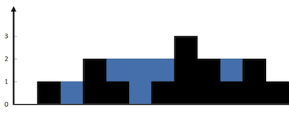
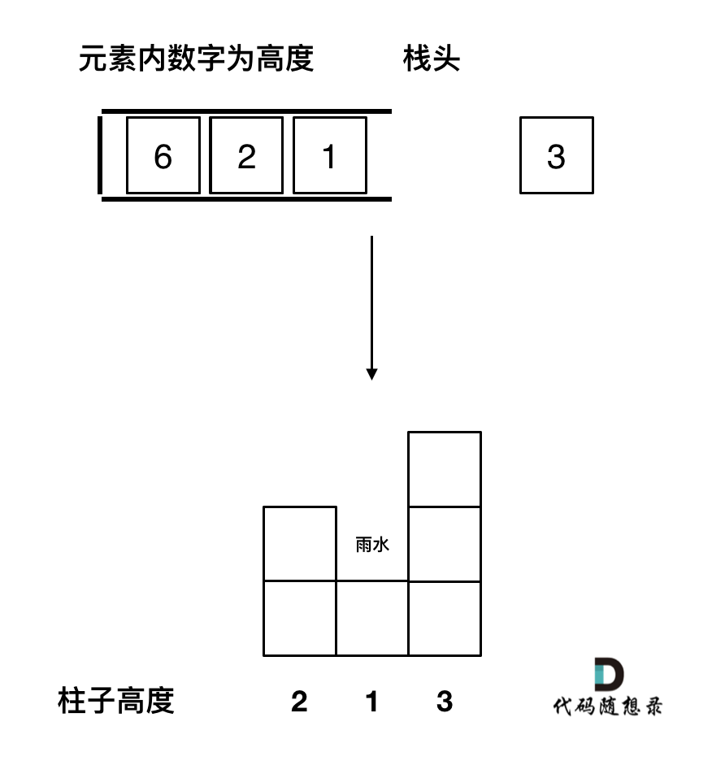
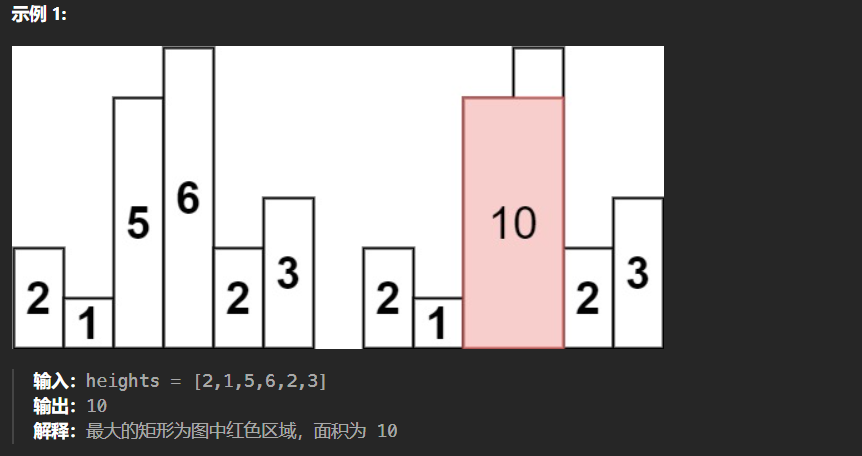
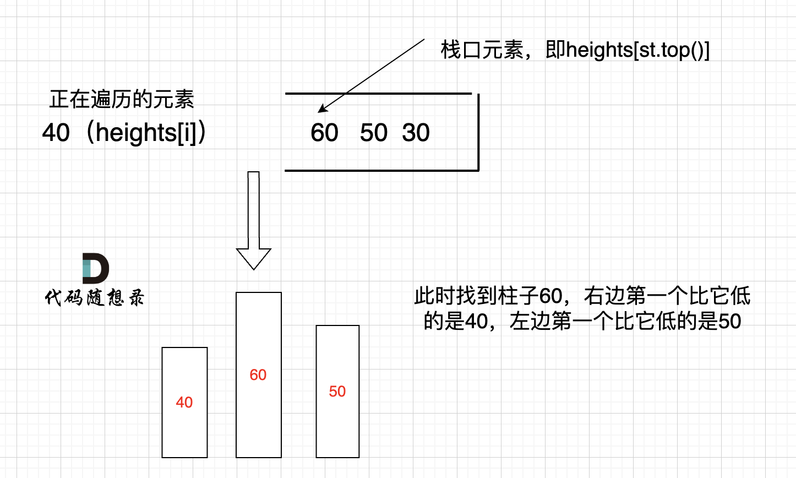

## 每日温度

> 请根据每日 气温 列表，重新生成一个列表。对应位置的输出为：要想观测到更高的气温，至少需要等待的天数。如果气温在这之后都不会升高，请在该位置用 0 来代替。
>
> 例如，给定一个列表 temperatures = [73, 74, 75, 71, 69, 72, 76, 73]，你的输出应该是 [1, 1, 4, 2, 1, 1, 0, 0]。

单调栈满足从栈底到栈顶元素对应的温度递减，因此每次有元素进栈时，会将温度更低的元素全部移除，并更新出栈元素对应的等待天数，这样可以确保等待天数一定是最小的

```go
func dailyTemperatures(temperatures []int) []int {
    n := len(temperatures)
    st := make([]int, 0)
    res := make([]int, n)

    for i, val := range temperatures {
        // 栈不空，且当前遍历元素 v 破坏了栈的单调性
        for len(st) != 0 && temperatures[st[len(st)-1]] < val {
            res[st[len(st)-1]] = i - st[len(st)-1]
            st = st[:len(st)-1]
        }
        st = append(st, i)
    }
    return res
}
```

---

## 下一个更大元素 I

> 给你两个 没有重复元素 的数组 nums1 和 nums2 ，其中nums1 是 nums2 的子集。
>
> 请你找出 nums1 中每个元素在 nums2 中的下一个比其大的值。
>
> nums1 中数字 x 的下一个更大元素是指 x 在 nums2 中对应位置的右边的第一个比 x 大的元素。如果不存在，对应位置输出 -1 。
>
> 示例 1:
>
> 输入: nums1 = [4,1,2], nums2 = [1,3,4,2].
> 输出: [-1,3,-1]
> 解释:
> 对于 num1 中的数字 4 ，你无法在第二个数组中找到下一个更大的数字，因此输出 -1 。
> 对于 num1 中的数字 1 ，第二个数组中数字1右边的下一个较大数字是 3 。
> 对于 num1 中的数字 2 ，第二个数组中没有下一个更大的数字，因此输出 -1 。
>
> 示例 2:
> 输入: nums1 = [2,4], nums2 = [1,2,3,4].
> 输出: [3,-1]
> 解释:
> 对于 num1 中的数字 2 ，第二个数组中的下一个较大数字是 3 。
> 对于 num1 中的数字 4 ，第二个数组中没有下一个更大的数字，因此输出-1 。

题目有点太复杂了，和前一个问题的区别就是结果是存储在 nums1 上的，所以用到一个 map 映射

```go
func nextGreaterElement(nums1 []int, nums2 []int) []int {
    // 储存 nums1 中各数字的下标
    set := make(map[int]int, 0)
    for i, num := range nums1 {
        set[num] = i
    }
    
    st := make([]int, 0)
    ans := make([]int, len(nums1))
    for i := range ans {
        ans[i] = -1
    }
    for _, num := range nums2 {
        for len(st) != 0 && num > st[len(st)-1] {
            // 如果是 nums1 中的元素，则更新 ans
            if index, exist := set[st[len(st)-1]]; exist {
                ans[index] = num
            }
            st = st[:len(st)-1]
        }
        st = append(st, num)
    }
    return ans
}
```

---

## 下一个更大元素II

> 给定一个循环数组（最后一个元素的下一个元素是数组的第一个元素），输出每个元素的下一个更大元素。数字 x 的下一个更大的元素是按数组遍历顺序，这个数字之后的第一个比它更大的数，这意味着你应该循环地搜索它的下一个更大的数。如果不存在，则输出 -1。
>
> 示例 1:
>
> - 输入: [1,2,1]
> - 输出: [2,-1,2]
> - 解释: 第一个 1 的下一个更大的数是 2；数字 2 找不到下一个更大的数；第二个 1 的下一个最大的数需要循环搜索，结果也是 2。

循环数组，遍历两遍。

```go
func nextGreaterElements(nums []int) []int {
    n := len(nums)
    res := make([]int, n)
    for i := range res {
        res[i] = -1
    }
    //单调递减，存储数组下标索引
    stack := make([]int, 0)
    for i := 0; i < n * 2; i++ {
        for len(stack) > 0 && nums[i%n] > nums[stack[len(stack)-1]] {
            index := stack[len(stack)-1]
            stack = stack[:len(stack)-1] // pop
            res[index] = nums[i%n]
        }
        stack = append(stack, i%n)
    }
    return res
}
```

---

## 接雨水

> 给定 n 个非负整数表示每个宽度为 1 的柱子的高度图，计算按此排列的柱子，下雨之后能接多少雨水。
>
> 示例 1：
>
> 
>
> - 输入：height = [0,1,0,2,1,0,1,3,2,1,2,1]
> - 输出：6
> - 解释：上面是由数组 [0,1,0,2,1,0,1,3,2,1,2,1] 表示的高度图，在这种情况下，可以接 6 个单位的雨水（蓝色部分表示雨水）。

如果当前遍历的元素（柱子）高度大于栈顶元素的高度，此时就出现凹槽。此时的栈顶元素st.top()，就是凹槽的左边位置，下标为st.top()，对应的高度为height[st.top()]（就是图中的高度2）。当前遍历的元素i，就是凹槽右边的位置，下标为i，对应的高度为height[i]（就是图中的高度3）。

那么雨水高度是 min(凹槽左边高度, 凹槽右边高度) - 凹槽底部高度，代码为：`int h = min(height[st.top()], height[i]) - height[mid];`

雨水的宽度是 凹槽右边的下标 - 凹槽左边的下标 - 1（因为只求中间宽度），代码为：`int w = i - st.top() - 1 ;`

当前凹槽雨水的体积就是：`h * w`。



```go
func trap(height []int) int {
    st := make([]int, 0)

    res := 0
    for i, h := range height {
        for len(st) > 0 && h > height[st[len(st)-1]] {
            // 获得凹槽高度
            mid := height[st[len(st)-1]]
            // 凹槽坐标出栈
            st = st[:len(st)-1]

            // 如果栈不为空则此时栈顶元素为左侧柱子坐标
            if len(st) > 0 {
                // 求得雨水高度
                h := min(height[i], height[st[len(st)-1]]) - mid
                // 求得雨水宽度
                w := i - st[len(st)-1] - 1
                res += h * w
            }
        }
        st = append(st, i)
    }
    return res
}
```

---

## 柱状图中最大的矩形

> 给定 n 个非负整数，用来表示柱状图中各个柱子的高度。每个柱子彼此相邻，且宽度为 1 。求在该柱状图中，能够勾勒出来的矩形的最大面积。
>
> 

找到左边右边第一个比自己低的 然后计算以自己为高的最大矩形面积。



```go
func largestRectangleArea(heights []int) int {
    st := make([]int, 0)
    heights = append([]int{0}, heights...)
    heights = append(heights, 0)

    res := 0
    for i, h := range heights {
        for len(st) > 0 && h < heights[st[len(st)-1]] {
            mid := heights[st[len(st)-1]]
            st = st[:len(st)-1]
            // left是top的下一位元素，i是将要入栈的元素
            left := st[len(st) - 1]
            // 高度x宽度
            tmp := mid * (i - left - 1)
            res = max(res, tmp)
        }
        st = append(st, i)
    }

    return res
}
```

---

## 滑动窗口最大值

> 给你一个整数数组 `nums`，有一个大小为 `k` 的滑动窗口从数组的最左侧移动到数组的最右侧。你只可以看到在滑动窗口内的 `k` 个数字。滑动窗口每次只向右移动一位。返回 *滑动窗口中的最大值* 。
>
> ```
> 输入：nums = [1,3,-1,-3,5,3,6,7], k = 3
> 输出：[3,3,5,5,6,7]
> 解释：
> 滑动窗口的位置                最大值
> ---------------               -----
> [1  3  -1] -3  5  3  6  7       3
>  1 [3  -1  -3] 5  3  6  7       3
>  1  3 [-1  -3  5] 3  6  7       5
>  1  3  -1 [-3  5  3] 6  7       5
>  1  3  -1  -3 [5  3  6] 7       6
>  1  3  -1  -3  5 [3  6  7]      7
> ```

维护一个单调栈，栈内至少存在一个元素，且元素从大到小排列，窗口每次往右移动一次，返回栈中的第一个元素。

当第一个元素不在窗口内时，出栈。

```go
func maxSlidingWindow(nums []int, k int) []int {
    n := len(nums)
    ans := make([]int, 0, n-k+1)
    st := make([]int, 0)
    for i, num := range nums {
        // 保持 st 递减
        for len(st) > 0 && num >= nums[st[len(st)-1]] {
            st = st[:len(st)-1]
        }
        st = append(st, i)
        // 需要出队
        if st[0] < i - k + 1 {
            st = st[1:]
        }
        if i >= k - 1 {
            ans = append(ans, nums[st[0]])
        }
    }
    return ans
}
```

---

## 

> 


```go

```

---

## 

> 


```go

```

---

## 

> 


```go

```

---

## 

> 


```go

```

---

## 

> 


```go

```

---

