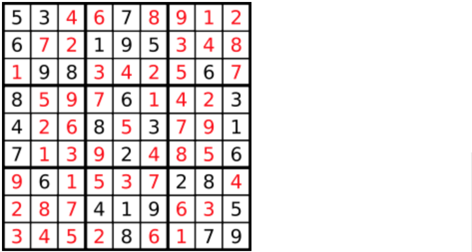

## 模板


```go
void backtracking(参数) {
    if (终止条件) {
        存放结果;
        return;
    }

    for (选择：本层集合中元素（树中节点孩子的数量就是集合的大小）) {
        处理节点;
        backtracking(路径，选择列表); // 递归
        回溯，撤销处理结果
    }
}
```

---

## 组合问题

> 给定两个整数 `n` 和 `k`，返回范围 `[1, n]` 中所有可能的 `k` 个数的组合。
>
> n = 100，k = 50？？？


```go
func combinationSum3(n int, k int) [][]int {
    path := make([]int, 0, k)
    res := make([][]int, 0)

    var backtracking func(n, k, start int)
    backtracking = func(n, k, start int) {
        if n == 0 && k == 0 {
            tmp := append([]int{}, path...) // 直接通过切片的方式完成拷贝
            res = append(res, tmp)
            return
        }

        for i := start; i <= 9; i++ {
            if i > n {
                break
            }
            if 9-i+1 < k-len(path) { // 剪枝
                break
            }
            path = append(path, i)
            backtracking(n-i, k-1, i+1)
            path = path[:len(path)-1] // 回溯
        }
    }

    backtracking(n, k, 1)
    return res
}
```

---

## 组合总和III

> 找出所有相加之和为 `n` 的 `k` 个数的组合，且满足下列条件：
>
> - 只使用数字1到9
> - 每个数字 **最多使用一次** 

```go
func combinationSum3(k int, n int) [][]int {
	path := make([]int, 0, k)
	res := make([][]int, 0)

	var backtracking func(n, k, start int)
	backtracking = func(n, k, start int) {
		if n == 0 && k == 0 {
			tmp := append([]int{}, path...)		//拷贝
			res = append(res, tmp)
			return
		}

		for i := start; i <= 9; i++ {
			if i > n {
				break
			}
			if 9-i+1 < k-len(path) {	//剪枝
				break
			}
			path = append(path, i)
			backtracking(n-i, k-1, i+1)
			path = path[:len(path)-1]	//回溯
		}
	}

	backtracking(n, k, 1)
	return res
}
```

---

## 电话号码的字母组合

> 给定一个仅包含数字 2-9 的字符串，返回所有它能表示的字母组合。
>
> 

和组合问题类似，回溯时要知道应该读取 `digits` 的第几位，我刚开始只传递了一个 `[]byte` 参数，虽然也能解题， 但中间多了一些处理步骤，多传递一个 `start` 参数会方便许多。

```go
func letterCombinations(digits string) []string {
	letters := []string{"abc", "def", "ghi", "jkl", "mno", "pqrs", "tuv", "wxyz"}
	path := make([]byte, 0)
	res := make([]string, 0)
	if digits == "" {
		return res
	}

	var backtracking func(digits string, start int)	//用start参数来控制读取到哪个数字
	backtracking = func(digits string, start int) {
		if len(path) == len(digits) {
			tmp := string(path)
			res = append(res, tmp)
			return
		}

		str := letters[int(digits[start]-'0')-2]
		for i, _ := range str {
			path = append(path, str[i])
			backtracking(digits, start+1)
			path = path[:len(path)-1]
		}
	}

	backtracking(digits, 0)
	return res
}
```

---

## 组合总和II

> 给定一个数组 candidates 和一个目标数 target ，找出 candidates 中所有可以使数字和为 target 的组合。candidates 中的每个数字在每个组合中只能使用一次。说明： 所有数字（包括目标数）都是正整数。解集不能包含重复的组合。
>
> **示例 2:**
>
> ```
> 输入: candidates = [2,5,2,1,2], target = 5,
> 输出:
> [
> [1,2,2],
> [5]
> ]
> ```

关键点：去重。阴差阳错的一次写对了，但是仔细分析去重的过程有点懵。

大概就是第一次遍历时全部取一遍。


```go
func combinationSum2(candidates []int, target int) [][]int {
	sort.Ints(candidates)
	path := make([]int, 0)
	res := make([][]int, 0)

	var backtracking func(target int, start int)
	backtracking = func(target int, start int) {
		if target == 0 {
			tmp := append([]int{}, path...)
			res = append(res, tmp)
			return
		}

		for i := start; i < len(candidates); i++ {
			if candidates[i] > target {	//剪枝	
				break
			}
			if i > start && candidates[i] == candidates[i-1] {	//去重
				continue
			}
			path = append(path, candidates[i])
			backtracking(target-candidates[i], i+1)
			path = path[:len(path)-1]
		}
	}

	backtracking(target, 0)
	return res
}
```

---

## 分割回文串

> 给定一个字符串 s，将 s 分割成一些子串，使每个子串都是回文串。
>
> 返回 s 所有可能的分割方案。
>
> 示例: 输入: "aab" 输出: [ ["aa","b"], ["a","a","b"] ]

两天一道题没写，写了一些小bug，头晕掉

```go
func partition(s string) [][]string {
	path := make([]string, 0)
	res := make([][]string, 0)

	var backtracking func(s string, start int)
	backtracking = func(s string, start int) {
		if start == len(s) {
			tmp := append([]string{}, path...)	//append，不是make
			res = append(res, tmp)
			return															//记得return
		}
		for i := start; i < len(s); i++ {
      		if isPalindrome(s[start : i+1]) {		//s[0:0]返回的是空
				str := s[start : i+1]
				path = append(path, str)
				backtracking(s, i+1)
				path = path[:len(path)-1]
			}
		}
	}

	backtracking(s, 0)
	return res
}

func isPalindrome(s string) bool {
	for i, j := 0, len(s)-1; i < j; i, j = i+1, j-1 {
		if s[i] != s[j] {	//没必要用[]byte
			return false
		}
	}
	return true
}
```

---

## 复原IP地址

> 给定一个只包含数字的字符串，复原它并返回所有可能的 IP 地址格式。
>
> 有效的 IP 地址 正好由四个整数（每个整数位于 0 到 255 之间组成，且不能含有前导 0），整数之间用 '.' 分隔。
>
> 例如："0.1.2.201" 和 "192.168.1.1" 是 有效的 IP 地址，但是 "0.011.255.245"、"192.168.1.312" 和 "192.168@1.1" 是 无效的 IP 地址。
>
> - 输入：s = "25525511135"
> - 输出：["255.255.11.135","255.255.111.35"]

- `make()`函数指定了size时，也应该指定len。

- 去除含有前导 '0' 的算法： `i != start && s[start] == '0'`

```go
func restoreIpAddresses(s string) []string {
	path := make([]string, 0, 4)
	res := make([]string, 0)

	var backtracking func(s string, start int)
	backtracking = func(s string, start int) {
		if len(path) == 4 {
			if start == len(s) {
				tmp := strings.Join(path, ".")
				res = append(res, tmp)
			}
			return
		}

		for i := start; i < len(s); i++ {
     		 //去除含有前导'0'
			if i != start && s[start] == '0' {
				break
			}
			str := s[start : i+1]
			num, _ := strconv.Atoi(str)
			if num >= 0 && num <= 255 {
				path = append(path, str)
				backtracking(s, i+1)
				path = path[:len(path)-1]
			} else {
				break
			}
		}
	}

	backtracking(s, 0)
	return res
}
```

---

## 递增子序列

> 给定一个整型数组, 你的任务是找到所有该数组的递增子序列，递增子序列的长度至少是2。
>
> 示例:
>
> - 输入: [4, 6, 7, 7]
> - 输出: [[4, 6], [4, 7], [4, 6, 7], [4, 6, 7, 7], [6, 7], [6, 7, 7], [7,7], [4,7,7]]

注意：原数组**未排序**，示例并不清楚反映未排序的效果

5676 中如何对 56 进行去重？ `if i > start && nums[i] == nums[i-1]` 不再生效！

所以采用方法 `used := make(map[int]bool, len(nums))   // 初始化used字典，用以对同层元素去重` ，因为每次递归都初始化了used，因此只会影响同层相同元素。

```go
func findSubsequences(nums []int) [][]int {
	path := make([]int, 0, len(nums))
	res := make([][]int, 0)

	var backtracking func(nums []int, start int)
	backtracking = func(nums []int, start int) {
		if len(path) > 1 {
			tmp := append([]int{}, path...)
			res = append(res, tmp)
		}

		used := make(map[int]bool, len(nums))	// 初始化used字典，用以对同层元素去重
		for i := start; i < len(nums); i++ {
			if used[nums[i]] { // 去重
				continue
			}
			if len(path) == 0 || nums[i] >= path[len(path)-1] {
				path = append(path, nums[i])
				used[nums[i]] = true
				backtracking(nums,  i+1)
				path = path[:len(path)-1]
			}
		}
	}

	backtracking(nums, 0)
	return res
}
```

---

## 全排列 II

> 给定一个可包含重复数字的序列 nums ，按任意顺序 返回所有不重复的全排列。
>
> 示例 1：
>
> - 输入：nums = [1,1,2]
> - 输出： [[1,1,2], [1,2,1], [2,1,1]]

不能只用脑子。画图太清楚了


去重逻辑： `if i > 0 && nums[i] == nums[i-1] && !used[i-1]  // 去重，用st来判别是深度还是广度`

树层上去重(used[i - 1] == false)，的树形结构如下：


```go
func permuteUnique(nums []int) [][]int {
	path := make([]int, 0, len(nums))
	res := make([][]int, 0)
	used := make([]bool, len(nums))
	sort.Ints(nums)

	var dfs func(nums []int)
	dfs = func(nums []int) {
		if len(path) == len(nums) {
			tmp := append([]int{}, path...)
			res = append(res, tmp)
		}

		for i := 0; i < len(nums); i++ {
			if i > 0 && nums[i] == nums[i-1] && !used[i-1] { // 去重
				continue
			}
			if !used[i] {
				path = append(path, nums[i])
				used[i] = true
				dfs(nums)
				used[i] = false
				path = path[:len(path)-1]
			}

		}
	}

	dfs(nums)
	return res
}
```

---

## 重新安排行程

> 给定一个机票的字符串二维数组 [from, to]，子数组中的两个成员分别表示飞机出发和降落的机场地点，对该行程进行重新规划排序。所有这些机票都属于一个从 JFK（肯尼迪国际机场）出发的先生，所以该行程必须从 JFK 开始。
>
> 示例 1：
>
> - 输入：[["MUC", "LHR"], ["JFK", "MUC"], ["SFO", "SJC"], ["LHR", "SFO"]]
> - 输出：["JFK", "MUC", "LHR", "SFO", "SJC"]
>
> 示例 2：
>
> - 输入：[["JFK","SFO"],["JFK","ATL"],["SFO","ATL"],["ATL","JFK"],["ATL","SFO"]]
> - 输出：["JFK","ATL","JFK","SFO","ATL","SFO"]
> - 解释：另一种有效的行程是 ["JFK","SFO","ATL","JFK","ATL","SFO"]。但是它自然排序更大更靠后。

不会。

首先先把图的邻接表存进字典，并且按字典序排序，然后从‘JFK’开始深搜，每前进一层就减去一条路径，直到某个起点不存在路径的时候就会跳出while循环进行回溯，相对先找不到路径的一定是放在相对后面，所以当前搜索的起点from会插在当前输出路径的第一个位置。

```go
var d map[string][]string
var ans []string

func findItinerary(tickets [][]string) []string {
    d = map[string][]string{}
    for _, v := range tickets {
        d[v[0]] = append(d[v[0]], v[1])
    }
    for _, v := range d {
        sort.Strings(v)
    }
    ans = []string{}
    dfs("JFK")
    return ans
}

func dfs(f string) {
    for len(d[f]) > 0 {
        v := d[f][0]
        d[f] = d[f][1: ]
        dfs(v)
    }
    ans = append([]string{f}, ans...)
}
```

---

## N皇后

> 皇后可以攻击与之处在同一行或同一列或同一斜线上的棋子。
>
> **n 皇后问题** 研究的是如何将 `n` 个皇后放置在 `n×n` 的棋盘上，并且使皇后彼此之间不能相互攻击。
>
> 
>
> - 输入：n = 4
> - 输出：[[".Q..","...Q","Q...","..Q."],["..Q.","Q...","...Q",".Q.."]]
> - 解释：如上图所示，4 皇后问题存在两个不同的解法。

逻辑比傻逼飞机票简单多了...

```go
func solveNQueens(n int) [][]string {
    res := make([][]string, 0)
    chessboard := make([][]string, n)
    for i := 0; i < n; i++ {
        chessboard[i] = make([]string, n) //初始化
    }
    for i := 0; i < n; i++ {
		for j := 0; j < n; j++ {
			chessboard[i][j] = "."
		}
	}

    var dfs func(row int)
    dfs = func(row int) {
        if row == n {
			temp := make([]string, n)
			for i, rowStr := range chessboard {
				temp[i] = strings.Join(rowStr, "")  //拼接字符串，分隔符为空
			}
			res = append(res, temp)
			return
		}
		for i := 0; i < n; i++ {
			if isValid(n, row, i, chessboard) {
				chessboard[row][i] = "Q"
				dfs(row + 1)
				chessboard[row][i] = "."
			}
		}
    }

    dfs(0)
    return res
}

func isValid(n, row, col int, chessboard [][]string) bool {
    for i := 0; i < row; i++ {	//上方不能有皇后
        if chessboard[i][col] == "Q" {
            return false
        }
    }
    for i, j := row-1, col-1; i >= 0 && j >= 0; i, j = i-1, j-1 {	//左上不可以有
        if chessboard[i][j] == "Q" {
            return false
        }
    }
    for i, j := row-1, col+1; i >= 0 && j <= n-1; i, j = i-1, j+1 {	//右上不可以有
        if chessboard[i][j] == "Q" {
            return false
        }
    }

    return true
}
```

---

## 解数独

> 一个数独的解法需遵循如下规则： 数字 1-9 在每一行只能出现一次。 数字 1-9 在每一列只能出现一次。 数字 1-9 在每一个以粗实线分隔的 3x3 宫内只能出现一次。 空白格用 '.' 表示。
>
> 

因为解数独找到一个符合的条件（就在树的叶子节点上）立刻就返回，相当于找从根节点到叶子节点一条唯一路径，所以需要使用``bool``返回值。

**注意这里return false的地方，这里放return false 是有讲究的**。

因为如果一行一列确定下来了，这里尝试了9个数都不行，说明这个棋盘找不到解决数独问题的解！

那么会直接返回， **这也就是为什么没有终止条件也不会永远填不满棋盘而无限递归下去！**

```go
func solveSudoku(board [][]byte) {
	n := len(board)
	var dfs func(board [][]byte) bool
	dfs = func(board [][]byte) bool {
		for i := 0; i < n; i++ {
			for j := 0; j < n; j++ {
				if board[i][j] != '.' {
					continue
				}
				for k := '1'; k <= '9'; k++ {
					if isValid(i, j, byte(k), board) {
						board[i][j] = byte(k)
						if dfs(board) {
							return true	// 如果找到合适一组立刻返回
						}
						board[i][j] = '.'
					}
				}
				return false // 1-9都填不进去
			}
		}

		return true
	}

	dfs(board)
}

func isValid(row, col int, k byte, board [][]byte) bool {
	n := len(board)
	for j := 0; j < n; j++ {	//行
		if board[row][j] == k {
			return false
		}
	}

	for i := 0; i < n; i++ {	//列
		if board[i][col] == k {
			return false
		}
	}

	r, c := (row/3)*3, (col/3)*3
	for i := r; i < r+3; i++ {	//九宫格
		for j := c; j < c+3; j++ {
			if board[i][j] == k {
				return false
			}
		}
	}

	return true
}
```

---

## 

> 


```go

```

---

## 

> 


```go

```

---

