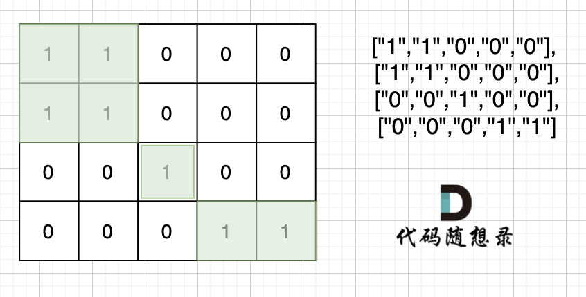

## 并查集


并查集主要有两个功能：

- 将两个元素添加到一个集合中。
- 判断两个元素在不在同一个集合。

除了根节点其他所有节点都挂载根节点下，这样我们在寻根的时候就很快，只需要一步

```go
// 并查集建立
father = make([]int, 10009)
for i := range father {
	father[i] = i
}

// 并查集里寻根的过程
func find(u int) int {
    if father[u] != u {   // 路径压缩
        father[u] = find(father[u])  // 在递归找根节点的同时中，将沿途的所有节点都指向根节点
    }  
    return father[u]
}

// 将v->u 这条边加入并查集
func join(u, v int) {
    u = find(u) // 寻找u的根
    v = find(v) // 寻找v的根
    if (u == v) {
        return
    }  // 如果发现根相同，则说明在一个集合，不用两个节点相连直接返回
    father[v] = u
}
```

可以简化：

```go
// 将v->u 这条边加入并查集
func join(u, v int) {
    father[find(u)] = father[find(v)]
}
```

---

## 岛屿数量（DFS）

> 给你一个由 `'1'`（陆地）和 `'0'`（水）组成的的二维网格，请你计算网格中岛屿的数量。岛屿总是被水包围，并且每座岛屿只能由水平方向和/或竖直方向上相邻的陆地连接形成。
>
> 

遇到一个没有遍历过的节点陆地，ans 就加一，然后把该节点陆地所能遍历到的陆地都标记上。在遇到标记过的陆地节点和海洋节点的时候直接跳过。 这样 ans 就是最终岛屿的数量。

```go
func numIslands(grid [][]byte) int {
    m, n := len(grid), len(grid[0])
    // 四个方向
    dir := [][]int{{1, 0}, {0, 1}, {-1, 0}, {0, -1}}
    visited := make([][]bool, m)
    for i := range visited {
        visited[i] = make([]bool, n)
    }

    var dfs func(x, y int)
    dfs = func(x, y int) {
        // 如果访问过、访问到‘水’则 return
        if visited[x][y] || grid[x][y] == '0' {
            return
        }
        visited[x][y] = true
        // 从四个方向开始搜索
        for i := range dir {
            nextx, nexty := x+dir[i][0], y+dir[i][1]
            if nextx < 0 || nextx >= m || nexty < 0 || nexty >= n {
                continue
            }
            dfs(nextx, nexty)
        }
    }

    ans := 0
    for i := 0; i < m; i++ {
        for j := 0; j < n; j++ {
            // 找到一块陆地后 ans++ 然后找到所有相邻的陆地
            if !visited[i][j] && grid[i][j] == '1' {
                ans += 1
                dfs(i, j)
            }
        }
    }
    return ans
}
```

理解深搜以后，简单一点的版本

```go
var ans int

func numIslands(grid [][]byte) int {
	ans = 0
	for i := 0; i < len(grid); i++ {
		for j := 0; j < len(grid[0]); j++ {
			if grid[i][j] == '1' {
				ans++
				dfs(grid, i, j)
			}
		}
	}
	return ans
}

func dfs(grid [][]byte, i, j int) {
	if i < 0 || j < 0 || i >= len(grid) || j >= len(grid[0]) {
		return
	}
	if grid[i][j] != '1' {
		return
	}
	grid[i][j] = '2'
	dfs(grid, i+1, j)
	dfs(grid, i-1, j)
	dfs(grid, i, j+1)
	dfs(grid, i, j-1)
}
```

---

## 腐烂的橘子（BFS）

> 在给定的 `m x n` 网格 `grid` 中，每个单元格可以有以下三个值之一：
>
> - 值 `0` 代表空单元格；
> - 值 `1` 代表新鲜橘子；
> - 值 `2` 代表腐烂的橘子。
>
> 每分钟，腐烂的橘子 **周围 4 个方向上相邻** 的新鲜橘子都会腐烂。返回 *直到单元格中没有新鲜橘子为止所必须经过的最小分钟数。如果不可能，返回 `-1`* 。
>
> ****
>
> ```
> 输入：grid = [[2,1,1],[1,1,0],[0,1,1]]
> 输出：4
> ```

统计新鲜橘子的数量 sum，将坏橘子入队 queue

每 bfs 一次，时间 ans++， 当 sum = 0 时返回 ans，当 sum > 0  时说明有橘子永远不会腐烂，返回 -1

```go
func orangesRotting(grid [][]int) int {
    dir := [][]int{{1, 0}, {0, 1}, {-1, 0}, {0, -1}}
    queue := make([][]int, 0)
    m, n := len(grid), len(grid[0])
    // 有几个新鲜橘子
    sum := 0
    for i := range grid {
        for j := range grid[i] {
           	// 将坏橘子入队
            if grid[i][j] == 2 {
                queue = append(queue, []int{i, j})
            } else if grid[i][j] == 1 {
                sum++
            }
        }
    }
    if sum == 0 {
        return 0
    }
    // 时间
    ans := 0
    for len(queue) > 0 {
        size := len(queue)
        ans++
        for i := 0; i < size; i++ {
            q := queue[0]
            queue = queue[1:]
            // 队列的橘子依次向上下左右传染
            for _, d := range dir {
                x, y := q[0]+d[0], q[1]+d[1]
                // 只处理将要被传染的橘子
                if x >= 0 && x < m && y >= 0 && y < n && grid[x][y] == 1 {
                    grid[x][y] = 2
                    sum--
                    queue = append(queue, []int{x, y})
                }
            }
        }
        // 没有新鲜橘子了
        if sum == 0 {
            return ans
        }
    }
    // 队列为空且还有新鲜橘子，说明无法传染到
    return -1
}
```

---

## 课程表（BFS 拓扑排序）

> 你这个学期必须选修 `numCourses` 门课程，记为 `0` 到 `numCourses - 1` 。在选修某些课程之前需要一些先修课程。 先修课程按数组 `prerequisites` 给出，其中 `prerequisites[i] = [ai, bi]` ，表示如果要学习课程 `ai` 则 **必须** 先学习课程 `bi` 。
>
> - 例如，先修课程对 `[0, 1]` 表示：想要学习课程 `0` ，你需要先完成课程 `1` 。
>
> 请你判断是否可能完成所有课程的学习？如果可以，返回 `true` ；否则，返回 `false` 。
>
> **示例 1：**
>
> ```
> 输入：numCourses = 2, prerequisites = [[1,0]]
> 输出：true
> 解释：总共有 2 门课程。学习课程 1 之前，你需要完成课程 0 。这是可能的。
> ```
>
> **示例 2：**
>
> ```
> 输入：numCourses = 2, prerequisites = [[1,0],[0,1]]
> 输出：false
> 解释：总共有 2 门课程。学习课程 1 之前，你需要先完成课程 0 ；并且学习课程 0 之前，你还应先完成课程 1 。这是不可能的。
> ```

bfs

```go
func canFinish(numCourses int, prerequisites [][]int) bool {
    // 课程有n个前置
    needCnt := make([]int, numCourses)
    // 记录课程的后置
    post := map[int][]int{}

    for _, v := range prerequisites {
        needCnt[v[0]]++
        post[v[1]] = append(post[v[1]], v[0])
    }

    queue := make([]int, 0)
    // 将没有先修的课程入队
    for i, v := range needCnt {
        if v == 0 {
            queue = append(queue, i)
        }
    }

    for len(queue) > 0 {
        size := len(queue)
        for i := 0; i < size; i++ {
            if v, ok := post[queue[i]]; !ok {
                continue
            } else {
                // 后置课程需要的前置-1
                for j := range v {
                    needCnt[v[j]]--
                    if needCnt[v[j]] == 0 {
                        queue = append(queue, v[j])
                    }
                }
            }
        }
        queue = queue[size:]
    }

    for _, v := range needCnt {
        if v != 0 {
            return false
        }
    }
    return true
}
```

当作拓扑排序的模板

```go
func canFinish(numCourses int, prerequisites [][]int) bool {
    // 构造图和记录入度
    edges := make([][]int, numCourses)
    indeg := make([]int, numCourses)

    for _, p := range prerequisites {
        // 先修p[1]  p[1] 指向 p[0]
        edges[p[1]] = append(edges[p[1]], p[0])
        indeg[p[0]]++
    }
    // 从入度为 0 的节点开始拓扑排序
    queue := make([]int, 0)
    for i := 0; i < numCourses; i++ {
        if indeg[i] == 0 {
            queue = append(queue, i)
        }
    }

    ans := make([]int, 0)
    for len(queue) > 0 {
        u := queue[0]
        queue = queue[1:]
        ans = append(ans, u)
        // 没入队的一定是互相冲突的节点： 1->2 2->1
        for _, e := range edges[u] {
            indeg[e]--
            if indeg[e] == 0 {
                queue = append(queue, e)
            }
        }
    }
    return len(ans) == numCourses
}
```

---

## 实现 Trie（前缀树）

> 请你实现 Trie 类：
>
> - `Trie()` 初始化前缀树对象。
> - `void insert(String word)` 向前缀树中插入字符串 `word` 。
> - `boolean search(String word)` 如果字符串 `word` 在前缀树中，返回 `true`（即，在检索之前已经插入）；否则，返回 `false` 。
> - `boolean startsWith(String prefix)` 如果之前已经插入的字符串 `word` 的前缀之一为 `prefix` ，返回 `true` ；否则，返回 `false` 。


```go
type Trie struct {
    children [26]*Trie
    isEnd    bool   // 该节点是否为字符串的结尾
}


func Constructor() Trie {
    return Trie{}
}


func (this *Trie) Insert(word string)  {
    for _, ch := range word {
        idx := ch - 'a'
        if this.children[idx] == nil {
            this.children[idx] = &Trie{}
        }
        this = this.children[idx]
    }
    this.isEnd = true	// 是结尾
}


func (this *Trie) Search(word string) bool {
    for _, ch := range word {
        idx := ch - 'a'
        if this.children[idx] == nil {
            return false
        }
        this = this.children[idx]
    }
    return this.isEnd
}


func (this *Trie) StartsWith(prefix string) bool {
    for _, ch := range prefix {
        idx := ch - 'a'
        if this.children[idx] == nil {
            return false
        }
        this = this.children[idx]
    }
    return true
}

```

---

## 

> 


```go

```

---

## 

> 


```go

```

---

## 

> 


```go

```

---

## 

> 


```go

```

---

## 

> 


```go

```

---

## 

> 


```go

```

---

## 

> 


```go

```

---

## 

> 


```go

```

---

## 

> 


```go

```

---

## 

> 


```go

```

---

