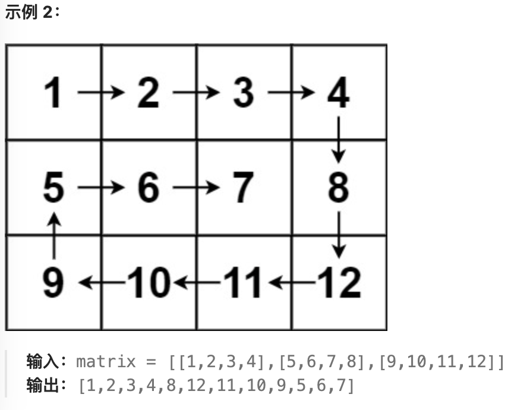

## 二分查找

> 给定一个 n 个元素有序的（升序）整型数组 nums 和一个目标值 target  ，写一个函数搜索 nums 中的 target，如果目标值存在返回下标，否则返回 -1。
>
> 示例 1:
>
> ```text
> 输入: nums = [-1,0,3,5,9,12], target = 9     
> 输出: 4       
> 解释: 9 出现在 nums 中并且下标为 4     
> ```
>
> 示例 2:
>
> ```text
> 输入: nums = [-1,0,3,5,9,12], target = 2     
> 输出: -1        
> 解释: 2 不存在 nums 中因此返回 -1        
> ```

关键点：right的初始取值；循环的判断条件是`<`还是`<=`；循环中right的取值

1. 根据区间判断初始取值：[0, len - 1]或者[0, len)
2. [0, len - 1]：left ==right可以取到，因此循环条件是`<=`，如下是左闭右闭区间的解法
3. [0, len)：循环条件是`<`，循环中right应该取middle，因为取不到right值

```go
func search(nums []int, target int) int {
	left, right := 0, len(nums)-1
	for left <= right {
		middle := (left + right) / 2
		if nums[middle] == target {
			return middle
		} else if nums[middle] < target {
			left = middle + 1
		} else {
			right = middle - 1
		}
	}
	return -1
}
```

---

## 移除元素

> 给你一个数组 nums 和一个值 val，你需要 原地 移除所有数值等于 val 的元素，并返回移除后数组的新长度。
>
> 不要使用额外的数组空间，你必须仅使用 O(1) 额外空间并**原地**修改输入数组。
>
> 元素的顺序可以改变。你不需要考虑数组中超出新长度后面的元素。
>
> 示例 1: 给定 nums = [3,2,2,3], val = 3, 函数应该返回新的长度 2, 并且 nums 中的前两个元素均为 2。 你不需要考虑数组中超出新长度后面的元素。
>
> 示例 2: 给定 nums = [0,1,2,2,3,0,4,2], val = 2, 函数应该返回新的长度 5, 并且 nums 中的前五个元素为 0, 1, 3, 0, 4。
>
> **你不需要考虑数组中超出新长度后面的元素。**

### 双指针法（快慢指针法） 

通过一个快指针和慢指针在一个for循环下完成两个for循环的工作。定义快慢指针

- 快指针：循环遍历原数组，将所有不等于 val的元素存储于新数组
- 慢指针：指向新数组下标的位置

```go
func removeElement(nums []int, val int) int {
	//慢指针用于返回
	slowIndex := 0
	for fastIndex := 0; fastIndex < len(nums); fastIndex++ {
		if nums[fastIndex] != val{
			nums[slowIndex] = nums[fastIndex]
			slowIndex += 1
		}
	}
	return slowIndex
}
```

---

## 有序数组的平方

> 给你一个按 非递减顺序 排序的整数数组 nums，返回 每个数字的平方 组成的新数组，要求也按 非递减顺序 排序。
>
> 示例 1：
>
> - 输入：nums = [-4,-1,0,3,10]
> - 输出：[0,1,9,16,100]
> - 解释：平方后，数组变为 [16,1,0,9,100]，排序后，数组变为 [0,1,9,16,100]
>
> 示例 2：
>
> - 输入：nums = [-7,-3,2,3,11]
> - 输出：[4,9,9,49,121]

数组平方的最大值就在数组的两端，不是最左边就是最右边，不可能是中间。

```go
func sortedSquares(nums []int) []int {
	length := len(nums)
	newNums := make([]int, length)
	left, right := 0, len(nums)-1
	for left <= right {
		lv, rv := nums[left]*nums[left], nums[right]*nums[right]
		if lv >= rv {
			newNums[length-1] = lv
			left++
		} else {
			newNums[length-1] = rv
			right--
		}
		length -= 1
	}
	return newNums
}
```

---

## 长度最小的子数组

> 给定一个含有 n 个正整数的数组和一个正整数 s ，找出该数组中满足其和 ≥ s 的长度最小的 连续 子数组，并返回其长度。如果不存在符合条件的子数组，返回 0。
>
> 示例：
>
> - 输入：s = 7, nums = [2,3,1,2,4,3]
> - 输出：2
> - 解释：子数组 [4,3] 是该条件下的长度最小的子数组。
>
> 提示：
>
> - 1 <= target <= 10^9
> - 1 <= nums.length <= 10^5
> - 1 <= nums[i] <= 10^5

```go
func minSubArrayLen(target int, nums []int) int {
	i := 0		//左指针
	sum := 0
	res := 0	//如果找不到对应条件的数组，返回0
	for j := 0; j < len(nums); j++ {
		sum += nums[j]
		for sum >= target {
			if res == 0 || res > j-i+1 {
				res = j - i + 1
			}
			sum -= nums[i]
			i++
		}
	}
	return res
}
```

---

## [螺旋矩阵II](https://www.bilibili.com/video/BV1SL4y1N7mV)

> 给定一个正整数 n，生成一个包含 1 到 n^2 所有元素，且元素按顺时针顺序螺旋排列的正方形矩阵。
>
> 示例:
>
> 
>
> 输入: 3 
>
> 输出: [ [ 1, 2, 3 ], [ 8, 9, 4 ], [ 7, 6, 5 ] ]

关键点：

1. 循环`n/2`圈，n为奇数时要单独为中心元素赋值	

2. 坚持同一原则，如下代码采用左闭右开原则，对每一条边不处理最后一个元素

```go
func generateMatrix(n int) [][]int {
	matrix := make([][]int, n) // 创建一个包含n个切片的切片
	for i := 0; i < n; i++ {
		matrix[i] = make([]int, n) // 每个切片都创建一个包含n个元素的切片
	}

	offset := 0    //从offset开始每一圈的赋值
	loop := n / 2 //要转n / 2圈，画一个5 * 5矩阵很好理解
	count := 1
	for loop > 0 {
		for j := offset; j < n-offset-1; j++ { //坚持左闭右开原则
			matrix[offset][j] = count
			count++
		}
		for i := offset; i < n-offset-1; i++ {
			matrix[i][n-offset-1] = count
			count++
		}
		for j := n - offset - 1; j > offset; j-- {
			matrix[n-offset-1][j] = count
			count++
		}
		for i := n - offset - 1; i > offset; i-- {
			matrix[i][offset] = count
			count++
		}

		offset += 1 //第二圈赋值从(1, 1)开始，依次...
		loop -= 1
	}

	if n%2 == 1 {
		matrix[offset][offset] = count
	}
	return matrix
}
```

---

## 螺旋矩阵I



不能盲目照抄上一题的思路，由于不是`n * n `的矩阵，因此需要加一些限定条件。

如[1, 2, 3]：若按照转一圈的思路解题，可能会输出[1, 2, 3, 3, 2, 1]

```go
func spiralOrder(matrix [][]int) []int {
	rows := len(matrix)
	cols := len(matrix[0])
	order := make([]int, rows*cols)
	
	index := 0
	left, right, top, bottom := 0, cols-1, 0, rows-1

	for left <= right && top <= bottom {
		for column := left; column <= right; column++ {
			order[index] = matrix[top][column]
			index++
		}
		for row := top + 1; row <= bottom; row++ {
			order[index] = matrix[row][right]
			index++
		}
		//[1, 2, 3]不能进行如下遍历，所以需要加一个限制条件
		if left < right && top < bottom {
			for column := right - 1; column > left; column-- {
				order[index] = matrix[bottom][column]
				index++
			}
			for row := bottom; row > top; row-- {
				order[index] = matrix[row][left]
				index++
			}
		}
		left++
		right--
		top++
		bottom--
	}
	return order
}
```

---

## 缺失的第一个数组

> 给你一个未排序的整数数组 `nums` ，请你找出其中没有出现的最小的正整数。请你实现时间复杂度为 `O(n)` 并且只使用常数级别额外空间的解决方案。
>
> ```
> 输入：nums = [1,2,0]
> 输出：3
> 输入：nums = [3,4,-1,1]
> 输出：2
> ```

将原数组当作哈希表，`f[i] = i + 1`

```go
func firstMissingPositive(nums []int) int {
    n := len(nums)
    for i := range nums {
        for nums[i] != i+1 && nums[i] > 0 && nums[i] <= n {	// 只处理[1, n]中的元素
            j := nums[i] - 1	// 映射到的地方
            if nums[j] == j+1 {
                break
            }
            nums[i], nums[j] = nums[j], nums[i]
        }
    }
    for i := range nums {
        if nums[i] != i+1 {
            return i + 1
        }
    }
    return n + 1
}
```

---

## 搜索二维矩阵II

> 编写一个高效的算法来搜索 `m x n` 矩阵 `matrix` 中的一个目标值 `target` 。该矩阵具有以下特性：
>
> - 每行的元素从左到右升序排列。
> - 每列的元素从上到下升序排列。
> - 

核心思想：找到从哪里开始遍历。

左上，右下：往哪个方向走都是增大或减小

右上：往左减小，往下增大。左下同理。因此可以将矩阵看作一棵二叉树，从右上开始遍历。

```go
func searchMatrix(matrix [][]int, target int) bool {
    m, n := len(matrix), len(matrix[0])
    // 从右上角开始遍历，看作一颗二叉树
    i, j := 0, n - 1

    for i < m && j >= 0 {
        if target == matrix[i][j] {
            return true
        }
        // 其实逻辑可以写成 if, 代码更简洁一些
        for i < m && target > matrix[i][j] {
            i++
        }
        if i == m {
            return false
        }
        for j >= 0 && target < matrix[i][j] {
            j--
        }
    }
    return false
}
```

---

## 颜色分类

> 给定一个包含红色、白色和蓝色、共 `n` 个元素的数组 `nums` ，**[原地](https://baike.baidu.com/item/原地算法)**对它们进行排序，使得相同颜色的元素相邻，并按照红色、白色、蓝色顺序排列。
>
> **示例 1：**输入：nums = [2,0,2,1,1,0]
>输出：[0,0,1,1,2,2]
> 
> **示例 2：**输入：nums = [2,0,1]
> 输出：[0,1,2]

0 low 1 mid      high 2

```go
func sortColors(nums []int) {
    low, mid, high := 0, 0, len(nums) - 1

    for mid <= high {
        if nums[mid] == 0 {
            nums[low], nums[mid] = nums[mid], nums[low]
            low++
            mid++
        } else if nums[mid] == 1 {
            mid++
        } else {
            nums[mid], nums[high] = nums[high], nums[mid]
            high--
        }
    }
}
```

---

## 下一个排列

> - 例如，`arr = [1,2,3]` 的下一个排列是 `[1,3,2]` 。
> - 类似地，`arr = [2,3,1]` 的下一个排列是 `[3,1,2]` 。
> - 而 `arr = [3,2,1]` 的下一个排列是 `[1,2,3]` ，因为 `[3,2,1]` 不存在一个字典序更大的排列。

从后往前找到**非降序排列** 说明存在下一个更大的排列

```go
func nextPermutation(nums []int)  {
    // 3 5 4 1 找到 3<5 说明存在下一个排列
    n := len(nums)
    if n == 1 {
        return
    }

    i, j := n-2, n-1
    for i >= 0 && nums[i] >= nums[j] {
        i--
        j--
    }
    // 整个数组都是降序排列 5 4 3 2 1
    if i < 0 {
        reverse(nums)
        return 
    }
    // 3 5 4 1 下一个排列:3和4做交换
    for k := n-1; k > i; k-- {
        if nums[k] > nums[i] {
            nums[i], nums[k] = nums[k], nums[i]
            break
        }
    }
    reverse(nums[i+1:])
}

func reverse(nums []int) {
    left, right := 0, len(nums)-1
    for left < right {
        nums[left], nums[right] = nums[right], nums[left]
        left++
        right--
    }
}
```

---

## 寻找重复数(二分)

> 给定一个包含 `n + 1` 个整数的数组 `nums` ，其数字都在 `[1, n]` 范围内（包括 `1` 和 `n`），可知至少存在一个重复的整数。
>
> 假设 `nums` 只有 **一个重复的整数** ，返回 **这个重复的数** 。
>
> 你设计的解决方案必须 **不修改** 数组 `nums` 且只用常量级 `O(1)` 的额外空间。
>
> 示例 1：输入：nums = [1,3,4,2,2]	输出：2
> 示例 2：输入：nums = [3,1,3,4,2]	输出：3
> 示例 3 :  输入：nums = [3,3,3,3,3]	输出：3

用二分法在 `[1, n]` 范围内 **猜** 重复数是多少

```go
func findDuplicate(nums []int) int {
    // 每一次猜一个数，然后 遍历整个输入数组，进而缩小搜索区间
    n := len(nums)
    l, r := 1, n-1
    for l <= r {
        mid := (l + r) / 2
        // 小于等于mid的个数
        cnt := 0
        for _, num := range nums {
            if num <= mid {
                cnt++
            }
        }
        // 说明[l,mid]有重复元素
        if cnt > mid {
            r = mid - 1
        } else {
            l = mid + 1
        }
    }

    return l
}
```

---

## 在排序数组中查找元素的第一个和最后一个位置

> 给你一个按照非递减顺序排列的整数数组 `nums`，和一个目标值 `target`。请你找出给定目标值在数组中的开始位置和结束位置。
> 如果数组中不存在目标值 `target`，返回 `[-1, -1]`。
>
> ```go
> 输入：nums = [5,7,7,8,8,10], target = 8
> 输出：[3,4]
> ```
>
> ```go
> 输入：nums = [5,7,7,8,8,10], target = 6
> 输出：[-1,-1]
> ```


```go
func searchRange(nums []int, target int) []int {
	l := lowerIndex(nums, target)
    // 如果全部小于 target 或者 不存在target
	if l == len(nums) || nums[l] != target {
		return []int{-1, -1}
	}

	r := lowerIndex(nums, target+1)
	return []int{l, r - 1}
}

// 返回有序数组中第一个 >=target 的index
func lowerIndex(nums []int, target int) int {
	l, r := 0, len(nums)-1
	for l <= r {
		mid := (l + r) / 2
		if nums[mid] < target {
			l = mid + 1
		} else {
			r = mid - 1
		}
		return l
	}
}
```

---

## 寻找旋转排序数组中的最小值

> 数组 `[a[0], a[1], a[2], ..., a[n-1]]` **旋转一次** 的结果为数组 `[a[n-1], a[0], a[1], a[2], ..., a[n-2]]` 。
> 给你一个元素值 **互不相同** 的数组 `nums` ，它原来是一个升序排列的数组，并按上述情形进行了多次旋转。请你找出并返回数组中的 **最小元素** 。
>
> ```c
> 输入：nums = [4,5,6,7,0,1,2]
> 输出：0
> 解释：原数组为 [0,1,2,4,5,6,7] ，旋转 3 次得到输入数组
> ```

经过旋转的数组，显然前半段满足 >= nums[0]，而后半段不满足 >= nums[0]。我们可以以此作为依据，通过「二分」找到旋转点。然后通过旋转点找到全局最小值即可。

```go
func findMin(nums []int) int {
	left := 0
	right := len(nums) - 1
	for left < right {
		mid := (left + right) / 2
		if nums[mid] > nums[right] {
			left = mid + 1
		} else {
			right = mid
		}
	}
	return nums[left]
}
```

---

## 搜索旋转排序数组

> 给你 **旋转后** 的数组 `nums` 和一个整数 `target` ，如果 `nums` 中存在这个目标值 `target` ，则返回它的下标，否则返回 `-1` 。
>
> ```go
> 输入：nums = [4,5,6,7,0,1,2], target = 0
> 输出：4
> ```
>
> ```go
> 输入：nums = [4,5,6,7,0,1,2], target = 3
> 输出：-1
> ```

经过旋转的数组，显然前半段满足 >= nums[0]，而后半段不满足 >= nums[0]。我们可以以此作为依据，通过「二分」找到旋转点。
找到旋转点之后，再通过比较 target 和 nums[0] 的大小，确定 target 落在旋转点的左边还是右边。

```go
func search(nums []int, target int) int {
    n := len(nums)
    if n == 1 {
        if target == nums[0] {
            return 0
        }
        return -1
    }
    // 找到第一段和第二段中间点的下标l
    l, r := 0, n - 1
    for l < r {
        mid := (l + r) / 2
        if nums[mid] > nums[r] {
            l = mid + 1
        } else {
            r = mid
        }
    }
    // 判断target是在第一段还是第二段
    if target >= nums[0] {
        // 需要考虑这是一个升序数组的情况，这种情况下只有 一段！！！
        if l == 0 {
            r = n - 1
        } else {
            l, r = 0, l - 1
        }
    } else {
        if l == 0 {
            return -1
        }
        r = n - 1
    }
    
    // 二分查找
    for l <= r {
        mid := (l + r) / 2
        if nums[mid] == target {
            return mid
        }
        if nums[mid] > target {
            r = mid - 1
        } else {
            l = mid + 1
        }
    }
    return -1
}
```

---

## 快速排序

快速排序，基于比较，不稳定算法，时间平均O(nlogn)，最坏O(n^2)，空间O(logn)

分治思想，**选主元，依次将剩余元素的小于主元放其左侧，大的放右侧**。然后取主元的前半部分和后半部分进行同样处理，直至各子序列剩余一个元素结束，排序完成

```go
func quickSort(nums []int, l, r int) {
	if l < r {
		pivot := partition(nums, l, r)
		quickSort(nums, l, pivot-1)
		quickSort(nums, pivot+1, r)
	}
}

func partition(nums []int, l, r int) int {
	newRand := rand.New(rand.NewSource(time.Now().UnixNano()))
	// 将pivot移到最右
	keyIndex := l + newRand.Intn(r-l+1)
	key := nums[keyIndex]
	nums[keyIndex], nums[r] = nums[r], nums[keyIndex]
	// [l, i) < key        [i, r] >= key
	i, j := l, l
	for j < r {
		if nums[j] < key {
			nums[i], nums[j] = nums[j], nums[i]
			i++
		}
		j++
	}
	// 将pivot放到i处
	nums[i], nums[r] = nums[r], nums[i]
	return i
}
```

---

## 最小k个数

> 设计一个算法，找出数组中最小的k个数。以任意顺序返回这k个数均可。
>
> **示例：**
>
> ```go
> 输入： arr = [1,3,5,7,2,4,6,8], k = 4
> 输出： [1,2,3,4]
> ```

当pivot == k 时，说明前k个元素已经排好序，就不用继续快排

```go
func smallestK(arr []int, k int) []int {
    quickSort(arr, 0, len(arr)-1, k)
    return arr[:k]
}

func quickSort(arr []int, l, r, k int) {
    if l < r {
        pivot := partition(arr, l, r)
      	// num：比pivot小的元素个数
        num := pivot - l + 1
        // k == num 跳出
        if k < num {
            quickSort(arr, l, pivot-1, k)
        } else if k > num {
            quickSort(arr, pivot+1, r, k-num)
        }
    } 
}

func partition(arr []int, l, r int) int {
    newRand := rand.New(rand.NewSource(time.Now().UnixNano()))
    keyIndex := l + newRand.Intn(r-l+1)
    key := arr[keyIndex]
    // key移到最右侧
    arr[keyIndex], arr[r] = arr[r], arr[keyIndex]
    i, j := l, l  
    for j < r {
        if arr[j] < key {
            arr[i], arr[j] = arr[j], arr[i]
            i++
        }
        j++
    }
    // 移动key到i
    arr[i], arr[r] = arr[r], arr[i]
    return i
}
```

堆排序解法：大根堆维护最小k个数，小根堆维护最大k个数

```go
func smallestK(arr []int, k int) []int {
    // 维护大小为 k 的大根堆
    for i := k / 2 - 1; i >= 0; i-- {
        heapify(arr, i, k)
    }
    // 比堆顶小就替换，让剩下k个数保持最小
    for i := k; i < len(arr); i++ {
        if arr[i] < arr[0] {
            arr[i], arr[0] = arr[0], arr[i]
            heapify(arr, 0, k)
        }
    }
    return arr[:k]
}

func heapify(arr []int, i, size int) {
    l, r, largest := 2 *i + 1, 2 * i + 2, i
    if l < size && arr[l] > arr[largest] {
        largest = l
    }
    if r < size && arr[r] > arr[largest] {
        largest = r
    }
    if largest != i {
        arr[i], arr[largest] = arr[largest], arr[i]
        heapify(arr, largest, size)
    }
}
```

---

## 数组中的第K个最大元素(堆排序)

> 给定整数数组 `nums` 和整数 `k`，请返回数组中第 `k` 个最大的元素。
>
> - 输入: [3,2,1,5,6,4], k = 2
>   输出: 5

构建大根堆，做 k-1 次弹出操作后，根节点就是第 k 大的元素

```go
func findKthLargest(nums []int, k int) int {
    // 建立一个大根堆
    size := len(nums)
    for i := size/2 - 1; i >= 0; i-- {
        heapify(nums, i, size)
    }
    // 做 k-1 次删减
    for i := k - 1; i > 0; i-- {
        // 将末尾节点移到根节点
        nums[0], nums[size-1] = nums[size-1], nums[0]
        size--
        heapify(nums, 0, size)
    }
    return nums[0]
}

// 维护堆的性质
func heapify(nums []int, i, size int) {
    // 和左右节点的最大值交换
    l, r, largest := 2 * i + 1, 2 * i + 2, i
    if l < size && nums[l] > nums[largest] {
        largest = l
    } 
    if r < size && nums[r] > nums[largest] {
        largest = r
    }
    if largest != i {
        nums[i], nums[largest] = nums[largest], nums[i]
        heapify(nums, largest, size)
    }
}
```

---

## 寻找两个正序数组的中位数

> 给定两个大小分别为 `m` 和 `n` 的正序（从小到大）数组 `nums1` 和 `nums2`。请你找出并返回这两个正序数组的 **中位数** 。
>
> **示例 1：**
>
> ```go
> 输入：nums1 = [1,3], nums2 = [2]
> 输出：2.00000
> 解释：合并数组 = [1,2,3] ，中位数 2
> ```
>
> **示例 2：**
>
> ```go
> 输入：nums1 = [1,2], nums2 = [3,4]
> 输出：2.50000
> 解释：合并数组 = [1,2,3,4] ，中位数 (2 + 3) / 2 = 2.5
> ```


```go
func findMedianSortedArrays(nums1 []int, nums2 []int) float64 {
    // 确保 nums1 是较短的数组，如果不是则交换它们
    if len(nums1) > len(nums2) {
        return findMedianSortedArrays(nums2, nums1)
    }

    m, n := len(nums1), len(nums2)
    imin, imax, halfLen := 0, m, (m+n+1)/2
    var maxOfLeft, minOfRight int

    // 二分查找
    for imin <= imax {
        // i 和 j 是当前切分的位置
        i := (imin + imax) / 2
        j := halfLen - i

        // 检查 i 是否过小，应该右移
        if i < m && nums1[i] < nums2[j-1] {
            imin = i + 1
        // 检查 i 是否过大，应该左移
        } else if i > 0 && nums1[i-1] > nums2[j] {
            imax = i - 1
        // i 是完美的
        } else {
            // 找到左半部分的最大值
            if i == 0 { 
                maxOfLeft = nums2[j-1]
            } else if j == 0 { 
                maxOfLeft = nums1[i-1]
            } else { 
                maxOfLeft = int(math.Max(float64(nums1[i-1]), float64(nums2[j-1])))
            }

            // 如果总长度是奇数，直接返回最大值
            if (m+n)%2 == 1 {
                return float64(maxOfLeft)
            }

            // 找到右半部分的最小值
            if i == m { 
                minOfRight = nums2[j]
            } else if j == n { 
                minOfRight = nums1[i]
            } else { 
                minOfRight = int(math.Min(float64(nums1[i]), float64(nums2[j])))
            }

            // 如果总长度是偶数，返回中位数
            return float64(maxOfLeft + minOfRight) / 2.0
        }
    }

    return 0.0
}
```

---

## 

> 


```go

```

---

