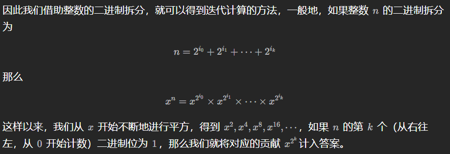

## func SearchInts(a []int, x int) int

返回 x 的下标，若 x 不存在，返回应该插入的 index。即返回第一个大于等于 x 的下标

```go
	a := []int{1, 2, 3, 4, 6, 7, 8}
	i = sort.SearchInts(a, 5)
	fmt.Printf("%d not found, can be inserted at index %d in %v\n", x, i, a)
	// 5 not found, can be inserted at index 4 in [1 2 3 4 6 7 8]
```

---

## func Replace(s, old, new string, n int) string

If n < 0, there is no limit on the number of replacements.  -> func ReplaceAll(s, old, new string) string

```go
	fmt.Println(strings.Replace("oink oink oink", "k", "ky", 2))
	// oinky oinky oink
```

---

## sort.Slice

`sort.Slice` 的函数签名如下：

```go
func Slice(slice interface{}, less func(i, j int) bool)
```

其中，`slice` 是要排序的切片，`less` 是一个函数，用于指定元素之间的比较规则。`less` 函数接收两个索引 `i` 和 `j`，并返回一个布尔值，表示索引 `i` 的元素是否应该排在索引 `j` 的元素之前。

---

## func Join(elems []string, sep string) string

create a single string. The separator string sep is placed between elements in the resulting string.

```go
	s := []string{"foo", "bar", "baz"}
	fmt.Println(strings.Join(s, ", "))
	// foo, bar, baz
```

---

## [treeset](https://pkg.go.dev/github.com/emirpasic/gods/sets/treeset)

```go
package main

import "github.com/emirpasic/gods/sets/treeset"

func main() {
	set := treeset.NewWithIntComparator() // empty (keys are of type int)
	set.Add(1)                            // 1
	set.Add(2, 2, 3, 4, 5)                // 1, 2, 3, 4, 5 (in order, duplicates ignored)
	set.Remove(4)                         // 1, 2, 3, 5 (in order)
	set.Remove(2, 3)                      // 1, 5 (in order)
	set.Contains(1)                       // true
	set.Contains(1, 5)                    // true
	set.Contains(1, 6)                    // false
	_ = set.Values()                      // []int{1,5} (in order)
	set.Clear()                           // empty
	set.Empty()                           // true
	set.Size()                            // 0
}
```

---

## slices.Sort

```go
	numbers := []int{0, 42, -10, 8}
	fmt.Println(slices.Equal(numbers, []int{0, 42, -10, 8}))	// true
	fmt.Println(slices.Max(numbers))	// 42
	slices.Sort(smallInts)	// [-10 0 8 42]
```

---

## pow(x, n)

谈一下**快速幂**的实现：77 = (1001101)~2~ 		x^77^ = x * x^4^ * x^8^ * x^64^



```go
func myPow(x float64, n int) float64 {
    if n >= 0 {
        return quickMul(x, n)
    }
    return 1.0 / quickMul(x, -n)
}

func quickMul(x float64, n int) float64 {
    res := 1.0
    // 贡献的初始值为 x
    x_contribute := x
    for n > 0 {
        if n % 2 == 1 {
            // 如果 N 二进制表示的最低位为 1，那么需要计入贡献
            res *= x_contribute
        }
        // 将贡献不断地平方
        x_contribute *= x_contribute
        n = n / 2
    }
    return res
}
```

---

## heap

```go
import (
    "container/heap"
    "sort"
)

// 继承sort.Interface的方法
type IntHeap struct {
    sort.IntSlice
}

//因为最大堆，所以覆盖Less方法，返回较大值
func (h IntHeap) Less(i, j int) bool {
    return h.IntSlice[i] > h.IntSlice[j]
}

func (h *IntHeap) Push(x interface{}) {
    h.IntSlice = append(h.IntSlice, x.(int))
}

func (h *IntHeap) Pop() interface{} {
    x := h.IntSlice[len(h.IntSlice)-1]
    h.IntSlice = h.IntSlice[:len(h.IntSlice)-1]
    return x
}

// 最小k个数
func getLeastNumbers(arr []int, k int) []int {
    if k == 0 {
        return []int{}
    }
    heapArr := make([]int, k)
    copy(heapArr, arr[:k])
    // 重要，取指针
    h := &IntHeap{IntSlice: heapArr}
    heap.Init(h)
    for i := k; i < len(arr); i++ {
        if x := arr[i]; x < h.IntSlice[0] {
            heap.Pop(h)
            heap.Push(h, x)
        }
    }
    return h.IntSlice

}
```

---

## time.Time


```go
// 将time转化为int64
userInfoRsp.Birthday = uint64(user.Birthday.Unix())
// 将int64转化为time
birthDay := time.Unix(int64(req.Birthday), 0)
```

---

## 


```go

```

---

## 


```go

```

---

## 


```go

```

---

## 


```go

```

---

## 


```go

```

---

## 


```go

```

---

## 


```go

```

---

## 


```go

```

---

## 


```go

```

---

## 


```go

```

---

## 


```go

```

---

## 


```go

```

---

## 


```go

```

---

## 


```go

```

---

## 


```go

```

---

## 


```go

```

---

