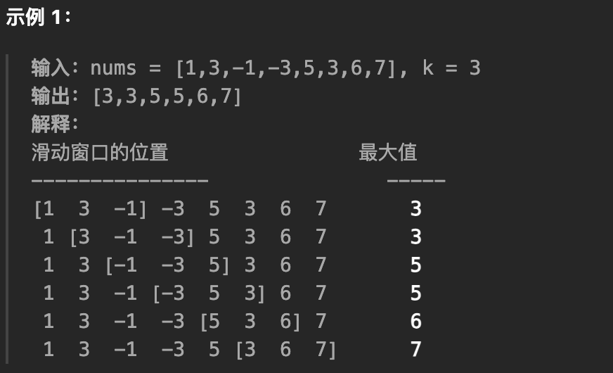
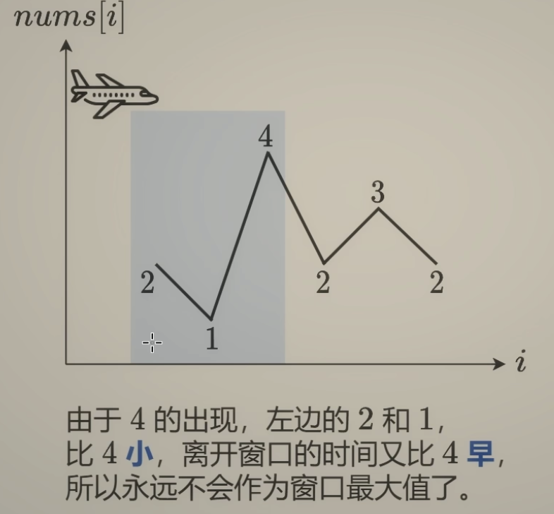

## 用栈实现队列

> 使用栈实现队列的下列操作：
>
> push(x) -- 将一个元素放入队列的尾部。
> pop() -- 从队列首部移除元素。
> peek() -- 返回队列首部的元素。
> empty() -- 返回队列是否为空。

在push数据的时候，只要数据放进输入栈就好，**但在pop的时候，操作就复杂一些，输出栈如果为空，就把进栈数据全部导入进来（注意是全部导入）**，再从出栈弹出数据，如果输出栈不为空，则直接从出栈弹出数据就可以了。

**peek函数可以用pop函数抽象**

```go
type MyQueue struct {
	sin []int
	sout []int
}


func Constructor() MyQueue {
	return MyQueue{
		sin: make([]int, 0),
		sout: make([]int, 0),
	}
}


func (this *MyQueue) Push(x int)  {
	this.sin = append(this.sin, x)
}


func (this *MyQueue) Pop() int {
	inlen, outlen := len(this.sin), len(this.sout)
	if outlen == 0 {
		if inlen == 0 {
			return -1
		}
		for i := inlen - 1; i >= 0; i-- {
			this.sout = append(this.sout, this.sin[i])
		}
		this.sin = []int{}
		outlen = len(this.sout)
	}
	res := this.sout[outlen - 1]
	this.sout = this.sout[:outlen - 1]
	return res
}


func (this *MyQueue) Peek() int {
	res := this.Pop()
	this.sout = append(this.sout, res)
	return res
}


func (this *MyQueue) Empty() bool {
	return len(this.sin) == 0 && len(this.sout) == 0
}
```

---

## 用队列实现栈

> 使用队列实现栈的下列操作：
>
> - push(x) -- 元素 x 入栈
> - pop() -- 移除栈顶元素
> - top() -- 获取栈顶元素
> - empty() -- 返回栈是否为空

**一个队列在模拟栈弹出元素的时候只要将队列头部的元素（除了最后一个元素外） 重新添加到队列尾部，此时再去弹出元素就是栈的顺序了。**

```go
type MyStack struct {
	queue []int
}


func Constructor() MyStack {
	return MyStack{
		queue: make([]int, 0),
	}
}


func (this *MyStack) Push(x int)  {
	this.queue = append(this.queue, x)
}


func (this *MyStack) Pop() int {
	length := len(this.queue)
	for length > 1 {
		front := this.queue[0]
		this.queue = this.queue[1:]
		this.Push(front)
        length -= 1
	}
	res := this.queue[0]
	this.queue = this.queue[1:]
	return res
}


func (this *MyStack) Top() int {
	return this.queue[len(this.queue) - 1]
}


func (this *MyStack) Empty() bool {
	return len(this.queue) == 0
}
```

---

## 有效的括号

> 给定一个只包括 `'('`，`')'`，`'{'`，`'}'`，`'['`，`']'` 的字符串 `s` ，判断字符串是否有效。
>
> 有效字符串需满足：
>
> 1. 左括号必须用相同类型的右括号闭合。
> 2. 左括号必须以正确的顺序闭合。
> 3. 每个右括号都有一个对应的相同类型的左括号。
>
> **示例 1：**
>
> ```
> 输入：s = "()"
> 输出：true
> 输入：s = "()[]{}"
> 输出：true
> 输入：s = "(]"
> 输出：false
> ```

用map来模拟一个hash来匹配右括号

```go
func isValid(s string) bool {
	set := map[byte]byte{')': '(', '}': '{', ']': '['}
	stack := make([]byte, 0)
	for i := 0; i < len(s); i++ {
		ch := s[i]
		if ch == '(' || ch == '{' || ch == '[' {
			stack = append(stack, ch)
		} else {
			l := len(stack) - 1
			if l < 0 {
				return false
			}
			if stack[l] == set[ch] {
				stack = stack[:l]
			} else {
				return false
			}
		}
	}
	return len(stack) == 0
}
```

---

## 删除字符串中的所有相邻重复项

> 给出由小写字母组成的字符串 S，重复项删除操作会选择两个相邻且相同的字母，并删除它们。
>
> 在 S 上反复执行重复项删除操作，直到无法继续删除。
>
> 在完成所有重复项删除操作后返回最终的字符串。答案保证唯一。
>
> 示例：
>
> - 输入："abbaca"
> - 输出："ca"
> - 解释：例如，在 "abbaca" 中，我们可以删除 "bb" 由于两字母相邻且相同，这是此时唯一可以执行删除操作的重复项。之后我们得到字符串 "aaca"，其中又只有 "aa" 可以执行重复项删除操作，所以最后的字符串为 "ca"。

```go
func removeDuplicates(s string) string {
	stack := make([]byte, 0)
	b := []byte(s)
	for i := 0; i < len(b); i++ {
		if len(stack) > 0 && b[i] == stack[len(stack)-1] {
			stack = stack[:len(stack)-1]
		} else {
			stack = append(stack, b[i])
		}
	}
	return string(stack)
}
```

---

## 逆波兰表达式求值

> 根据 逆波兰表示法，求表达式的值。
>
> 有效的运算符包括 + , - , * , / 。每个运算对象可以是整数，也可以是另一个逆波兰表达式。
>
> 说明：
>
> 整数除法只保留整数部分。 给定逆波兰表达式总是有效的。换句话说，表达式总会得出有效数值且不存在除数为 0 的情况。
>
> 示例 1：
>
> - 输入: ["2", "1", "+", "3", " * "]
> - 输出: 9
> - 解释: 该算式转化为常见的中缀算术表达式为：((2 + 1) * 3) = 9
>
> 示例 2：
>
> - 输入: ["4", "13", "5", "/", "+"]
> - 输出: 6
> - 解释: 该算式转化为常见的中缀算术表达式为：(4 + (13 / 5)) = 6
>
> 示例 3：
>
> - 输入: ["10", "6", "9", "3", "+", "-11", " * ", "/", " * ", "17", "+", "5", "+"]
> - 输出: 22
> - 解释:该算式转化为常见的中缀算术表达式为：

```go
func evalRPN(tokens []string) int {
	var stack []int
	for _, str := range tokens {
		val, err := strconv.Atoi(str)
		if err != nil {
			stack = append(stack, val)
		} else {
			i, j := stack[len(stack)-2], stack[len(stack)-1]
			stack = stack[:len(stack)-2]
			switch str {
			case "+":
				stack = append(stack, i+j)
			case "-":
				stack = append(stack, i-j)
			case "*":
				stack = append(stack, i*j)
			case "/":
				stack = append(stack, i/j)
			}
		}
	}
	return stack[len(stack)-1]
}
```

---

## 滑动窗口最大值

> 给定一个数组 nums，有一个大小为 k 的滑动窗口从数组的最左侧移动到数组的最右侧。你只可以看到在滑动窗口内的 k 个数字。滑动窗口每次只向右移动一位。
>
> 返回滑动窗口中的最大值。
>
> 

核心思想：**维持一个单调递减的队列**，存储元素的下标而不是元素的值，用于判断出列逻辑，当`i-q[0] >= k`时，说明队首元素应该离开队列。



```go
func maxSlidingWindow(nums []int, k int) []int {
	q := []int{}
	ans := make([]int, 0, len(nums)-k+1)
	for i, num := range nums {
		//入,且要维持单调性，如1 2 4
		for len(q) > 0 && num >= nums[q[len(q)-1]] {
			q = q[:len(q)-1]
		}
		q = append(q, i)
		//出
		if i-q[0] >= k { // 队首已经离开窗口了
			q = q[1:]
		}
		//加入res
		if i >= k-1 {
			ans = append(ans, nums[q[0]])
		}
	}
	return ans
}
```

---

## 前 K 个高频元素

> 给定一个非空的整数数组，返回其中出现频率前 k 高的元素。
>
> 示例 1:
>
> - 输入: nums = [1,1,1,2,2,3], k = 2
> - 输出: [1,2]
>
> 示例 2:
>
> - 输入: nums = [1], k = 1
> - 输出: [1]

定义一个二维数组，tmp[i] 存储出现了 i 次的元素

```go
func topKFrequent(nums []int, k int) []int {
    freq := map[int]int{}
    for _, num := range nums {
        freq[num] += 1
    }

    n := len(nums)
    // tmp[i]:出现i次的元素
    tmp := make([][]int, n+1)
    for key, v := range freq {
        tmp[v] = append(tmp[v], key)
    }
    // tmp 从大到小返回结果
    res := make([]int, 0)
    for i := n; i > 0; i-- {
        if len(tmp[i]) > 0 {
            res = append(res, v...)
        }
        if len(res) >= k {
            return res
        }
    }

    return res

}
```


----

## 柱状图中最大的矩形

> 给定 n 个非负整数，用来表示柱状图中各个柱子的高度。每个柱子彼此相邻，且宽度为 1 。求在该柱状图中，能够勾勒出来的矩形的最大面积。
>
> **示例 1:**
>
> 
>
> ```go
> 输入：heights = [2,1,5,6,2,3]
> 输出：10
> 解释：最大的矩形为图中红色区域，面积为 10
> ```

思路：**假设 h=heights[i] 是矩形的高度**，那么矩形的宽度最大是多少？我们需要知道：

- 在 i 左侧的小于 h 的最近元素的下标 left。

- 在 i 右侧的小于 h 的最近元素的下标 right。

比如示例 1（上图），选择 i=2 这个柱子作为矩形高，那么左边小于 heights[2]=5 的最近元素的下标为 left=1，右边小于 heights[2]=5 的最近元素的下标为 right=4。

那么矩形的宽度就是 right−left−1=4−1−1=2，矩形面积为 h⋅(right−left−1)=5⋅2=10。

**前后都加上0 统一逻辑：在 heights[] 单调的条件下也可以得到 left 和 right**

```go
func largestRectangleArea(heights []int) int {
    st := make([]int, 0)
    // 前后都加上0 统一逻辑
    heights = append(heights, 0)
    heights = append([]int{0}, heights...)

    res := 0
    for i, h := range heights {
        for len(st) > 0 && h < heights[st[len(st)-1]] {
            // 矩形以 heights[i] 为高
            mid := heights[st[len(st)-1]]
            st = st[:len(st)-1]
            left := st[len(st)-1]
            right := i
            // 面积 = 高 * 宽
            tmp := mid * (right - left - 1)
            res = max(res, tmp)
        }
        st = append(st, i)
    }
    return res
}
```

---

## 字符串解码

> 给定一个经过编码的字符串，返回它解码后的字符串。
>
> 编码规则为: `k[encoded_string]`，表示其中方括号内部的 `encoded_string` 正好重复 `k` 次。注意 `k` 保证为正整数。
>
> **示例 1：**
>
> ```go
> 输入：s = "3[a]2[bc]"
> 输出："aaabcbc"
> ```
>
> **示例 2：**
>
> ```go
> 输入：s = "3[a2[c]]"
> 输出："accaccacc"
> ```
>
> **示例 3：**
>
> ```go
> 输入：s = "2[abc]3[cd]ef"
> 输出："abcabccdcdcdef"
> ```

构建辅助栈 stack， 遍历字符串 s 中每个字符 c；

- 当 c 为数字时，将数字字符转化为数字 multi，用于后续倍数计算；
- 当 c 为字母时，在 res 尾部添加 c；
- **当 c 为 [ 时，将当前 multi 和 res 入栈**，并分别置空置 0：
  记录此 [ 前的临时结果 res 至栈，用于发现对应 ] 后的拼接操作；
  记录此 [ 前的倍数 multi 至栈，用于发现对应 ] 后，获取 multi × [...] 字符串。
  进入到新 [ 后，res 和 multi 重新记录。
- **当 c 为 ] 时，stack 出栈，拼接字符串 res = last_res + cur_multi * res**，其中:
  last_res是上个 [ 到当前 [ 的字符串，例如 "3[a2[c]]" 中的 a；
  cur_multi是当前 [ 到 ] 内字符串的重复倍数，例如 "3[a2[c]]" 中的 2。

```go
type Pair struct {
	multi int
	res   string
}

func decodeString(s string) string {
	st := make([]Pair, 0)
	res := ""
	multi := 0
	for _, str := range s {
		if str >= 'a' && str <= 'z' {
			res += string(str)
		} else if str >= '0' && str <= '9' {
			// str-'0' 是 int32 型
			multi = 10*multi + int(str-'0')
		} else if str == '[' {
			st = append(st, Pair{multi, res})
			multi, res = 0, ""
		} else {
			// str ==']'
			last := st[len(st)-1]
			st = st[:len(st)-1]
			res = last.res + repeatString(res, last.multi)
		}
	}
	return res
}

func repeatString(s string, multi int) string {
	res := ""
	for i := 0; i < multi; i++ {
		res += s
	}
	return res
}
```

---

## 

> 


```go

```

---

## 

> 


```go

```

---

## 

> 


```go

```

---

## 

> 


```go

```

---

## 

> 


```go

```

---

