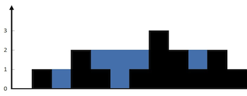
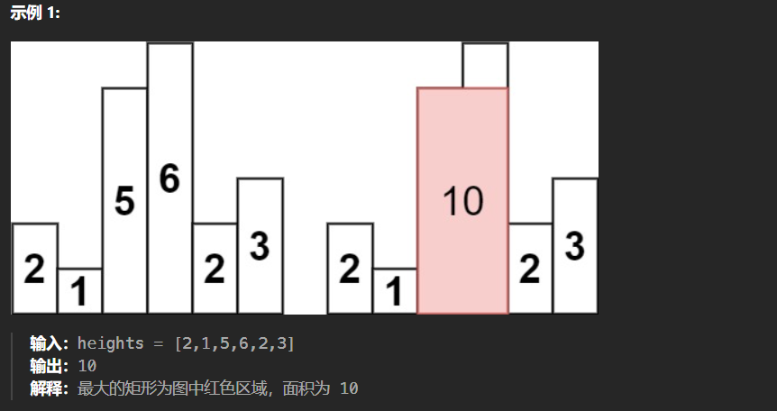
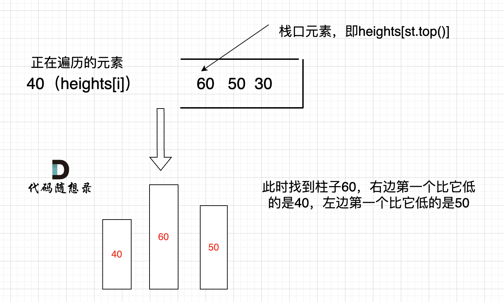

## 用栈实现队列

> 使用栈实现队列的下列操作：
>
> push(x) -- 将一个元素放入队列的尾部。
> pop() -- 从队列首部移除元素。
> peek() -- 返回队列首部的元素。
> empty() -- 返回队列是否为空。

在push数据的时候，只要数据放进输入栈就好，**但在pop的时候，操作就复杂一些，输出栈如果为空，就把进栈数据全部导入进来（注意是全部导入）**，再从出栈弹出数据，如果输出栈不为空，则直接从出栈弹出数据就可以了。

**peek函数可以用pop函数抽象**

```go
type MyQueue struct {
	sin []int
	sout []int
}


func Constructor() MyQueue {
	return MyQueue{
		sin: make([]int, 0),
		sout: make([]int, 0),
	}
}


func (this *MyQueue) Push(x int)  {
	this.sin = append(this.sin, x)
}


func (this *MyQueue) Pop() int {
	inlen, outlen := len(this.sin), len(this.sout)
	if outlen == 0 {
		if inlen == 0 {
			return -1
		}
		for i := inlen - 1; i >= 0; i-- {
			this.sout = append(this.sout, this.sin[i])
		}
		this.sin = []int{}
		outlen = len(this.sout)
	}
	res := this.sout[outlen - 1]
	this.sout = this.sout[:outlen - 1]
	return res
}


func (this *MyQueue) Peek() int {
	res := this.Pop()
	this.sout = append(this.sout, res)
	return res
}


func (this *MyQueue) Empty() bool {
	return len(this.sin) == 0 && len(this.sout) == 0
}
```

---

## 用队列实现栈

> 使用队列实现栈的下列操作：
>
> - push(x) -- 元素 x 入栈
> - pop() -- 移除栈顶元素
> - top() -- 获取栈顶元素
> - empty() -- 返回栈是否为空

**一个队列在模拟栈弹出元素的时候只要将队列头部的元素（除了最后一个元素外） 重新添加到队列尾部，此时再去弹出元素就是栈的顺序了。**

```go
type MyStack struct {
	queue []int
}


func Constructor() MyStack {
	return MyStack{
		queue: make([]int, 0),
	}
}


func (this *MyStack) Push(x int)  {
	this.queue = append(this.queue, x)
}


func (this *MyStack) Pop() int {
	length := len(this.queue)
	for length > 1 {
		front := this.queue[0]
		this.queue = this.queue[1:]
		this.Push(front)
        length -= 1
	}
	res := this.queue[0]
	this.queue = this.queue[1:]
	return res
}


func (this *MyStack) Top() int {
	return this.queue[len(this.queue) - 1]
}


func (this *MyStack) Empty() bool {
	return len(this.queue) == 0
}
```

---

## 有效的括号

> 给定一个只包括 `'('`，`')'`，`'{'`，`'}'`，`'['`，`']'` 的字符串 `s` ，判断字符串是否有效。
>
> 有效字符串需满足：
>
> 1. 左括号必须用相同类型的右括号闭合。
> 2. 左括号必须以正确的顺序闭合。
> 3. 每个右括号都有一个对应的相同类型的左括号。
>
> **示例 1：**
>
> ```
> 输入：s = "()"
> 输出：true
> 输入：s = "()[]{}"
> 输出：true
> 输入：s = "(]"
> 输出：false
> ```

用map来模拟一个hash来匹配右括号

```go
func isValid(s string) bool {
	set := map[byte]byte{')': '(', '}': '{', ']': '['}
	stack := make([]byte, 0)
	for i := 0; i < len(s); i++ {
		ch := s[i]
		if ch == '(' || ch == '{' || ch == '[' {
			stack = append(stack, ch)
		} else {
			l := len(stack) - 1
			if l < 0 {
				return false
			}
			if stack[l] == set[ch] {
				stack = stack[:l]
			} else {
				return false
			}
		}
	}
	return len(stack) == 0
}
```

---

## 删除字符串中的所有相邻重复项

> 给出由小写字母组成的字符串 S，重复项删除操作会选择两个相邻且相同的字母，并删除它们。
>
> 在 S 上反复执行重复项删除操作，直到无法继续删除。
>
> 在完成所有重复项删除操作后返回最终的字符串。答案保证唯一。
>
> 示例：
>
> - 输入："abbaca"
> - 输出："ca"
> - 解释：例如，在 "abbaca" 中，我们可以删除 "bb" 由于两字母相邻且相同，这是此时唯一可以执行删除操作的重复项。之后我们得到字符串 "aaca"，其中又只有 "aa" 可以执行重复项删除操作，所以最后的字符串为 "ca"。

```go
func removeDuplicates(s string) string {
	stack := make([]byte, 0)
	b := []byte(s)
	for i := 0; i < len(b); i++ {
		if len(stack) > 0 && b[i] == stack[len(stack)-1] {
			stack = stack[:len(stack)-1]
		} else {
			stack = append(stack, b[i])
		}
	}
	return string(stack)
}
```

---

## 逆波兰表达式求值

> 根据 逆波兰表示法，求表达式的值。
>
> 有效的运算符包括 + , - , * , / 。每个运算对象可以是整数，也可以是另一个逆波兰表达式。
>
> 说明：
>
> 整数除法只保留整数部分。 给定逆波兰表达式总是有效的。换句话说，表达式总会得出有效数值且不存在除数为 0 的情况。
>
> 示例 1：
>
> - 输入: ["2", "1", "+", "3", " * "]
> - 输出: 9
> - 解释: 该算式转化为常见的中缀算术表达式为：((2 + 1) * 3) = 9
>
> 示例 2：
>
> - 输入: ["4", "13", "5", "/", "+"]
> - 输出: 6
> - 解释: 该算式转化为常见的中缀算术表达式为：(4 + (13 / 5)) = 6
>
> 示例 3：
>
> - 输入: ["10", "6", "9", "3", "+", "-11", " * ", "/", " * ", "17", "+", "5", "+"]
> - 输出: 22
> - 解释:该算式转化为常见的中缀算术表达式为：

```go
func evalRPN(tokens []string) int {
	var stack []int
	for _, str := range tokens {
		val, err := strconv.Atoi(str)
		if err != nil {
			stack = append(stack, val)
		} else {
			i, j := stack[len(stack)-2], stack[len(stack)-1]
			stack = stack[:len(stack)-2]
			switch str {
			case "+":
				stack = append(stack, i+j)
			case "-":
				stack = append(stack, i-j)
			case "*":
				stack = append(stack, i*j)
			case "/":
				stack = append(stack, i/j)
			}
		}
	}
	return stack[len(stack)-1]
}
```

---

## 滑动窗口最大值

> 给定一个数组 nums，有一个大小为 k 的滑动窗口从数组的最左侧移动到数组的最右侧。你只可以看到在滑动窗口内的 k 个数字。滑动窗口每次只向右移动一位。
>
> 返回滑动窗口中的最大值。
>
> 

核心思想：**维持一个单调递减的队列**，存储元素的下标而不是元素的值，用于判断出列逻辑，当`i-q[0] >= k`时，说明队首元素应该离开队列。


```go
func maxSlidingWindow(nums []int, k int) []int {
    n := len(nums)
    ans := make([]int, 0, n-k+1)
    st := make([]int, 0)
    for i, num := range nums {
        // 保持 st 递减
        for len(st) > 0 && num >= nums[st[len(st)-1]] {
            st = st[:len(st)-1]
        }
        st = append(st, i)
        // 需要出队
        if st[0] < i - k + 1 {
            st = st[1:]
        }
        if i >= k - 1 {
            ans = append(ans, nums[st[0]])
        }
    }
    return ans
}
```

---

## 前 K 个高频元素

> 给定一个非空的整数数组，返回其中出现频率前 k 高的元素。
>
> 示例 1:
>
> - 输入: nums = [1,1,1,2,2,3], k = 2
> - 输出: [1,2]
>
> 示例 2:
>
> - 输入: nums = [1], k = 1
> - 输出: [1]

定义一个二维数组，tmp[i] 存储出现了 i 次的元素

```go
func topKFrequent(nums []int, k int) []int {
    freq := map[int]int{}
    for _, num := range nums {
        freq[num] += 1
    }

    n := len(nums)
    // tmp[i]:出现i次的元素
    tmp := make([][]int, n+1)
    for key, v := range freq {
        tmp[v] = append(tmp[v], key)
    }
    // tmp 从大到小返回结果
    res := make([]int, 0)
    for i := n; i > 0; i-- {
        if len(tmp[i]) > 0 {
            res = append(res, v...)
        }
        if len(res) >= k {
            return res
        }
    }

    return res

}
```

---

## 字符串解码

> 给定一个经过编码的字符串，返回它解码后的字符串。
>
> 编码规则为: `k[encoded_string]`，表示其中方括号内部的 `encoded_string` 正好重复 `k` 次。注意 `k` 保证为正整数。
>
> **示例 1：**
>
> ```go
> 输入：s = "3[a]2[bc]"
> 输出："aaabcbc"
> ```
>
> **示例 2：**
>
> ```go
> 输入：s = "3[a2[c]]"
> 输出："accaccacc"
> ```
>
> **示例 3：**
>
> ```go
> 输入：s = "2[abc]3[cd]ef"
> 输出："abcabccdcdcdef"
> ```

构建辅助栈 stack， 遍历字符串 s 中每个字符 c；

- 当 c 为数字时，将数字字符转化为数字 multi，用于后续倍数计算；
- 当 c 为字母时，在 res 尾部添加 c；
- **当 c 为 [ 时，将当前 multi 和 res 入栈**，并分别置空置 0：
  记录此 [ 前的临时结果 res 至栈，用于发现对应 ] 后的拼接操作；
  记录此 [ 前的倍数 multi 至栈，用于发现对应 ] 后，获取 multi × [...] 字符串。
  进入到新 [ 后，res 和 multi 重新记录。
- **当 c 为 ] 时，stack 出栈，拼接字符串 res = last_res + cur_multi * res**，其中:
  last_res是上个 [ 到当前 [ 的字符串，例如 "3[a2[c]]" 中的 a；
  cur_multi是当前 [ 到 ] 内字符串的重复倍数，例如 "3[a2[c]]" 中的 2。

```go
type Pair struct {
	multi int
	res   string
}

func decodeString(s string) string {
	st := make([]Pair, 0)
	res := ""
	multi := 0
	for _, str := range s {
		if str >= 'a' && str <= 'z' {
			res += string(str)
		} else if str >= '0' && str <= '9' {
			// str-'0' 是 int32 型
			multi = 10*multi + int(str-'0')
		} else if str == '[' {
			st = append(st, Pair{multi, res})
			multi, res = 0, ""
		} else {
			// str ==']'
			last := st[len(st)-1]
			st = st[:len(st)-1]
			res = last.res + repeatString(res, last.multi)
		}
	}
	return res
}

func repeatString(s string, multi int) string {
	res := ""
	for i := 0; i < multi; i++ {
		res += s
	}
	return res
}
```

---

## 每日温度

> 请根据每日 气温 列表，重新生成一个列表。对应位置的输出为：要想观测到更高的气温，至少需要等待的天数。如果气温在这之后都不会升高，请在该位置用 0 来代替。
>
> 例如，给定一个列表 temperatures = [73, 74, 75, 71, 69, 72, 76, 73]，你的输出应该是 [1, 1, 4, 2, 1, 1, 0, 0]。

单调栈满足从栈底到栈顶元素对应的温度递减，因此每次有元素进栈时，会将温度更低的元素全部移除，并更新出栈元素对应的等待天数，这样可以确保等待天数一定是最小的

```go
func dailyTemperatures(temperatures []int) []int {
    n := len(temperatures)
    st := make([]int, 0)
    res := make([]int, n)

    for i, val := range temperatures {
        // 栈不空，且当前遍历元素 v 破坏了栈的单调性
        for len(st) != 0 && temperatures[st[len(st)-1]] < val {
            res[st[len(st)-1]] = i - st[len(st)-1]
            st = st[:len(st)-1]
        }
        st = append(st, i)
    }
    return res
}
```

---

## 下一个更大元素 I

> 给你两个 没有重复元素 的数组 nums1 和 nums2 ，其中nums1 是 nums2 的子集。
>
> 请你找出 nums1 中每个元素在 nums2 中的下一个比其大的值。
>
> nums1 中数字 x 的下一个更大元素是指 x 在 nums2 中对应位置的右边的第一个比 x 大的元素。如果不存在，对应位置输出 -1 。
>
> 示例 1:
>
> 输入: nums1 = [4,1,2], nums2 = [1,3,4,2].
> 输出: [-1,3,-1]
> 解释:
> 对于 num1 中的数字 4 ，你无法在第二个数组中找到下一个更大的数字，因此输出 -1 。
> 对于 num1 中的数字 1 ，第二个数组中数字1右边的下一个较大数字是 3 。
> 对于 num1 中的数字 2 ，第二个数组中没有下一个更大的数字，因此输出 -1 。
>
> 示例 2:
> 输入: nums1 = [2,4], nums2 = [1,2,3,4].
> 输出: [3,-1]
> 解释:
> 对于 num1 中的数字 2 ，第二个数组中的下一个较大数字是 3 。
> 对于 num1 中的数字 4 ，第二个数组中没有下一个更大的数字，因此输出-1 。

题目有点太复杂了，和前一个问题的区别就是结果是存储在 nums1 上的，所以用到一个 map 映射

```go
func nextGreaterElement(nums1 []int, nums2 []int) []int {
    // 储存 nums1 中各数字的下标
    set := make(map[int]int, 0)
    for i, num := range nums1 {
        set[num] = i
    }
    
    st := make([]int, 0)
    ans := make([]int, len(nums1))
    for i := range ans {
        ans[i] = -1
    }
    for _, num := range nums2 {
        for len(st) != 0 && num > st[len(st)-1] {
            // 如果是 nums1 中的元素，则更新 ans
            if index, exist := set[st[len(st)-1]]; exist {
                ans[index] = num
            }
            st = st[:len(st)-1]
        }
        st = append(st, num)
    }
    return ans
}
```

---

## 下一个更大元素II

> 给定一个循环数组（最后一个元素的下一个元素是数组的第一个元素），输出每个元素的下一个更大元素。数字 x 的下一个更大的元素是按数组遍历顺序，这个数字之后的第一个比它更大的数，这意味着你应该循环地搜索它的下一个更大的数。如果不存在，则输出 -1。
>
> 示例 1:
>
> - 输入: [1,2,1]
> - 输出: [2,-1,2]
> - 解释: 第一个 1 的下一个更大的数是 2；数字 2 找不到下一个更大的数；第二个 1 的下一个最大的数需要循环搜索，结果也是 2。

循环数组，遍历两遍。

```go
func nextGreaterElements(nums []int) []int {
    n := len(nums)
    res := make([]int, n)
    for i := range res {
        res[i] = -1
    }
    //单调递减，存储数组下标索引
    stack := make([]int, 0)
    for i := 0; i < n * 2; i++ {
        for len(stack) > 0 && nums[i%n] > nums[stack[len(stack)-1]] {
            index := stack[len(stack)-1]
            stack = stack[:len(stack)-1] // pop
            res[index] = nums[i%n]
        }
        stack = append(stack, i%n)
    }
    return res
}
```

---

## 接雨水

> 给定 n 个非负整数表示每个宽度为 1 的柱子的高度图，计算按此排列的柱子，下雨之后能接多少雨水。
>
> 示例 1：
>
> 
>
> - 输入：height = [0,1,0,2,1,0,1,3,2,1,2,1]
> - 输出：6
> - 解释：上面是由数组 [0,1,0,2,1,0,1,3,2,1,2,1] 表示的高度图，在这种情况下，可以接 6 个单位的雨水（蓝色部分表示雨水）。

如果当前遍历的元素（柱子）高度大于栈顶元素的高度，此时就出现凹槽。此时的栈顶元素st.top()，就是凹槽的左边位置，下标为st.top()，对应的高度为height[st.top()]（就是图中的高度2）。当前遍历的元素i，就是凹槽右边的位置，下标为i，对应的高度为height[i]（就是图中的高度3）。

那么雨水高度是 min(凹槽左边高度, 凹槽右边高度) - 凹槽底部高度，代码为：`int h = min(height[st.top()], height[i]) - height[mid];`

雨水的宽度是 凹槽右边的下标 - 凹槽左边的下标 - 1（因为只求中间宽度），代码为：`int w = i - st.top() - 1 ;`

当前凹槽雨水的体积就是：`h * w`。


```go
func trap(height []int) int {
    st := make([]int, 0)

    res := 0
    for i, h := range height {
        for len(st) > 0 && h > height[st[len(st)-1]] {
            // 获得凹槽高度
            mid := height[st[len(st)-1]]
            // 凹槽坐标出栈
            st = st[:len(st)-1]

            // 如果栈不为空则此时栈顶元素为左侧柱子坐标
            if len(st) > 0 {
                // 求得雨水高度
                h := min(height[i], height[st[len(st)-1]]) - mid
                // 求得雨水宽度
                w := i - st[len(st)-1] - 1
                res += h * w
            }
        }
        st = append(st, i)
    }
    return res
}
```

```go
// 双指针
func trap(height []int) int {
    i, j := 0, len(height) - 1
    leftMax, rightMax := 0, 0
    
    ans := 0
    for i < j {
        leftMax = max(leftMax, height[i])
        rightMax = max(rightMax, height[j])
        if leftMax < rightMax {
            ans += leftMax - height[i]
            i++
        } else {
            ans += rightMax - height[j]
            j--
        }
    }
    return ans
}
```

---

## 柱状图中最大的矩形

> 给定 n 个非负整数，用来表示柱状图中各个柱子的高度。每个柱子彼此相邻，且宽度为 1 。求在该柱状图中，能够勾勒出来的矩形的最大面积。
>
> 

找到左边右边第一个比自己低的 然后计算以自己为高的最大矩形面积。



```go
func largestRectangleArea(heights []int) int {
    st := make([]int, 0)
    heights = append([]int{0}, heights...)
    heights = append(heights, 0)

    res := 0
    for i, h := range heights {
        for len(st) > 0 && h < heights[st[len(st)-1]] {
            mid := heights[st[len(st)-1]]
            st = st[:len(st)-1]
            // left是top的下一位元素，i是将要入栈的元素
            left := st[len(st) - 1]
            // 高度x宽度
            tmp := mid * (i - left - 1)
            res = max(res, tmp)
        }
        st = append(st, i)
    }

    return res
}
```

---

## 最小栈

> 设计一个支持 `push` ，`pop` ，`top` 操作，并能在常数时间内检索到最小元素的栈。
>
> 实现 `MinStack` 类:
>
> - `MinStack()` 初始化堆栈对象。
> - `void push(int val)` 将元素val推入堆栈。
> - `void pop()` 删除堆栈顶部的元素。
> - `int top()` 获取堆栈顶部的元素。
> - `int getMin()` 获取堆栈中的最小元素。

```go
type MinStack struct {
    st []Node
}

type Node struct {
    val int
    minVal int
}

func Constructor() MinStack {
    return MinStack{
        st: make([]Node, 0),
    }
}


func (this *MinStack) Push(val int)  {
    n := Node{
        val: val,
    }
    if len(this.st) > 0 {
        n.minVal = min(val, this.st[len(this.st)-1].minVal)
    } else {
        n.minVal = val
    }
    this.st = append(this.st, n)
}


func (this *MinStack) Pop()  {
    this.st = this.st[:len(this.st)-1]
}


func (this *MinStack) Top() int {
    return this.st[len(this.st)-1].val
}


func (this *MinStack) GetMin() int {
    return this.st[len(this.st)-1].minVal
}


/**
 * Your MinStack object will be instantiated and called as such:
 * obj := Constructor();
 * obj.Push(val);
 * obj.Pop();
 * param_3 := obj.Top();
 * param_4 := obj.GetMin();
 */
```

---

## 

> 


```go

```

---

## 

> 


```go

```

---

## 

> 


```go

```

---


---

## 

> 


```go

```

---

## 

> 


```go

```

---

## 

> 


```go

```

---

## 

> 


```go

```

---

