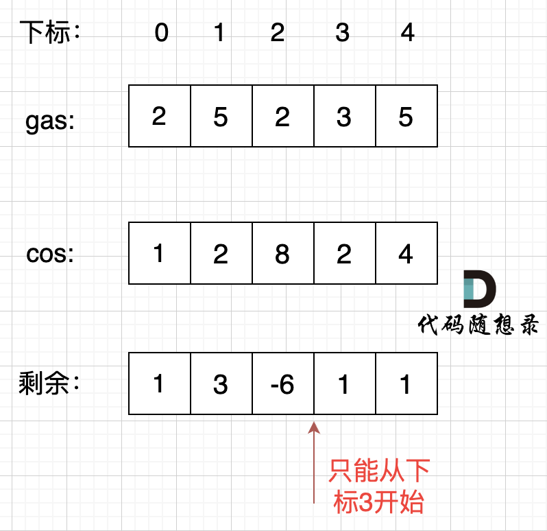
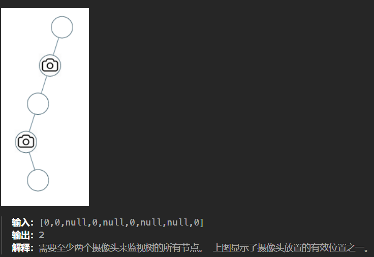

## 摆动序列

> 例如， [1,7,4,9,2,5] 是一个摆动序列，因为差值 (6,-3,5,-7,3) 是正负交替出现的。相反, [1,4,7,2,5] 和  [1,7,4,5,5] 不是摆动序列，第一个序列是因为它的前两个差值都是正数，第二个序列是因为它的最后一个差值为零。
>
> 给定一个整数序列，返回作为摆动序列的最长子序列的长度。 通过从原始序列中删除一些（也可以不删除）元素来获得子序列，剩下的元素保持其原始顺序。
>
> ```go
> 输入：nums = [1,7,4,9,2,5]
> 输出：6
> 解释：整个序列均为摆动序列，各元素之间的差值为 (6, -3, 5, -7, 3) 。
> ```

**局部最优：删除单调坡度上的节点（不包括单调坡度两端的节点），那么这个坡度就可以有两个局部峰值**。如 1 2 3 4 5 取1 5 

`if diff > 0 && prevDiff <= 0 || diff < 0 && prevDiff >= 0` 需要注意的是判断坡度时， `preDiff` 可以等于0，这是因为可能会出现 2 2 2 2 3 这种情况，前面一直是平坡，这种情况下只要 `diff != 0 ` 即可

```go
func wiggleMaxLength(nums []int) int {
	n := len(nums)
	if n < 2 {
		return n
	}
	res := 1
	prevDiff := nums[1] - nums[0]
	if prevDiff != 0 {
		res = 2
	}
	for i := 2; i < n; i++ {
		diff := nums[i] - nums[i-1]
		if diff > 0 && prevDiff <= 0 || diff < 0 && prevDiff >= 0 { // <= 和 >=
			res++
			prevDiff = diff
		}
	}

	return res
}
```

---

## 最大子数组和

> 给你一个整数数组 `nums` ，请你找出一个具有最大和的连续子数组（子数组最少包含一个元素），返回其最大和。
>
> **子数组** 是数组中的一个连续部分。
>
> 输入：nums = [-2,1,-3,4,-1,2,1,-5,4]
> 输出：6
> 解释：连续子数组 [4,-1,2,1] 的和最大，为 6 。

如果 -2 1 在一起，计算起点的时候，一定是从 1 开始计算，因为负数只会拉低总和，这就是贪心贪的地方！

局部最优：当前“连续和”为负数的时候立刻放弃，从下一个元素重新计算“连续和”，因为负数加上下一个元素 “连续和”只会越来越小。

```go
func maxSubArray(nums []int) int {
    res := nums[0]
    ans := 0
    for _, num := range nums {
        ans += num
        if ans > res {	//大于 res 就更新
            res = ans
        }
        if ans <= 0 {	//等于 0 就放弃
            ans = 0
        }
    }

    return res
}

func max(a, b int) int {
    if a >= b {
        return a
    }
    return b 
}
```

---

## 买卖股票的最佳时机 II

> 给定一个数组，它的第  i 个元素是一支给定股票第 i 天的价格。设计一个算法来计算你所能获取的最大利润。
>
> - 输入: [7,1,5,3,6,4]
> - 输出: 7
> - 解释: 在第 2 天（股票价格 = 1）的时候买入，在第 3 天（股票价格 = 5）的时候卖出, 这笔交易所能获得利润 = 5-1 = 4。随后，在第 4 天（股票价格 = 3）的时候买入，在第 5 天（股票价格 = 6）的时候卖出, 这笔交易所能获得利润 = 6-3 = 3 。

**局部最优：收集每天的正利润，全局最优：求得最大利润**。


```go
func maxProfit(prices []int) int {
    var sum int
    for i := 1; i < len(prices); i++ {
        // 累加每次大于0的交易
        if prices[i] - prices[i-1] > 0 {
            sum += prices[i] - prices[i-1]
        }
    }
    return sum
}
```

---

## 跳跃游戏 *

> 给定一个非负整数数组，你最初位于数组的第一个位置。数组中的每个元素代表你在该位置可以跳跃的最大长度。判断你是否能够到达最后一个位置。
>
> - 输入: [2,3,1,1,4]
> - 输出: true
> - 解释: 我们可以先跳 1 步，从位置 0 到达 位置 1, 然后再从位置 1 跳 3 步到达最后一个位置。

**贪心无套路**。。。问题转化为：**跳跃覆盖范围究竟可不可以覆盖到终点**。

i 每次移动只能在 cover 的范围内移动，每移动一个元素，cover 得到该元素数值（新的覆盖范围）的补充，让 i 继续移动下去。如果 cover 大于等于了终点下标，直接 return true 就可以了。

```go
func canJump(nums []int) bool {
    cover := 0
    for i := 0; i <= cover; i++ {
        if i + nums[i] > cover {    // 每走一步都将 cover 更新为最大值
            cover = i + nums[i]
        }
        if cover >= len(nums) - 1 {   // 说明可以覆盖到终点了
            return true
        } 
    }

    return false
}
```

---

## 跳跃游戏 II

> 给定一个非负整数数组，你最初位于数组的第一个位置。数组中的每个元素代表你在该位置可以跳跃的最大长度。你的目标是使用最少的跳跃次数到达数组的最后一个位置。
>
> - 输入: [2,3,1,1,4]
> - 输出: 2
> - 解释: 跳到最后一个位置的最小跳跃数是 2。从下标为 0 跳到下标为 1 的位置，跳  1 步，然后跳  3 步到达数组的最后一个位置

当移动下标达到了当前覆盖的最远距离下标时

- 如果当前覆盖最远距离下标不是是集合终点，步数就加一，还需要继续走。
- 如果当前覆盖最远距离下标就是是集合终点，步数不用加一，因为不能再往后走了。

```go
func jump(nums []int) int {
    cur, next, step := 0, 0, 0
    if len(nums) == 1 {	//特殊情况
        return step
    }
    for i := 0; i <= cur; i++ {
        if i + nums[i] > next {	//更新next
            next = i + nums[i]
        }
        if i == cur {	//走完了 步数 +1
            cur = next
            step++
        }
        if cur >= len(nums)-1 {	//可以走到终点，直接跳出
            break
        }
    }

    return step
}
```

---

## 加油站

> 在一条环路上有 N 个加油站，其中第 i 个加油站有汽油 gas[i] 升，从第 i 个加油站开往第 i+1 个加油站需要消耗汽油 cost[i] 升。你从其中的一个加油站出发，开始时油箱为空。
>
> 如果你可以绕环路行驶一周，则返回出发时加油站的编号，否则返回 -1。



每个加油站的剩余量rest[i]为gas[i] - cost[i]。i从0开始累加rest[i]，和记为curSum，一旦curSum小于零，说明[0, i]区间都不能作为起始位置，因为这个区间选择任何一个位置作为起点，到i这里都会断油，那么起始位置从i+1算起，再从0计算curSum。

**局部最优：当前累加rest[i]的和curSum一旦小于0，起始位置至少要是i+1，因为从i之前开始一定不行。**

```go
func canCompleteCircuit(gas []int, cost []int) int {
    curSum, totalSum := 0, 0
    start := 0
    for i := 0; i < len(gas); i++ {
        curSum += gas[i] - cost[i]	//如果为负，更新起点start
        totalSum += gas[i] - cost[i]	//用于判断能否行驶一周
        if curSum < 0 {
            start = i + 1
            curSum = 0
        }
    }
    if totalSum < 0 {
        return -1
    }
    return start
}
```

---

## 分发糖果

> - 每个孩子至少分配到 1 个糖果。
> - 相邻的孩子中，评分高的孩子必须获得更多的糖果。
>
> 输入：ratings = [1,2,2]
> 输出：4
> 解释：你可以分别给第一个、第二个、第三个孩子分发 1、2、1 颗糖果。
>            第三个孩子只得到 1 颗糖果，这满足题面中的两个条件。

- 一次是从左到右遍历，只比较右边孩子评分比左边大的情况。

局部最优：只要右边评分比左边大，右边的孩子就多一个糖果，全局最优：相邻的孩子中，评分高的右孩子获得比左边孩子更多的糖果

- 一次是从右到左遍历，只比较左边孩子评分比右边大的情况。

取candyVec[i + 1] + 1 和 candyVec[i] 最大的糖果数量，保证第i个小孩的糖果数量既大于左边的也大于右边的。

这样从局部最优推出了全局最优，即：相邻的孩子中，评分高的孩子获得更多的糖果

```go
func candy(ratings []int) int {
    n := len(ratings)
    nums := make([]int, n)
    for i := 0; i < n; i++ {
        nums[i] = 1
    }
    /**先确定一边，再确定另外一边
        1.先从左到右，当右边的大于左边的就加1
        2.再从右到左，当左边的大于右边的就再加1
    **/
    for i := 1; i < n; i++ {
        if ratings[i] > ratings[i-1] {
            nums[i] = nums[i-1] + 1
        }
    }
    for i := n-2; i >= 0; i-- {
        if ratings[i] > ratings[i+1] {
            nums[i] = max(nums[i], nums[i+1]+1)
        }
    }

    res := 0
    for _, num := range(nums) {
        res += num
    }
    return res
}

func max(a, b int) int {
    if a > b {
        return a
    }
    return b
}
```

---

## 根据身高重建队列

> 每个 people[i] = [hi, ki] 表示第 i 个人的身高为 hi ，前面 正好 有 ki 个身高大于或等于 hi 的人。
>
> 请你重新构造并返回输入数组 people 所表示的队列。
>
> - 输入：people = [[7,0],[4,4],[7,1],[5,0],[6,1],[5,2]]
> - 输出：[[5,0],[7,0],[5,2],[6,1],[4,4],[7,1]]
> - 解释：
>   - 编号为 0 的人身高为 5 ，没有身高更高或者相同的人排在他前面。
>   - 编号为 1 的人身高为 7 ，没有身高更高或者相同的人排在他前面。
>   - 编号为 2 的人身高为 5 ，有 2 个身高更高或者相同的人排在他前面，即编号为 0 和 1 的人。
>   - 编号为 3 的人身高为 6 ，有 1 个身高更高或者相同的人排在他前面，即编号为 1 的人。
>   - 编号为 4 的人身高为 4 ，有 4 个身高更高或者相同的人排在他前面，即编号为 0、1、2、3 的人。
>   - 编号为 5 的人身高为 7 ，有 1 个身高更高或者相同的人排在他前面，即编号为 1 的人。
>   - 因此 [[5,0],[7,0],[5,2],[6,1],[4,4],[7,1]] 是重新构造后的队列。

核心思想：从高到低入队，保证前面只有 k 个比自己高的人。后面的人一定比自己矮。

```go
func reconstructQueue(people [][]int) [][]int {
    sort.Slice(people, func(i, j int) bool { //按身高从高到低排序
        if people[i][0] == people[j][0] {	//身高一样时，k小的人站在前面
            return people[i][1] < people[j][1]
        }
        return people[i][0] > people[j][0]
    })
    
    for i, p := range people {
		copy(people[p[1]+1 : i+1], people[p[1] : i])  // 空出一个位置
		people[p[1]] = p    //前面有p[1]个人，在p[1]处插入p
	}
	return people
}
```

---

## 用最少数量的箭引爆气球 *

> 一支弓箭可以沿着 x 轴垂直地射出。在坐标 x 处射出一支箭，若有一个气球的直径的开始和结束坐标为 xstart，xend， 且满足  xstart ≤ x ≤ xend，则该气球会被引爆。
>
> 给你一个数组 points ，其中 points [i] = [xstart,xend] ，返回引爆所有气球所必须射出的最小弓箭数。
>
> - 输入：points = [[10,16],[2,8],[1,6],[7,12]]
> - 输出：2
> - 解释：对于该样例，x = 6 可以射爆 [2,8],[1,6] 两个气球，以及 x = 11 射爆另外两个气球

自己的思路像幼稚园...

抄的代码：局部最优：当气球出现重叠，一起射，所用弓箭最少。全局最优：把所有气球射爆所用弓箭最少。难点在于：如何判断气球重叠，我最开始的思路是只要 start 比第一个气球的 end 小即可，但是报错并非如此，考虑如下情况，是需要两根箭的：
1               6
   2 3
          4 5      
根据答案，每次气球重叠时，要做一次右边界的更新，这时候再看上面的例子，由于 4 > 3，则需要两根箭                                       

```go
func findMinArrowShots(points [][]int) int {
    res := 1  //弓箭数
    //先按照第一位排序
    sort.Slice(points, func (i,j int) bool {
        return points[i][0] < points[j][0]
    })

    for i := 1; i < len(points); i++ {
        if points[i-1][1] < points[i][0] {  //如果前一位的右边界小于后一位的左边界，则一定不重合
            res++
        } else {
            points[i][1] = min(points[i - 1][1], points[i][1]); // 更新重叠气球最小右边界,覆盖该位置的值，留到下一步使用
        }
    }
    return res
}
func min(a, b int) int {
    if a > b {
        return b
    }
    return a
}
```

---

## 划分字母区间 *

> 字符串 S 由小写字母组成。把这个字符串划分为尽可能多的片段，同一字母最多出现在一个片段中。返回一个表示每个字符串片段的长度的列表。
>
> - 输入：S = "ababcbacadefegdehijhklij"
> - 输出：[9,7,8] 解释： 划分结果为 "ababcbaca", "defegde", "hijhklij"。 每个字母最多出现在一个片段中。 像 "ababcbacadefegde", "hijhklij" 的划分是错误的，因为划分的片段数较少。

在遍历的过程中相当于是要找每一个字母的边界，**如果找到之前遍历过的所有字母的最远边界，说明这个边界就是分割点了**。此时前面出现过所有字母，最远也就到这个边界了。可以分为如下两步：

- 统计每一个字符最后出现的位置
- 从头遍历字符，并更新字符的最远出现下标，如果找到字符最远出现位置下标和当前下标相等了，则找到了分割点

```go
func partitionLabels(s string) []int {
    set := make([]int, 26)
    for i := 0; i < len(s); i++ {   //记录单词的最远下标
        set[s[i]-'a'] = i
    }

    left, right := 0, 0
    res := make([]int, 0)
    for i := 0; i < len(s); i++ {
        right = max(right, set[s[i]-'a'])
        if i == right {	//到达了遍历过的所有单词的最远边界 -> 可以分割
            res = append(res, right-left+1)
            left = right + 1
        }
    }

    return res
}

func max(a, b int) int {
    if a > b {
        return a
    }
    return b
}
```

---

## 合并区间

> - 输入: intervals = [[1,3],[2,6],[8,10],[15,18]]
> - 输出: [[1,6],[8,10],[15,18]]
> - 解释: 区间 [1,3] 和 [2,6] 重叠, 将它们合并为 [1,6].

画个图，按照左边界从小到大排序之后，写出逻辑

```go
func merge(intervals [][]int) [][]int {
    sort.Slice(intervals, func(i, j int) bool {
        return intervals[i][0] < intervals[j][0]
    })

    n := len(intervals)
    if n == 1 {
        return intervals
    }
    res := [][]int{}
    left, right := intervals[0][0], intervals[0][1] 
    for i := 1; i < n; i++ {
        if intervals[i][0] > right {	
            res = append(res, []int{left, right})   //存储之前的区间
            left, right = intervals[i][0], intervals[i][1]  //更新现在维护的区间
        } else {
            right = max(right, intervals[i][1])
        }
    }
    res = append(res, []int{left, right})   //存储最后一组区间

    return res
}

func max(a, b int) int {
    if a > b {
        return a
    }
    return b
}
```

---

## 单调递增的数字

> 给定一个非负整数 N，找出小于或等于 N 的最大的整数，同时这个整数需要满足其各个位数上的数字是单调递增。
>
> - 输入: N = 332    N = 10
> - 输出: 299           9

从后向前遍历，当前面元素更大时，后面的全置为 9

`num, _ := strconv.Atoi(string([]byte{'0','9','9'}))` 得到的 `num = 99` 。因此不需要处理第一个元素为 0 的逻辑...

```go
func monotoneIncreasingDigits(n int) int {
    s := strconv.Itoa(n)
    b := []byte(s)
    for i := len(b) - 1; i > 0; i-- {
        if b[i] < b[i-1] {
            b[i-1]--
            for j := i; j < len(b); j++ {   //后面的全部置为9
                b[j] = '9'
            }
        }
    }

    res, _ := strconv.Atoi(string(b))
    return res
}
```

---

## 监控二叉树 *

> 给定一个二叉树，我们在树的节点上安装摄像头。节点上的每个摄影头都可以监视其父对象、自身及其直接子对象。计算监控树的所有节点所需的最小摄像头数量。
>
> 

想到了使用后序遍历在叶子节点上放置摄像头，并且每隔两个节点放置摄像头，但是逻辑写不明白

用三个节点表示状态，考虑各种情形...

- 0：该节点无覆盖
- 1：本节点有摄像头
- 2：本节点有覆盖

```go
func minCameraCover(root *TreeNode) int {
    res := 0
    var dfs func(root *TreeNode) int
    dfs = func(root *TreeNode) int {
        if root == nil {
            return 2
        }
        // 后序遍历
        l, r := dfs(root.Left), dfs(root.Right)
        // 状态1 左右节点均被覆盖（或者均为空）
        if l == 2 && r == 2 {
            return 0
        }
        // 状态2 左右节点有未覆盖的节点
        if l == 0 || r == 0 {
            res++
            return 1
        }
        // 状态3 左右节点有摄像头
        if l == 1 || r == 1 {
            return 2
        }
        // 不会出现这种情况
        return -1
    }
	// 状态4 根节点未覆盖
    if dfs(root) == 0 {
        res++
    }
    return res
}
```

---

## 

> 


```go

```

---

## 

> 


```go

```

---

## 

> 


```go

```

---

## 

> 


```go

```

---

## 

> 


```go

```

---

## 

> 


```go

```

---

## 

> 


```go

```

---

## 

> 


```go

```

---

## 

> 


```go

```

---

## 

> 


```go

```

---

## 

> 


```go

```

---

## 

> 


```go

```

---

## 

> 


```go

```

---

## 

> 


```go

```

---

## 

> 


```go

```

---

## 

> 


```go

```

---

## 

> 


```go

```

---

## 

> 


```go

```

---

## 

> 


```go

```

---

## 

> 


```go

```

---

