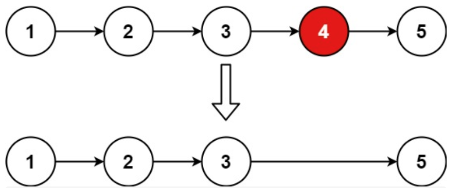
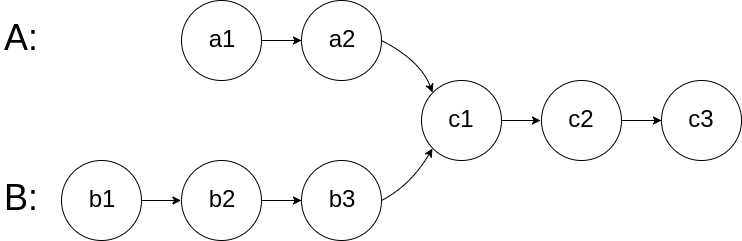

## 移除链表元素

> 删除链表中等于给定值 val 的所有节点。
>
> 示例 1： 输入：head = [1,2,6,3,4,5,6], val = 6 输出：[1,2,3,4,5]
>
> 示例 2： 输入：head = [], val = 1 输出：[]
>
> 示例 3： 输入：head = [7,7,7,7], val = 7 输出：[]

在单链表中移除头结点 和 移除其他节点的操作方式是不一样，其实在写代码的时候也会发现，需要单独写一段逻辑来处理移除头结点的情况。那么可不可以 以一种统一的逻辑来移除 链表的节点呢。其实**可以设置一个虚拟头结点**，这样原链表的所有节点就都可以按照统一的方式进行移除了。


```go
/**
 * Definition for singly-linked list.
 * type ListNode struct {
 *     Val int
 *     Next *ListNode
 * }
 */
func removeElements(head *ListNode, val int) *ListNode {
	dummyHead := &ListNode{}	
    //当声明一个指针变量时，它的默认值是 nil，表示指针不指向任何有效的内存地址。因此，在给 dummyHead 分配内存之前，需要先为其分配一个实际的节点。
	dummyHead.Next = head

	current := dummyHead
	for current.Next != nil {
		if current.Next.Val == val {
			current.Next = current.Next.Next
		} else {
			current = current.Next
		}
	}

	return dummyHead.Next
}
```

---

## 设计链表

> 在链表类中实现这些功能：
>
> - get(index)：获取链表中第 index 个节点的值。如果索引无效，则返回-1。
> - addAtHead(val)：在链表的第一个元素之前添加一个值为 val 的节点。插入后，新节点将成为链表的第一个节点。
> - addAtTail(val)：将值为 val 的节点追加到链表的最后一个元素。
> - addAtIndex(index,val)：在链表中的第 index 个节点之前添加值为 val 的节点。如果 index 等于链表的长度，则该节点将附加到链表的末尾。如果 index 大于链表长度，则不会插入节点。如果index小于0，则在头部插入节点。
> - deleteAtIndex(index)：如果索引 index 有效，则删除链表中的第 index 个节点。

`addAtHead(val）`、`addAtTail(val) `都可以调用 `addAtIndex(index,val)`

```go
type MyLinkedList struct {
	dummyHead *ListNode
	size      int
}

func Constructor() MyLinkedList {
	newNode := &ListNode{}
	return MyLinkedList{ // 返回链表
		dummyHead: newNode,
		size:      0,
	}
}

func (this *MyLinkedList) Get(index int) int {
	if this == nil || index < 0 || index >= this.size {
		return -1
	}
	cur := this.dummyHead.Next
	for index > 0 {
		cur = cur.Next
		index -= 1
	}
	return cur.Val
}

func (this *MyLinkedList) AddAtHead(val int) {
	this.AddAtIndex(0, val)
}

func (this *MyLinkedList) AddAtTail(val int) {
	this.AddAtIndex(this.size, val)
}

func (this *MyLinkedList) AddAtIndex(index int, val int) {
	if index > this.size {
		return
	}
	cur := this.dummyHead
	for index > 0 {
		cur = cur.Next
		index -= 1
	}
	newNode := &ListNode{Val: val}
	newNode.Next = cur.Next
	cur.Next = newNode
	this.size += 1

}

func (this *MyLinkedList) DeleteAtIndex(index int) {
	if index < 0 || index > this.size-1 {
		return
	}
	cur := this.dummyHead
	for index > 0 {
		cur = cur.Next
		index -= 1
	}
	if cur.Next != nil {
		cur.Next = cur.Next.Next
	}
	this.size -= 1
}
```

---

## 反转链表

> 反转一个单链表。
>
> 示例: 输入: 1->2->3->4->5->NULL 输出: 5->4->3->2->1->NULL


注意：不要使用 `prev := &ListNode{}` 初始化prev，将 `prev` 的初始值设置为 `nil`，而不是一个空的 `ListNode`

```go
func reverseList(head *ListNode) *ListNode {
    var pre *ListNode
    cur := head
    for cur != nil {
        tmp := cur.Next
        cur.Next = pre
        pre = cur
        cur = tmp
    }
    return pre
}
```

---

## K个一组翻转链表

> 给你链表的头节点 `head` ，每 `k` 个节点一组进行翻转，请你返回修改后的链表。`k` 是一个正整数，它的值小于或等于链表的长度。如果节点总数不是 `k` 的整数倍，那么请将最后剩余的节点保持原有顺序。
>
> 
>
> 


```go
func reverseKGroup(head *ListNode, k int) *ListNode {
    n := 0
    // 统计节点个数
    for cur := head; cur != nil; cur = cur.Next {
        n++
    }

    dummy := &ListNode{Next: head}
    var pre *ListNode
    cur := dummy.Next
    p := dummy	// 记录前面链表的最后一个节点
    for i := n; i >= k; i -= k {
        for i := 0; i < k; i++ {
            tmp := cur.Next
            cur.Next = pre
            pre = cur
            cur = tmp
        }
        tmp1 := p.Next
        p.Next.Next = cur
        p.Next = pre
        p = tmp1
    }
    return dummy.Next
}
```

---

## 两两交换链表中的节点

> 给定一个链表，两两交换其中相邻的节点，并返回交换后的链表。你不能只是单纯的改变节点内部的值，而是需要实际的进行节点交换。
>
> 

暴力罗列算了，免得麻烦

```go
func swapPairs(head *ListNode) *ListNode {
	dummyHead := &ListNode{
		Next: head,
	}

	cur := dummyHead
	for cur.Next != nil && cur.Next.Next != nil {
		node1 := cur.Next
		node2 := cur.Next.Next
		node3 := cur.Next.Next.Next
		cur.Next = node2
		cur.Next.Next = node1
		cur.Next.Next.Next = node3
		cur = cur.Next.Next
		
	}
	return dummyHead.Next
}
```

---

## 删除链表的倒数第N个节点

>给你一个链表，删除链表的倒数第 n 个结点，并且返回链表的头结点。
>
>进阶：你能尝试使用一趟扫描实现吗？
>
>

快慢指针，先走n步，画个图就出来了

```go
func removeNthFromEnd(head *ListNode, n int) *ListNode {
	dummyhead := &ListNode{
		Next: head,
	}
	slow, fast := dummyhead, dummyhead
	for n > 0 {
		fast = fast.Next
		n -= 1
	}
	for fast.Next != nil {
		slow = slow.Next
		fast = fast.Next
	}
	slow.Next = slow.Next.Next
	return dummyhead.Next
}
```

---

## 链表相交

> 给你两个单链表的头节点 headA 和 headB ，请你找出并返回两个单链表相交的起始节点。如果两个链表没有交点，返回 null 
>
> 

因为给的A、B链表一定会相交。

```go
func getIntersectionNode(headA, headB *ListNode) *ListNode {
    if headA == nil || headB == nil {
        return nil
    }
    pa, pb := headA, headB
    for pa != pb {
        if pa == nil {
            pa = headB
        } else {
            pa = pa.Next
        }
        if pb == nil {
            pb = headA
        } else {
            pb = pb.Next
        }
    }
    
    return pa
}
```

---

## [环形链表II](https://programmercarl.com/0142.%E7%8E%AF%E5%BD%A2%E9%93%BE%E8%A1%A8II.html)

> 给定一个链表，返回链表开始入环的第一个节点。 如果链表无环，则返回 null。
>
> 为了表示给定链表中的环，使用整数 pos 来表示链表尾连接到链表中的位置（索引从 0 开始）。 如果 pos 是 -1，则在该链表中没有环。
>
> 

相遇时：slow指针走过的节点数为: `x + y`， fast指针走过的节点数：`x + y + n (y + z)`，n为fast指针在环内走了n圈才遇到slow指针， （y+z）为 一圈内节点的个数A。

因为fast指针是一步走两个节点，slow指针一步走一个节点， 所以 fast指针走过的节点数 = slow指针走过的节点数 * 2：

```
(x + y) * 2 = x + y + n (y + z)
```

两边消掉一个（x+y）: `x + y = n (y + z)`

因为要找环形的入口，那么要求的是x，因为x表示 头结点到 环形入口节点的的距离。

所以要求x ，将x单独放在左面：`x = n (y + z) - y` ,

再从 n(y+z) 中提出一个（y+z）来，整理公式之后为如下公式：`x = (n - 1) (y + z) + z` 注意这里n一定是大于等于1的，因为 fast指针至少要多走一圈才能相遇slow指针。

这就意味着，**从头结点出发一个指针，从相遇节点 也出发一个指针，这两个指针每次只走一个节点， 那么当这两个指针相遇的时候就是 环形入口的节点**。


```go
func detectCycle(head *ListNode) *ListNode {
	slow, fast := head, head
	for fast != nil && fast.Next != nil {
		slow = slow.Next
		fast = fast.Next.Next
		if slow == fast {
			slow = head
			for slow != fast {
				slow = slow.Next
				fast = fast.Next
			}
			return slow
		}
	}
	return nil
}
```

---

## 合并两个有序链表

> 将两个升序链表合并为一个新的 **升序** 链表并返回。新链表是通过拼接给定的两个链表的所有节点组成的。 
>
> 

```go
func mergeTwoLists(list1 *ListNode, list2 *ListNode) *ListNode {
    head := &ListNode{}
    cur := head
    for list1 != nil && list2 != nil {
        if list1.Val < list2.Val {
            cur.Next = list1
            list1 = list1.Next
        } else {
            cur.Next = list2
            list2 = list2.Next
        }
        cur = cur.Next
    }
    if list1 == nil {
        cur.Next = list2
    } else {
        cur.Next = list1
    }
    return head.Next
}
```

---

## 合并K个有序链表

> 将K个升序链表合并为一个新的 **升序** 链表并返回。新链表是通过拼接给定的两个链表的所有节点组成的。 
>

```go
func mergeKLists(lists []*ListNode) *ListNode {
    n := len(lists)
    if n == 0 {
        return nil
    }
    if n == 1 {
        return lists[0]
    }
    l, r := mergeKLists(lists[:n/2]), mergeKLists(lists[n/2:])
    return mergeTwoLists(l, r)
}
...
```

---


## 随即链表的复制

> 给你一个长度为 `n` 的链表，每个节点包含一个额外增加的随机指针 `random` ，该指针可以指向链表中的任何节点或空节点。
>
> 构造这个链表的 **深拷贝**。 深拷贝应该正好由 `n` 个 **全新** 节点组成，其中每个新节点的值都设为其对应的原节点的值。新节点的 `next` 指针和 `random` 指针也都应指向复制链表中的新节点，并使原链表和复制链表中的这些指针能够表示相同的链表状态。**复制链表中的指针都不应指向原链表中的节点** 。

```go
/**
 * Definition for a Node.
 * type Node struct {
 *     Val int
 *     Next *Node
 *     Random *Node
 * }
 */
func copyRandomList(head *Node) *Node {
    if head == nil {
        return nil
    }
    cur := head
    set := make(map[*Node]*Node, 0)
    // 先构造节点
    for cur != nil {
        set[cur] = &Node{Val: cur.Val}
        cur = cur.Next
    }
    cur = head
    // 然后连接 next 和 random
    for cur != nil {
        set[cur].Next = set[cur.Next]
        set[cur].Random = set[cur.Random]
        cur = cur.Next
    }
    return set[head]
}

```

---

## 排序链表

> 给你链表的头结点 `head` ，请将其按 **升序** 排列并返回 **排序后的链表** 。
>
> 

`O(n log n)` 时间复杂度：自顶向下归并排序

```go
func sortList(head *ListNode) *ListNode {
    if head == nil || head.Next == nil {
        return head
    }
    slow, fast := head, head
    // 前一部分的最后一个节点
    var p *ListNode 
    for fast != nil && fast.Next != nil {
        p = slow
        slow = slow.Next
        fast = fast.Next.Next
    }    
    // 拆分为两个链表
    p.Next = nil
    // 继续拆分为最小单位
    l, r := sortList(head), sortList(slow)
    // 合并有序链表
    return merge(l, r)
}

func merge(l, r *ListNode) *ListNode {
    dummy := &ListNode{}
    cur := dummy
    for l != nil && r != nil {
        if l.Val < r.Val {
            cur.Next = l
            l = l.Next
        } else {
            cur.Next = r
            r = r.Next
        }
        cur = cur.Next
    }
    if l != nil {
        cur.Next = l
    } else {
        cur.Next = r
    }
    return dummy.Next
}
```

---

## LRU缓存

> 实现 `LRUCache` 类：
>
> - `LRUCache(int capacity)` 以 **正整数** 作为容量 `capacity` 初始化 LRU 缓存
> - `int get(int key)` 如果关键字 `key` 存在于缓存中，则返回关键字的值，否则返回 `-1` 。
> - `void put(int key, int value)` 如果关键字 `key` 已经存在，则变更其数据值 `value` ；如果不存在，则向缓存中插入该组 `key-value` 。如果插入操作导致关键字数量超过 `capacity` ，则应该 **逐出** 最久未使用的关键字。

```go
type LRUCache struct {
	capacity   int
	size       int
	head, tail *Node
	cache      map[int]*Node
}

type Node struct {
	key        int
	value      int
	prev, next *Node
}

func Constructor(capacity int) LRUCache {
	l := LRUCache{
		capacity: capacity,
		size:     0,
		head:     &Node{},
		tail:     &Node{},
		cache:    map[int]*Node{},
	}
	l.head.next = l.tail
	l.tail.prev = l.head
	return l
}

func (c *LRUCache) Get(key int) int {
	if _, ok := c.cache[key]; !ok {
		return -1
	}
	node := c.cache[key]
	c.MoveToHead(node)
	return node.value
}

func (c *LRUCache) Put(key int, value int) {
    // 存在就更新
	if node, ok := c.cache[key]; ok {
		node.value = value
		c.MoveToHead((node))
		return
	}
    // 不存在就新增
	newNode := &Node{
		key:   key,
		value: value,
	}
	c.AddToHead(newNode)
	c.cache[key] = newNode
	c.size++
    // lru
	if c.size > c.capacity {
		c.RemoveTail()
		c.size--
	}
}

// 移除节点
func (c *LRUCache) RemoveNode(node *Node) {
	node.prev.next = node.next
	node.next.prev = node.prev
}

// 添加到头节点
func (c *LRUCache) AddToHead(node *Node) {
	node.next = c.head.next
	node.next.prev = node
	c.head.next = node
	node.prev = c.head
}

// 最新访问
func (c *LRUCache) MoveToHead(node *Node) {
	c.RemoveNode(node)
	c.AddToHead(node)
}

// 容量满
func (c *LRUCache) RemoveTail() {
	node := c.tail.prev
	c.RemoveNode(node)
	delete(c.cache, node.key)
}

```

---

## 

> 


```go

```

---

## 

> 


```go

```

---

## 

> 


```go

```

---

